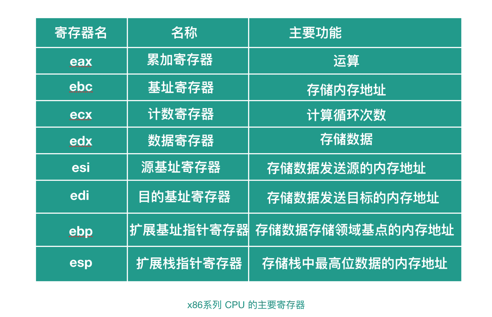
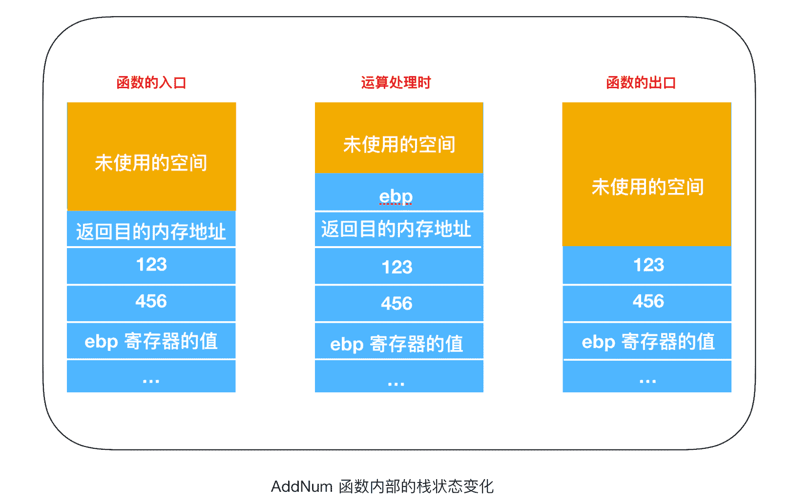
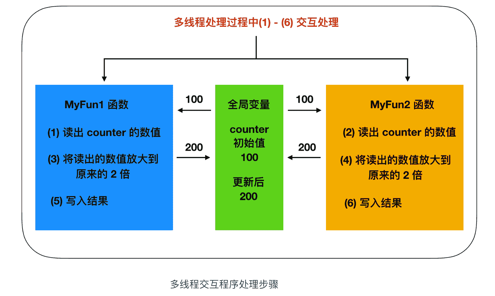

<!--yml
category: 未分类
date: 0001-01-01 00:00:00
-->

# 程序员需要了解的硬核知识之汇编语言

> 原文：[https://zwmst.com/2660.html](https://zwmst.com/2660.html)

   [ *Java基础* ](https://zwmst.com/java%e5%9f%ba%e7%a1%80)*[ <time datetime="2021-09-06T09:39:59+08:00"> 2021-09-06 </time> ](https://zwmst.com/2660.html)  *   [程序员需要了解的硬核知识之汇编语言](#程序员需要了解的硬核知识之汇编语言)
    *   [汇编语言和本地代码](#汇编语言和本地代码)
    *   [通过编译器输出汇编语言的源代码](#通过编译器输出汇编语言的源代码)
    *   [不会转换成本地代码的伪指令](#不会转换成本地代码的伪指令)
    *   [汇编语言的语法是 操作码 + 操作数](#汇编语言的语法是-操作码--操作数)
        *   [指令解析](#指令解析)
        *   [函数的调用机制](#函数的调用机制)
        *   [函数的内部处理](#函数的内部处理)
        *   [全局变量和局部变量](#全局变量和局部变量)
        *   [临时确保局部变量使用的内存空间](#临时确保局部变量使用的内存空间)
        *   [循环控制语句的处理](#循环控制语句的处理)
        *   [条件分支的处理方法](#条件分支的处理方法)
        *   [了解程序运行逻辑的必要性](#了解程序运行逻辑的必要性)

之前的系列文章从 CPU 和内存方面简单介绍了一下汇编语言，但是还没有系统的了解一下汇编语言，汇编语言作为第二代计算机语言，会用一些容易理解和记忆的字母，单词来代替一个特定的指令，作为高级编程语言的基础，有必要系统的了解一下汇编语言，那么本篇文章希望大家跟我一起来了解一下汇编语言。

## 汇编语言和本地代码

我们在之前的文章中探讨过，计算机 CPU 只能运行本地代码(机器语言)程序，用 C 语言等高级语言编写的代码，需要经过编译器编译后，转换为本地代码才能够被 CPU 解释执行。

但是本地代码的可读性非常差，所以需要使用一种能够直接读懂的语言来替换本地代码，那就是在各本地代码中，附带上表示其功能的英文缩写，比如在加法运算的本地代码加上`add(addition)` 的缩写、在比较运算符的本地代码中加上`cmp(compare)`的缩写等，这些通过缩写来表示具体本地代码指令的标志称为 `助记符`，使用助记符的语言称为`汇编语言`。这样，通过阅读汇编语言，也能够了解本地代码的含义了。

不过，即使是使用汇编语言编写的源代码，最终也必须要转换为本地代码才能够运行，负责做这项工作的程序称为`编译器`，转换的这个过程称为`汇编`。在将源代码转换为本地代码这个功能方面，汇编器和编译器是同样的。

用汇编语言编写的源代码和本地代码是一一对应的。因而，本地代码也可以反过来转换成汇编语言编写的代码。把本地代码转换为汇编代码的这一过程称为`反汇编`，执行反汇编的程序称为`反汇编程序`。


哪怕是 C 语言编写的源代码，编译后也会转换成特定 CPU 用的本地代码。而将其反汇编的话，就可以得到汇编语言的源代码，并对其内容进行调查。不过，**本地代码变成 C 语言源代码的反编译，要比本地代码转换成汇编代码的反汇编要困难**，这是因为，C 语言代码和本地代码不是一一对应的关系。

## 通过编译器输出汇编语言的源代码

我们上面提到本地代码可以经过反汇编转换成为汇编代码，但是只有这一种转换方式吗？显然不是，C 语言编写的源代码也能够通过编译器编译称为汇编代码，下面就来尝试一下。

首先需要先做一些准备，需要先下载 `Borland C++ 5.5` 编译器，为了方便，我这边直接下载好了读者直接从我的百度网盘提取即可 （链接:[https://pan.baidu.com/s/19LqVICpn5GcV88thD2AnlA](https://pan.baidu.com/s/19LqVICpn5GcV88thD2AnlA) 密码:hz1u）

下载完毕，需要进行配置，下面是配置说明 （[https://wenku.baidu.com/view/22e2f418650e52ea551898ad.html），教程很完整跟着配置就可以，下面开始我们的编译过程](https://wenku.baidu.com/view/22e2f418650e52ea551898ad.html），教程很完整跟着配置就可以，下面开始我们的编译过程)

首先用 Windows 记事本等文本编辑器编写如下代码

```
// 返回两个参数值之和的函数
int AddNum(int a,int b){
  return a + b;
}

// 调用 AddNum 函数的函数
void MyFunc(){
  int c;
  c = AddNum(123,456);
}
```

编写完成后将其文件名保存为 Sample4.c ，C 语言源文件的扩展名，通常用`.c` 来表示，上面程序是提供两个输入参数并返回它们之和。

在 Windows 操作系统下打开 `命令提示符`，切换到保存 Sample4.c 的文件夹下，然后在命令提示符中输入

```
bcc32 -c -S Sample4.c
```

bcc32 是启动 Borland C++ 的命令，`-c` 的选项是指仅进行编译而不进行链接，`-S` 选项被用来指定生成汇编语言的源代码

作为编译的结果，当前目录下会生成一个名为`Sample4.asm` 的汇编语言源代码。汇编语言源文件的扩展名，通常用`.asm` 来表示，下面就让我们用编辑器打开看一下 Sample4.asm 中的内容

```
 .386p
    ifdef ??version
    if    ??version GT 500H
    .mmx
    endif
    endif
    model flat
    ifndef  ??version
    ?debug  macro
    endm
    endif
    ?debug  S "Sample4.c"
    ?debug  T "Sample4.c"
_TEXT   segment dword public use32 'CODE'
_TEXT   ends
_DATA   segment dword public use32 'DATA'
_DATA   ends
_BSS    segment dword public use32 'BSS'
_BSS    ends
DGROUP  group   _BSS,_DATA
_TEXT   segment dword public use32 'CODE'
_AddNum proc    near
?live1@0:
   ;    
   ;    int AddNum(int a,int b){
   ;    
    push      ebp
    mov       ebp,esp
   ;    
   ;    
   ;        return a + b;
   ;    
@1:
    mov       eax,dword ptr [ebp+8]
    add       eax,dword ptr [ebp+12]
   ;    
   ;    }
   ;    
@3:
@2:
    pop       ebp
    ret 
_AddNum endp
_MyFunc proc    near
?live1@48:
   ;    
   ;    void MyFunc(){
   ;    
    push      ebp
    mov       ebp,esp
   ;    
   ;        int c;
   ;        c = AddNum(123,456);
   ;    
@4:
    push      456
    push      123
    call      _AddNum
    add       esp,8
   ;    
   ;    }
   ;    
@5:
    pop       ebp
    ret 
_MyFunc endp
_TEXT   ends
    public  _AddNum
    public  _MyFunc
    ?debug  D "Sample4.c" 20343 45835
    end
```

这样，编译器就成功的把 C 语言转换成为了汇编代码了。

## 不会转换成本地代码的伪指令

第一次看到汇编代码的读者可能感觉起来比较难，不过实际上其实比较简单，而且可能比 C 语言还要简单，为了便于阅读汇编代码的源代码，需要注意几个要点

汇编语言的源代码，是由转换成本地代码的指令（后面讲述的操作码）和针对汇编器的伪指令构成的。伪指令负责把程序的构造以及汇编的方法指示给汇编器（转换程序）。不过伪指令是无法汇编转换成为本地代码的。下面是上面程序截取的伪指令

```
_TEXT   segment dword public use32 'CODE'
_TEXT   ends
_DATA   segment dword public use32 'DATA'
_DATA   ends
_BSS    segment dword public use32 'BSS'
_BSS    ends
DGROUP  group   _BSS,_DATA

_AddNum proc    near
_AddNum endp

_MyFunc proc    near
_MyFunc endp

_TEXT   ends
    end
```

由伪指令 `segment` 和 `ends` 围起来的部分，是给构成程序的命令和数据的集合体上加一个名字而得到的，称为`段定义`。段定义的英文表达具有`区域`的意思，在这个程序中，段定义指的是命令和数据等程序的集合体的意思，一个程序由多个段定义构成。

上面代码的开始位置，定义了3个名称分别为 `_TEXT、_DATA、_BSS` 的段定义，`_TEXT` 是指定的段定义，`_DATA` 是被初始化（有初始值）的数据的段定义，`_BSS` 是尚未初始化的数据的段定义。这种定义的名称是由 Borland C++ 定义的，是由 Borland C++ 编译器自动分配的，所以程序段定义的顺序就成为了 `_TEXT、_DATA、_BSS` ，这样也确保了内存的连续性

```
_TEXT   segment dword public use32 'CODE'
_TEXT   ends
_DATA   segment dword public use32 'DATA'
_DATA   ends
_BSS    segment dword public use32 'BSS'
_BSS    ends
```

> 段定义( segment ) 是用来区分或者划分范围区域的意思。汇编语言的 segment 伪指令表示段定义的起始，ends 伪指令表示段定义的结束。段定义是一段连续的内存空间

而`group` 这个伪指令表示的是将 `_BSS和_DATA` 这两个段定义汇总名为 DGROUP 的组

```
DGROUP  group   _BSS,_DATA
```

围起 `_AddNum` 和 `_MyFun` 的 `_TEXT` segment 和 `_TEXT` ends ，表示`_AddNum` 和 `_MyFun` 是属于 `_TEXT` 这一段定义的。

```
_TEXT   segment dword public use32 'CODE'
_TEXT   ends
```

因此，即使在源代码中指令和数据是混杂编写的，经过编译和汇编后，也会转换成为规整的本地代码。

`_AddNum proc` 和 `_AddNum endp` 围起来的部分，以及`_MyFunc proc` 和 `_MyFunc endp` 围起来的部分，分别表示 AddNum 函数和 MyFunc 函数的范围。

```
_AddNum proc    near
_AddNum endp

_MyFunc proc    near
_MyFunc endp
```

编译后在函数名前附带上下划线`_` ，是 Borland C++ 的规定。在 C 语言中编写的 AddNum 函数，在内部是以 _AddNum 这个名称处理的。伪指令 proc 和 endp 围起来的部分，表示的是 `过程(procedure)` 的范围。在汇编语言中，这种相当于 C 语言的函数的形式称为过程。

末尾的 `end` 伪指令，表示的是源代码的结束。

## 汇编语言的语法是 操作码 + 操作数

在汇编语言中，一行表示一对 CPU 的一个指令。汇编语言指令的语法结构是 **操作码 + 操作数**，也存在只有操作码没有操作数的指令。

操作码表示的是指令动作，操作数表示的是指令对象。操作码和操作数一起使用就是一个英文指令。比如从英语语法来分析的话，操作码是动词，操作数是宾语。比如这个句子 `Give me money`这个英文指令的话，Give 就是操作码，me 和 money 就是操作数。汇编语言中存在多个操作数的情况，要用逗号把它们分割，就像是 Give me,money 这样。

能够使用何种形式的操作码，是由 CPU 的种类决定的，下面对操作码的功能进行了整理。


本地代码需要加载到内存后才能运行，内存中存储着构成本地代码的指令和数据。程序运行时，CPU会从内存中把数据和指令读出来，然后放在 CPU 内部的寄存器中进行处理。


如果 CPU 和内存的关系你还不是很了解的话，请阅读作者的另一篇文章 [程序员需要了解的硬核知识之CPU](https://mp.weixin.qq.com/s?__biz=MzU2NDg0OTgyMA==&mid=2247484585&idx=1&sn=0d6c3ccf8cc5bec2fea80eb437213801&chksm=fc45f95acb32704c7dcc952a803e88e8a9b0e67c86d8c27abf4e6c776e48b1fcd770dd2dcc8d&token=653889808&lang=zh_CN#rd) 详细了解。

寄存器是 CPU 中的存储区域，寄存器除了具有临时存储和计算的功能之外，还具有运算功能，x86 系列的主要种类和角色如下图所示



### 指令解析

下面就对 CPU 中的指令进行分析

**最常用的 mov 指令**

指令中最常使用的是对寄存器和内存进行数据存储的 `mov` 指令，mov 指令的两个操作数，分别用来指定数据的存储地和读出源。操作数中可以指定寄存器、常数、标签(附加在地址前)，以及用方括号`([])` 围起来的这些内容。如果指定了没有用`([])` 方括号围起来的内容，就表示对该值进行处理；如果指定了用方括号围起来的内容，方括号的值则会被解释为内存地址，然后就会对该内存地址对应的值进行读写操作。让我们对上面的代码片段进行说明

```
 mov       ebp,esp
    mov       eax,dword ptr [ebp+8]
```

mov ebp,esp 中，esp 寄存器中的值被直接存储在了 ebp 中，也就是说，如果 esp 寄存器的值是100的话那么 ebp 寄存器的值也是 100。

而在 `mov eax,dword ptr [ebp+8]` 这条指令中，ebp 寄存器的值 + 8 后会被解析称为内存地址。如果 ebp

寄存器的值是100的话，那么 eax 寄存器的值就是 100 + 8 的地址的值。`dword ptr` 也叫做 `double word pointer` 简单解释一下就是从指定的内存地址中读出4字节的数据

**对栈进行 push 和 pop**

程序运行时，会在内存上申请分配一个称为栈的数据空间。栈（stack）的特性是后入先出，数据在存储时是从内存的下层（大的地址编号）逐渐往上层（小的地址编号）累积，读出时则是按照从上往下进行读取的。


栈是存储临时数据的区域，它的特点是通过 push 指令和 pop 指令进行数据的存储和读出。向栈中存储数据称为 `入栈` ，从栈中读出数据称为 `出栈`，32位 x86 系列的 CPU 中，进行1次 push 或者 pop，即可处理 32 位（4字节）的数据。

### 函数的调用机制

下面我们一起来分析一下函数的调用机制，我们以上面的 C 语言编写的代码为例。首先，让我们从`MyFunc` 函数调用`AddNum` 函数的汇编语言部分开始，来对函数的调用机制进行说明。栈在函数的调用中发挥了巨大的作用，下面是经过处理后的 MyFunc 函数的汇编处理内容

```
_MyFunc      proc    near
    push            ebp       ; 将 ebp 寄存器的值存入栈中                                      (1) 
    mov             ebp,esp ; 将 esp 寄存器的值存入 ebp 寄存器中                            (2)
    push            456         ; 将 456 入栈                                  (3)
    push            123         ; 将 123 入栈                              (4)
    call            _AddNum ; 调用 AddNum 函数                              (5)
    add             esp,8       ; esp 寄存器的值 + 8                     (6)
    pop             ebp         ; 读出栈中的数值存入 ebp 寄存器中            (7)
    ret                             ; 结束 MyFunc 函数，返回到调用源           (8)
_MyFunc         endp
```

代码解释中的(1)、(2)、(7)、(8)的处理适用于 C 语言中的所有函数，我们会在后面展示 `AddNum` 函数处理内容时进行说明。这里希望大家先关注(3) – (6) 这一部分，这对了解函数调用机制至关重要。

(3) 和 (4) 表示的是将传递给 AddNum 函数的参数通过 push 入栈。在 C 语言源代码中，虽然记述为函数 AddNum(123,456)，但入栈时则会先按照 456，123 这样的顺序。也就是位于后面的数值先入栈。这是 C 语言的规定。(5) 表示的 call 指令，会把程序流程跳转到 AddNum 函数指令的地址处。在汇编语言中，`函数名`表示的就是函数所在的内存地址。AddNum 函数处理完毕后，程序流程必须要返回到编号(6) 这一行。call 指令运行后，call 指令的下一行(也就指的是 (6) 这一行)的内存地址(调用函数完毕后要返回的内存地址)会自动的 push 入栈。该值会在 AddNum 函数处理的最后通过 `ret` 指令 pop 出栈，然后程序会返回到 (6) 这一行。

(6) 部分会把栈中存储的两个参数 (456 和 123) 进行销毁处理。虽然通过两次的 pop 指令也可以实现，不过采用 esp 寄存器 + 8 的方式会更有效率(处理 1 次即可)。对栈进行数值的输入和输出时，数值的单位是4字节。因此，通过在负责栈地址管理的 esp 寄存器中加上4的2倍8，就可以达到和运行两次 pop 命令同样的效果。虽然内存中的数据实际上还残留着，但只要把 esp 寄存器的值更新为数据存储地址前面的数据位置，该数据也就相当于销毁了。

我在编译 `Sample4.c` 文件时，出现了下图的这条消息


图中的意思是指 c 的值在 MyFunc 定义了但是一直未被使用，这其实是一项编译器优化的功能，由于存储着 AddNum 函数返回值的变量 c 在后面没有被用到，因此编译器就认为 **该变量没有意义**，进而也就**没有生成与之对应的汇编语言代码**。

下图是调用 AddNum 这一函数前后栈内存的变化


### 函数的内部处理

上面我们用汇编代码分析了一下 Sample4.c 整个过程的代码，现在我们着重分析一下 AddNum 函数的源代码部分，分析一下参数的接收、返回值和返回等机制

```
_AddNum         proc        near
    push            ebp                                                            (1)
    mov             ebp,esp                                                             (2)
    mov             eax,dword ptr[ebp+8]                                     (3)
    add             eax,dword ptr[ebp+12]                                   (4)
    pop             ebp                                   (5)
    ret                                                                                       (6)
_AddNum         endp
```

ebp 寄存器的值在(1)中入栈，在(5)中出栈，这主要是为了把函数中用到的 ebp 寄存器的内容，恢复到函数调用前的状态。

(2) 中把负责管理栈地址的 esp 寄存器的值赋值到了 ebp 寄存器中。这是因为，在 mov 指令中方括号内的参数，是不允许指定 esp 寄存器的。因此，这里就采用了不直接通过 esp，而是用 ebp 寄存器来读写栈内容的方法。

(3) 使用[ebp + 8] 指定栈中存储的第1个参数123，并将其读出到 eax 寄存器中。像这样，不使用 pop 指令，也可以参照栈的内容。而之所以从多个寄存器中选择了 eax 寄存器，是因为 eax 是负责运算的累加寄存器。

通过(4) 的 add 指令，把当前 eax 寄存器的值同第2个参数相加后的结果存储在 eax 寄存器中。[ebp + 12] 是用来指定第2个参数456的。在 C 语言中，函数的返回值必须通过 eax 寄存器返回，这也是规定。也就是 **函数的参数是通过栈来传递，返回值是通过寄存器返回的**。

(6) 中 ret 指令运行后，函数返回目的地内存地址会`自动出栈`，据此，程序流程就会跳转返回到`(6) (Call _AddNum)` 的下一行。这时，AddNum 函数入口和出口处栈的状态变化，就如下图所示



### 全局变量和局部变量

在熟悉了汇编语言后，接下来我们来了解一下全局变量和局部变量，在函数外部定义的变量称为`全局变量`，在函数内部定义的变量称为`局部变量`，全局变量可以在任意函数中使用，局部变量只能在函数定义局部变量的内部使用。下面，我们就通过汇编语言来看一下全局变量和局部变量的不同之处。

下面定义的 C 语言代码分别定义了局部变量和全局变量，并且给各变量进行了赋值，我们先看一下源代码部分

```
// 定义被初始化的全局变量
int a1 = 1;
int a2 = 2;
int a3 = 3;
int a4 = 4;
int a5 = 5;

// 定义没有初始化的全局变量
int b1,b2,b3,b4,b5;

// 定义函数
void MyFunc(){
  // 定义局部变量
  int c1,c2,c3,c4,c5,c6,c7,c8,c9,c10;

  // 给局部变量赋值
  c1 = 1;
  c2 = 2;
  c3 = 3;
  c4 = 4;
  c5 = 5;
  c6 = 6;
  c7 = 7;
  c8 = 8;
  c9 = 9;
  c10 = 10;

  // 把局部变量赋值给全局变量
  a1 = c1;
  a2 = c2;
  a3 = c3;
  a4 = c4;
  a5 = c5;
  b1 = c6;
  b2 = c7;
  b3 = c8;
  b4 = c9;
  b5 = c10;
}
```

上面的代码挺暴力的，不过没关系，能够便于我们分析其汇编源码就好，我们用 Borland C++ 编译后的汇编代码如下，编译完成后的源码比较长，这里我们只拿出来一部分作为分析使用（我们改变了一下段定义顺序，删除了部分注释）

```
_DATA segment dword public use32 'DATA'
   align 4
  _a1 label dword
            dd 1
   align 4
  _a2 label dword
            dd 2
   align 4
  _a3 label dword
            dd 3
   align 4
  _a4 label dword
            dd 4
   align 4
  _a5 label dword
            dd 5
_DATA ends

_BSS segment dword public use32 'BSS'
 align 4
  _b1 label dword
            db 4 dup(?)
   align 4
  _b2 label dword
            db 4 dup(?)
   align 4
  _b3 label dword
            db 4 dup(?)
   align 4
  _b4 label dword
            db 4 dup(?)
   align 4
  _b5 label dword
            db 4 dup(?)
_BSS ends

_TEXT segment dword public use32 'CODE'
_MyFunc proc near

 push      ebp
 mov       ebp,esp
 add       esp,-20
 push      ebx
 push      esi
 mov       eax,1
 mov       edx,2
 mov       ecx,3
 mov       ebx,4
 mov       esi,5
 mov       dword ptr [ebp-4],6
 mov       dword ptr [ebp-8],7
 mov       dword ptr [ebp-12],8
 mov       dword ptr [ebp-16],9
 mov       dword ptr [ebp-20],10
 mov       dword ptr [_a1],eax
 mov       dword ptr [_a2],edx
 mov       dword ptr [_a3],ecx
 mov       dword ptr [_a4],ebx
 mov       dword ptr [_a5],esi
 mov       eax,dword ptr [ebp-4]
 mov       dword ptr [_b1],eax
 mov       edx,dword ptr [ebp-8]
 mov       dword ptr [_b2],edx
 mov       ecx,dword ptr [ebp-12]
 mov       dword ptr [_b3],ecx
 mov       eax,dword ptr [ebp-16]
 mov       dword ptr [_b4],eax
 mov       edx,dword ptr [ebp-20]
 mov       dword ptr [_b5],edx
 pop       esi
 pop       ebx
 mov       esp,ebp
 pop       ebp
 ret

_MyFunc   endp
_TEXT   ends
```

编译后的程序，会被归类到名为段定义的组。

*   初始化的全局变量，会汇总到名为 _DATA 的段定义中

```
_DATA segment dword public use32 'DATA'
...
_DATA ends
```

*   没有初始化的全局变量，会汇总到名为 _BSS 的段定义中

```
_BSS segment dword public use32 'BSS'
 ...
_BSS ends
```

*   被段定义 _TEXT 围起来的汇编代码则是 Borland C++ 的定义

```
_TEXT segment dword public use32 'CODE'
_MyFunc proc near
...
_MyFunc   endp
_TEXT   ends
```

我们在分析上面汇编代码之前，先来认识一下更多的汇编指令，此表是对上面**部分操作码及其功能**的接续

| 操作码 | 操作数 | 功能 |
| --- | --- | --- |
| add | A,B | 把A和B的值相加，并把结果赋值给A |
| call | A | 调用函数A |
| cmp | A,B | 对A和B进行比较，比较结果会自动存入标志寄存器中 |
| inc | A | 对A的值 + 1 |
| ige | 标签名 | 和 cmp 命令组合使用。跳转到标签行 |
| jl | 标签名 | 和 cmp 命令组合使用。跳转到标签行 |
| jle | 标签名 | 和 cmp 命令组合使用。跳转到标签行 |
| jmp | 标签名 | 和 cmp 命令组合使用。跳转到标签行 |
| mov | A,B | 把 B 的值赋给 A |
| pop | A | 从栈中读取数值并存入A |
| push | A | 把A的值存入栈中 |
| ret | 无 | 将处理返回到调用源 |
| xor | A,B | A和B的位进行亦或比较，并将结果存入A中 |

我们首先来看一下 `_DATA` 段定义的内容。 `_a1 label dword` 定义了 `_a1` 这个标签。标签表示的是相对于段定义起始位置的位置。由于`_a1` 在 `_DATA 段`定义的开头位置，所以相对位置是0。 `_a1` 就相当于是全局变量a1。编译后的函数名和变量名前面会加一个`(_)`，这也是 Borland C++ 的规定。`dd 1` 指的是，申请分配了4字节的内存空间，存储着1这个初始值。 dd指的是 `define double word` 表示有两个长度为2的字节领域(word)，也就是4字节的意思。

Borland C++ 中，由于`int` 类型的长度是4字节，因此汇编器就把 int a1 = 1 变换成了 `_a1 label dword 和 dd 1`。同样，这里也定义了相当于全局变量的 a2 – a5 的标签 `_a2 - _a5`，它们各自的初始值 2 – 5 也被存储在各自的4字节中。

接下来，我们来说一说 `_BSS` 段定义的内容。这里定义了相当于全局变量 b1 – b5 的标签 `_b1 - _b5`。其中的`db 4dup(?)` 表示的是申请分配了4字节的领域，但值尚未确定（这里用 ? 来表示）的意思。`db(define byte)` 表示有1个长度是1字节的内存空间。因而，db 4 dup(?) 的情况下，就是4字节的内存空间。

> 注意：db 4 dup(?) 不要和 dd 4 混淆了，前者表示的是4个长度是1字节的内存空间。而 db 4 表示的则是双字节( = 4 字节) 的内存空间中存储的值是 4

### 临时确保局部变量使用的内存空间

我们知道，局部变量是临时保存在寄存器和栈中的。函数内部利用栈进行局部变量的存储，函数调用完成后，局部变量值被销毁，但是寄存器可能用于其他目的。所以，**局部变量只是函数在处理期间临时存储在寄存器和栈中的**。

回想一下上述代码是不是定义了10个局部变量？这是为了表示存储局部变量的不仅仅是栈，还有寄存器。为了确保 c1 – c10 所需的域，寄存器空闲的时候就会使用寄存器，寄存器空间不足的时候就会使用栈。

让我们继续来分析上面代码的内容。`_TEXT`段定义表示的是 `MyFunc` 函数的范围。在 MyFunc 函数中定义的局部变量所需要的内存领域。会被尽可能的分配在寄存器中。大家可能认为使用高性能的寄存器来替代普通的内存是一种资源浪费，但是编译器不这么认为，只要寄存器有空间，编译器就会使用它。由于寄存器的访问速度远高于内存，所以直接访问寄存器能够高效的处理。局部变量使用寄存器，是 Borland C++ 编译器最优化的运行结果。

代码清单中的如下内容表示的是向寄存器中分配局部变量的部分

```
mov       eax,1
mov       edx,2
mov       ecx,3
mov       ebx,4
mov       esi,5
```

仅仅对局部变量进行定义是不够的，只有在给局部变量赋值时，才会被分配到寄存器的内存区域。上述代码相当于就是给5个局部变量 c1 – c5 分别赋值为 1 – 5。**eax、edx、ecx、ebx、esi** 是 x86 系列32位 CPU 寄存器的名称。至于使用哪个寄存器，是由`编译器`来决定的 。

x86 系列 CPU 拥有的寄存器中，程序可以操作的是十几，其中空闲的最多会有几个。因而，局部变量超过寄存器数量的时候，可分配的寄存器就不够用了，这种情况下，编译器就会把栈派上用场，用来存储剩余的局部变量。

在上述代码这一部分，给局部变量c1 – c5 分配完寄存器后，可用的寄存器数量就不足了。于是，剩下的5个局部变量c6 – c10 就被分配给了栈的内存空间。如下面代码所示

```
mov       dword ptr [ebp-4],6
mov       dword ptr [ebp-8],7
mov       dword ptr [ebp-12],8
mov       dword ptr [ebp-16],9
mov       dword ptr [ebp-20],10
```

函数入口 `add esp,-20` 指的是，对栈数据存储位置的 esp 寄存器(栈指针)的值做减20的处理。为了确保内存变量 c6 – c10 在栈中，就需要保留5个 int 类型的局部变量（4字节 * 5 = 20 字节）所需的空间。 `mov ebp,esp`这行指令表示的意思是将 esp 寄存器的值赋值到 ebp 寄存器。之所以需要这么处理，是为了通过在函数出口处 `mov esp ebp` 这一处理，把 esp 寄存器的值还原到原始状态，从而对申请分配的栈空间进行释放，这时栈中用到的局部变量就消失了。这也是栈的清理处理。在使用寄存器的情况下，局部变量则会在寄存器被用于其他用途时自动消失，如下图所示。


```
 mov       dword ptr [ebp-4],6
 mov       dword ptr [ebp-8],7
 mov       dword ptr [ebp-12],8
 mov       dword ptr [ebp-16],9
 mov       dword ptr [ebp-20],10
```

这五行代码是往栈空间代入数值的部分，由于在向栈申请内存空间前，借助了 `mov ebp, esp` 这个处理，esp 寄存器的值被保存到了 ebp 寄存器中，因此，通过使用[ebp – 4]、[ebp – 8]、[ebp – 12]、[ebp – 16]、[ebp – 20] 这样的形式，就可以申请分配20字节的栈内存空间切分成5个长度为4字节的空间来使用。例如， `mov dword ptr [ebp-4],6` 表示的就是，从申请分配的内存空间的下端(ebp寄存器指示的位置)开始向前4字节的地址([ebp – 4]) 中，存储着6这一4字节数据。


### 循环控制语句的处理

上面说的都是顺序流程，那么现在就让我们分析一下循环流程的处理，看一下 `for 循环`以及 `if 条件分支`等 c 语言程序的 `流程控制`是如何实现的，我们还是以代码以及编译后的结果为例，看一下程序控制流程的处理过程。

```
// 定义MySub 函数
void MySub(){
  // 不做任何处理

}

// 定义MyFunc 函数
void Myfunc(){
  int i;
  for(int i = 0;i < 10;i++){
    // 重复调用MySub十次
    MySub();
  }
}
```

上述代码将局部变量 i 作为循环条件，循环调用十次`MySub` 函数，下面是它主要的汇编代码

```
 xor         ebx, ebx    ; 将寄存器清0
@4  call        _MySub      ; 调用MySub函数
        inc         ebx             ; ebx寄存器的值 + 1
        cmp         ebx,10      ;   将ebx寄存器的值和10进行比较
        jl          short @4    ; 如果小于10就跳转到 @4
```

C 语言中的 for 语句是通过在括号中指定循环计数器的初始值(i = 0)、循环的继续条件(i < 10)、循环计数器的更新(i++) 这三种形式来进行循环处理的。与此相对的汇编代码就是通过`比较指令(cmp)` 和 `跳转指令(jl)`来实现的。

下面我们来对上述代码进行说明

`MyFunc` 函数中用到的局部变量只有 i ，变量 i 申请分配了 ebx 寄存器的内存空间。for 语句括号中的 i = 0 被转换为 `xor ebx,ebx` 这一处理，xor 指令会对左起第一个操作数和右起第二个操作数进行 XOR 运算，然后把结果存储在第一个操作数中。由于这里把第一个操作数和第二个操作数都指定为了 ebx，因此就变成了对相同数值的 XOR 运算。也就是说不管当前寄存器的值是什么，最终的结果都是0。类似的，我们使用 `mov ebx,0` 也能得到相同的结果，但是 xor 指令的处理速度更快，而且编译器也会启动最优化功能。

> XOR 指的就是异或操作，它的运算规则是 **如果a、b两个值不相同，则异或结果为1。如果a、b两个值相同，异或结果为0**。
> 
> 相同数值进行 XOR 运算，运算结果为0。XOR 的运算规则是，值不同时结果为1，值相同时结果为0。例如 01010101 和 01010101 进行运算，就会分别对各个数字位进行 XOR 运算。因为每个数字位都相同，所以运算结果为0。

ebx 寄存器的值初始化后，会通过 call 指定调用 _MySub 函数，从 _MySub 函数返回后，会执行`inc ebx` 指令，对 ebx 的值进行 + 1 操作，这个操作就相当于 i++ 的意思，++ 表示的就是当前数值 + 1。

> 这里需要知道 i++ 和 ++i 的区别
> 
> i++ 是先赋值，复制完成后再对 i执行 + 1 操作
> 
> ++i 是先进行 +1 操作，完成后再进行赋值

`inc` 下一行的 `cmp` 是用来对第一个操作数和第二个操作数的数值进行比较的指令。 `cmp ebx,10` 就相当于 C 语言中的 i < 10 这一处理，意思是把 ebx 寄存器的值与10进行比较。汇编语言中比较指令的结果，会存储在 CPU 的标志寄存器中。不过，标志寄存器的值，程序是无法直接参考的。那如何判断比较结果呢？

汇编语言中有多个`跳转指令`，这些跳转指令会根据标志寄存器的值来判断是否进行跳转操作，例如最后一行的 jl，它会根据 cmp ebx,10 指令所存储在标志寄存器中的值来判断是否跳转，`jl` 这条指令表示的就是 `jump on less than(小于的话就跳转)`。发现如果 i 比 10 小，就会跳转到 @4 所在的指令处继续执行。

那么汇编代码的意思也可以用 C 语言来改写一下，加深理解

```
 i ^= i;
L4: MySub();
        i++;
        if(i < 10) goto L4;
```

代码第一行 i ^= i 指的就是 i 和 i 进行异或运算，也就是 XOR 运算，MySub() 函数用 L4 标签来替代，然后进行 i 自增操作，如果i 的值小于 10 的话，就会一直循环 MySub() 函数。

### 条件分支的处理方法

条件分支的处理方式和循环的处理方式很相似，使用的也是 cmp 指令和跳转指令。下面是用 C 语言编写的条件分支的代码

```
// 定义MySub1 函数
void MySub1(){

 // 不做任何处理
}

// 定义MySub2 函数
void MySub2(){

 // 不做任何处理
}

// 定义MySub3 函数
void MySub3(){

 // 不做任何处理
}

// 定义MyFunc 函数
void MyFunc(){

 int a = 123;
 // 根据条件调用不同的函数
 if(a > 100){
  MySub1();
 }
 else if(a < 50){
  MySub2();
 }
 else
 {
  MySub3();
 }

}
```

很简单的一个实现了条件判断的 C 语言代码，那么我们把它用 Borland C++ 编译之后的结果如下

```
_MyFunc proc near
 push      ebp              
 mov       ebp,esp
 mov       eax,123          ; 把123存入 eax 寄存器中
 cmp       eax,100          ; 把 eax 寄存器的值同100进行比较
 jle       short @8         ; 比100小时，跳转到@8标签
 call      _MySub1          ; 调用MySub1函数
 jmp             short @11      ; 跳转到@11标签
@8:
 cmp       eax,50               ; 把 eax 寄存器的值同50进行比较
 jge       short @10        ; 比50大时，跳转到@10标签
 call      _MySub2          ; 调用MySub2函数
 jmp             short @11      ; 跳转到@11标签
@10:
 call      _MySub3          ; 调用MySub3函数
@11:
 pop       ebp
 ret 
_MyFunc endp
```

上面代码用到了三种跳转指令，分别是`jle(jump on less or equal)` 比较结果小时跳转，`jge(jump on greater or equal)` 比较结果大时跳转，还有不管结果怎样都会进行跳转的`jmp`，在这些跳转指令之前还有用来比较的指令 `cmp`，构成了上述汇编代码的主要逻辑形式。

### 了解程序运行逻辑的必要性

通过对上述汇编代码和 C 语言源代码进行比较，想必大家对程序的运行方式有了新的理解，而且，从汇编源代码中获取的知识，也有助于了解 Java 等高级语言的特性，比如 Java 中就有 native 关键字修饰的变量，那么这个变量的底层就是使用 C 语言编写的，还有一些 Java 中的语法糖只有通过汇编代码才能知道其运行逻辑。在某些情况下，对于查找 bug 的原因也是有帮助的。

上面我们了解到的编程方式都是串行处理的，那么串行处理有什么特点呢？


串行处理最大的一个特点就是`专心只做一件事情`，一件事情做完之后才会去做另外一件事情。

计算机是支持多线程的，多线程的核心就是 CPU切换，如下图所示


我们还是举个实际的例子，让我们来看一段代码

```
// 定义全局变量
int counter = 100;

// 定义MyFunc1()
void MyFunc(){
  counter *= 2;
}

// 定义MyFunc2()
void MyFunc2(){
  counter *= 2;
}
```

上述代码是更新 counter 的值的 C 语言程序，MyFunc1() 和 MyFunc2() 的处理内容都是把 counter 的值扩大至原来的二倍，然后再把 counter 的值赋值给 counter 。这里，我们假设使用`多线程处理`，同时调用了一次MyFunc1 和 MyFunc2 函数，这时，全局变量 counter 的值，理应编程 100 *2* 2 = 400。如果你开启了多个线程的话，你会发现 counter 的数值有时也是 200，对于为什么出现这种情况，如果你不了解程序的运行方式，是很难找到原因的。

我们将上面的代码转换成汇编语言的代码如下

```
mov eax,dword ptr[_counter]     ; 将 counter 的值读入 eax 寄存器
add eax,eax                                     ; 将 eax 寄存器的值扩大2倍。
mov dword ptr[_counter],eax     ; 将 eax 寄存器的值存入 counter 中。
```

在多线程程序中，用汇编语言表示的代码每运行一行，处理都有可能切换到其他线程中。因而，假设 MyFun1 函数在读出 counter 数值100后，还未来得及将它的二倍值200写入 counter 时，正巧 MyFun2 函数读出了 counter 的值100，那么结果就将变为 200 。



为了避免该bug，我们可以采用以函数或 C 语言代码的行为单位来禁止线程切换的`锁定`方法，或者使用某种线程安全的方式来避免该问题的出现。

现在基本上没有人用汇编语言来编写程序了，因为 C、Java等高级语言的效率要比汇编语言快很多。不过，汇编语言的经验还是很重要的，通过借助汇编语言，我们可以更好的了解计算机运行机制。*