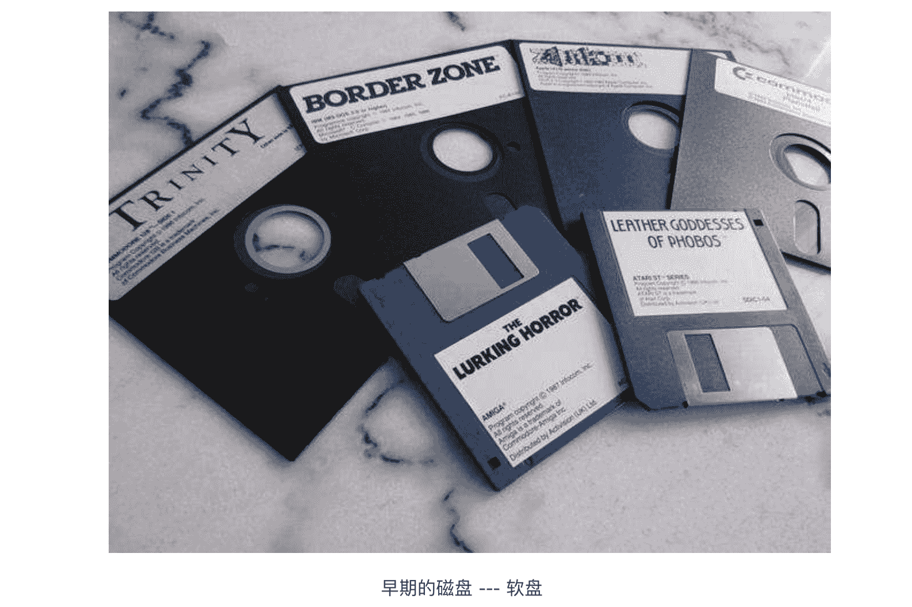
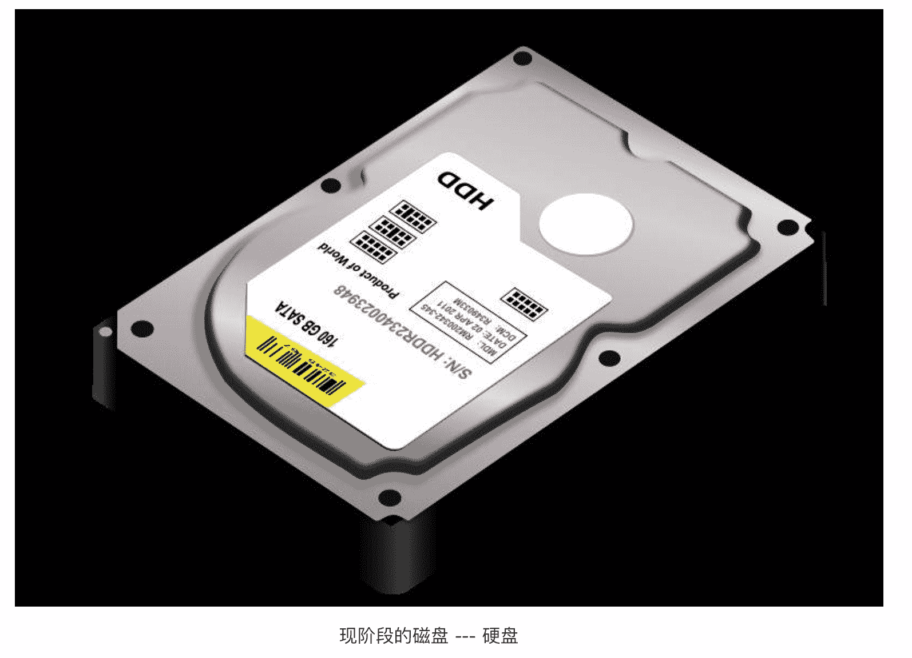
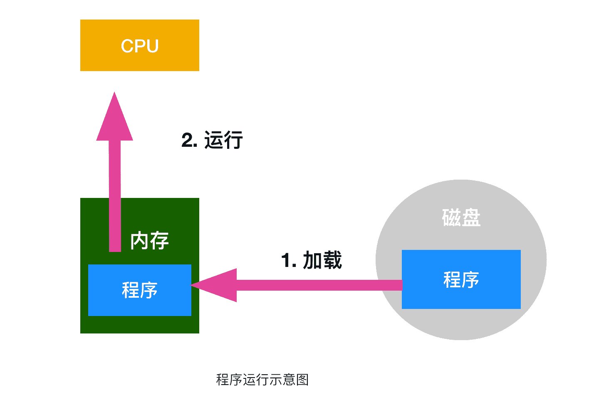
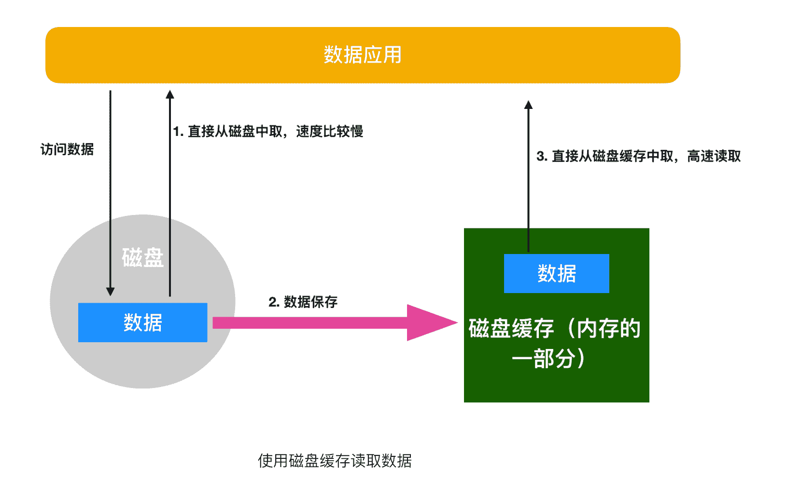
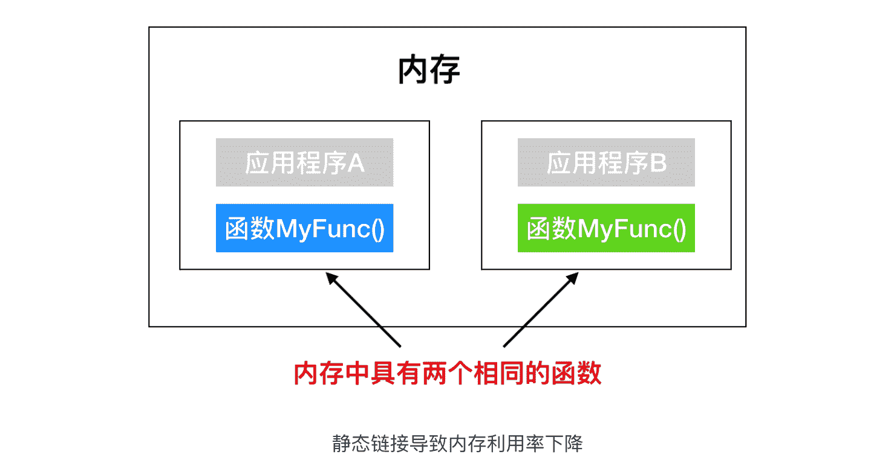
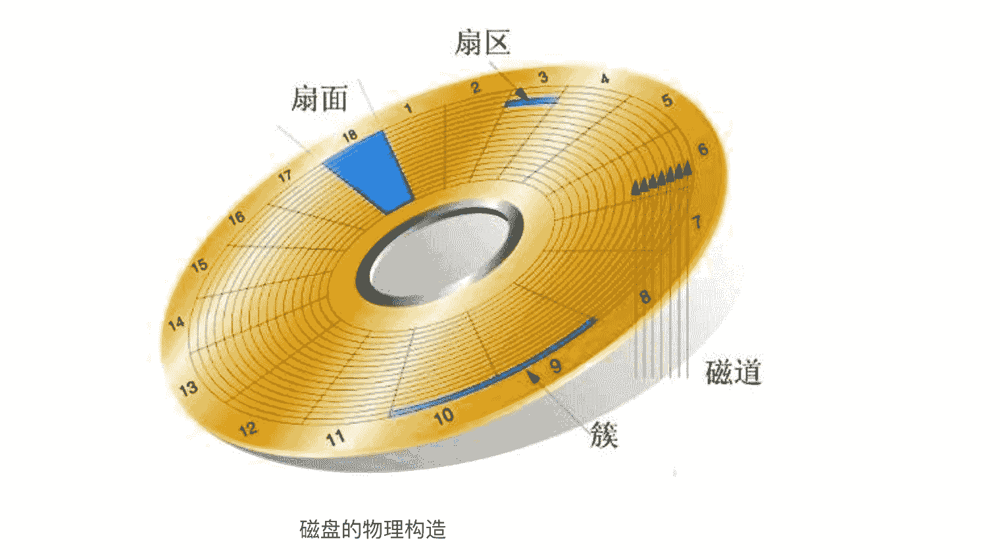
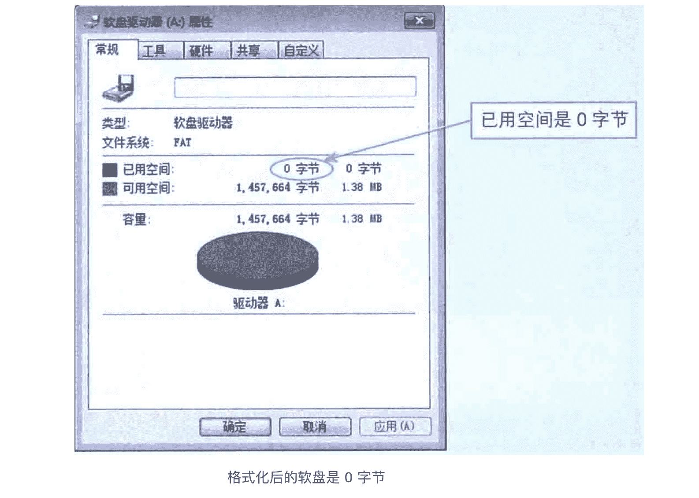
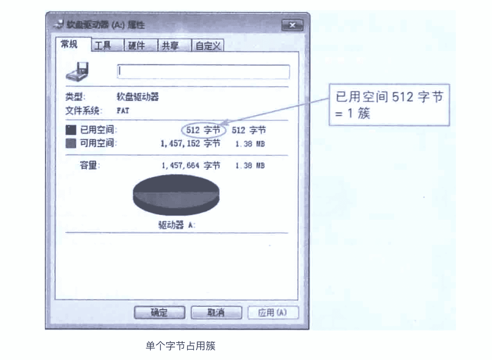

<!--yml
category: 未分类
date: 0001-01-01 00:00:00
--->

# 程序员需要了解的硬核知识之磁盘

> 原文：[https://zwmst.com/2668.html](https://zwmst.com/2668.html)

   [ *Java基础* ](https://zwmst.com/java%e5%9f%ba%e7%a1%80)*[ <time datetime="2021-09-06T09:40:41+08:00"> 2021-09-06 </time> ](https://zwmst.com/2668.html)  *   [程序员需要了解的硬核知识之磁盘](#程序员需要了解的硬核知识之磁盘)
    *   [认识磁盘](#认识磁盘)
        *   [程序不读入内存就无法运行](#程序不读入内存就无法运行)
    *   [磁盘构件](#磁盘构件)
        *   [磁盘缓存](#磁盘缓存)
        *   [虚拟内存](#虚拟内存)
            *   [虚拟内存与内存的交换方式](#虚拟内存与内存的交换方式)
    *   [节约内存](#节约内存)
        *   [通过 DLL 文件实现函数共有](#通过-dll-文件实现函数共有)
        *   [通过调用 _stdcall 来减少程序文件的大小](#通过调用-_stdcall-来减少程序文件的大小)
        *   [磁盘的物理结构](#磁盘的物理结构)

我们大家知道，计算机的五大基础部件是 `存储器`、`控制器`、`运算器`、`输入和输出设备`，其中从存储功能的角度来看，可以把存储器分为`内存`和 `磁盘`，内存我们上面的文章已经介绍过了，那么此篇文章我们来介绍一下磁盘以及内存和磁盘的关系。

## 认识磁盘

首先，磁盘和内存都具有存储功能，它们都是存储设备。区别在于，内存是通过`电流` 来实现存储；磁盘则是通过`磁记录技术`来实现存储。内存是一种高速，造假昂贵的存储设备；而磁盘则是速度较慢、造假低廉的存储设备；电脑断电后，内存中的数据会丢失，而磁盘中的数据可以长久保留。内存是属于`内部存储设备`，硬盘是属于 `外部存储设备`。一般在我们的计算机中，磁盘和内存是相互配合共同作业的。

一般内存指的就是主存（负责存储CPU中运行的程序和数据）；早起的磁盘指的是软磁盘（soft disk，简称软盘），就是下面这个



（2000年的时候我曾经我姑姑家最早的计算机中见到过这个，当时还不知道这是啥，现在知道了。）

如今常用的磁盘是硬磁盘（hard disk，简称硬盘），就是下面这个



### 程序不读入内存就无法运行

在了解磁盘前，还需要了解一下内存的运行机制是怎样的，我们的程序被保存在存储设备中，通过使用 CPU 读入来实现程序指令的执行。这种机制称为`存储程序方式`，现在看来这种方式是理所当然的，但在以前程序的运行都是通过改变计算机的布线来读写指令的。

计算机最主要的存储部件是内存和磁盘。**磁盘中存储的程序必须加载到内存中才能运行**，在磁盘中保存的程序是无法直接运行的，这是因为负责解析和运行程序内容的 CPU 是需要通过程序计数器来指定内存地址从而读出程序指令的。



## 磁盘构件

### 磁盘缓存

我们上面提到，磁盘往往和内存是互利共生的关系，相互协作，彼此持有良好的合作关系。每次内存都需要从磁盘中读取数据，必然会读到相同的内容，所以一定会有一个角色负责存储我们经常需要读到的内容。 我们大家做软件的时候经常会用到`缓存技术`，那么硬件层面也不例外，磁盘也有缓存，磁盘的缓存叫做`磁盘缓存`。

磁盘缓存指的是把从磁盘中读出的数据存储到内存的方式，这样一来，当接下来需要读取相同的内容时，就不会再通过实际的磁盘，而是通过磁盘缓存来读取。某一种技术或者框架的出现势必要解决某种问题的，那么磁盘缓存就大大**改善了磁盘访问的速度**。



Windows 操作系统提供了磁盘缓存技术，不过，对于大部分用户来说是感受不到磁盘缓存的，并且随着计算机的演进，对硬盘的访问速度也在不断演进，实际上磁盘缓存到 Windows 95/98 就已经不怎么使用了。

把低速设备的数据保存在高速设备中，需要时可以直接将其从高速设备中读出，这种缓存方式在web中应用比较广泛，web 浏览器是通过网络来获取远程 web 服务器的数据并将其显示出来。因此，在读取较大的图片的时候，会耗费不少时间，这时 web 浏览器可以把获取的数据保存在磁盘中，然后根据需要显示数据，再次读取的时候就不用重新加载了。

### 虚拟内存

`虚拟内存`是内存和磁盘交互的第二个媒介。虚拟内存是指把磁盘的一部分作为`假想内存`来使用。这与磁盘缓存是假想的磁盘（实际上是内存）相对，虚拟内存是假想的内存（实际上是磁盘）。

虚拟内存是计算机系统内存管理的一种技术。它使得应用程序认为它拥有`连续可用`的内存（一个完整的地址空间），但是实际上，它通常被分割成多个物理碎片，还有部分存储在外部磁盘管理器上，必要时进行数据交换。

计算机中的程序都要通过内存来运行，如果程序占用内存很大，就会将内存空间消耗殆尽。为了解决这个问题，WINDOWS 操作系统运用了虚拟内存技术，通过拿出一部分硬盘来当作内存使用，来保证程序耗尽内存仍然有可以存储的空间。虚拟内存在硬盘上的存在形式就是 `PAGEFILE.SYS` 这个页面文件。

通过借助虚拟内存，在内存不足时仍然可以运行程序。例如，在只剩 5MB 内存空间的情况下仍然可以运行 10MB 的程序。由于 CPU 只能执行加载到内存中的程序，因此，虚拟内存的空间就需要和内存中的空间进行`置换（swap）`，然后运行程序。

#### 虚拟内存与内存的交换方式

刚才我们提到虚拟内存需要和内存中的部分内容做置换才可让 CPU 继续执行程序，那么做置换的方式是怎样的呢？又分为哪几种方式呢？

虚拟内存的方法有`分页式` 和 `分段式` 两种。Windows 采用的是分页式。该方式是指在不考虑程序构造的情况下，把运行的程序按照一定大小的页进行分割，并以`页`为单位进行置换。在分页式中，我们把磁盘的内容读到内存中称为 `Page In`，把内存的内容写入磁盘称为 `Page Out`。Windows 计算机的页大小为 4KB ，也就是说，需要把应用程序按照 4KB 的页来进行切分，以页（page）为单位放到磁盘中，然后进行置换。


为了实现内存功能，Windows 在磁盘上提供了虚拟内存使用的文件（page file，页文件）。该文件由 Windows 生成和管理，文件的大小和虚拟内存大小相同，通常大小是内存的 1 – 2 倍。

## 节约内存

Windows 是以图形界面为基础的操作系统。它的前身是 `MS-DOC`，最初的版本可以在 128kb 的内存上运行程序，但是现在想要 Windows 运行流畅的花至少要需要 512MB 的内存，但通常往往是不够的。

也许许多人认为可以使用虚拟内存来解决内存不足的情况，而虚拟内存确实能够在内存不足的时候提供补充，但是使用虚拟内存的 Page In 和 Page Out 通常伴随着低速的磁盘访问，这是一种得不偿失的表现。所以虚拟内存无法从根本上解决内存不足的情况。

为了从根本上解决内存不足的情况，要么是增加内存的容量，加内存条；要么是优化应用程序，使其尽可能变小。第一种建议往往需要衡量口袋的银子，所以我们只关注第二种情况。

> 注意：以下的篇幅会涉及到 C 语言的介绍，是每个程序员（不限语言）都需要知道和了解的知识。

### 通过 DLL 文件实现函数共有

`DLL（Dynamic Link Library）`文件，是一种`动态链接库` 文件，顾名思义，是在程序运行时可以动态加载 `Library（函数和数据的集合）`的文件。此外，多个应用可以共有同一个 DLL 文件。而通过共有一个 DLL 文件则可以达到节约内存的效果。

例如，假设我们编写了一个具有某些处理功能的函数 `MyFunc()`。应用 A 和 应用 B 都需要用到这个函数，然后在各自的应用程序中内置 MyFunc()（这个称为Static Link，静态链接）后同时运行两个应用，内存中就存在了同一个函数的两个程序，这会造成资源浪费。



为了改变这一点，使用 DLL 文件而不是应用程序的执行文件（EXE文件）。因为同一个 DLL 文件内容在运行时可以被多个应用共有，因此内存中存在函数 MyFunc（）的程序就只有一个


Windows 操作系统其实就是无数个 DLL 文件的集合体。有些应用在安装时，DLL文件也会被追加。应用程序通过这些 DLL 文件来运行，既可以节约内存，也可以在不升级 EXE 文件的情况下，通过升级 DLL 文件就可以完成更新。

### 通过调用 _stdcall 来减少程序文件的大小

通过调用 `_stdcall` 来减小程序文件的方法，是用 C 语言编写应用时可以利用的高级技巧。我们来认识一下什么是 _stdcall。

_stdcall 是 `standard call(标准调用)`的缩写。Windows 提供的 DLL 文件内的函数，基本上都是通过 _stdcall 调用方式来完成的，这主要是为了节约内存。另一方面，用 C 语言编写的程序默认都不是 _stdcall 。C 语言特有的调用方式称为 `C 调用`。C 语言默认不使用 _stdcall 的原因是因为 C 语言所对应的函数传入参数是可变的，只有函数调用方才能知道到底有多少个参数，在这种情况下，栈的清理作业便无法进行。不过，在 C 语言中，如果函数的参数和数量固定的话，指定 _stdcall 是没有任何问题的。

> C 语言和 Java 最主要的区别之一在于 C 语言需要人为控制释放内存空间

C 语言中，在调用函数后，需要人为执行栈清理指令。把不需要的数据从接收和传递函数的参数时使用的内存上的栈区域中清理出去的操作叫做 `栈清理处理`。

例如如下代码

```
// 函数调用方
void main(){
  int a;
  a = MyFunc(123,456);
}

// 被调用方
int MyFunc(int a,int b){
  ...
}
```

代码中，从 main 主函数调用到 MyFunc() 方法，按照默认的设定，栈的清理处理会附加在 main 主函数这一方。在同一个程序中，有可能会多次调用，导致 MyFunc() 会进行多次清理，这就会造成内存的浪费。

汇编之后的代码如下

```
push 1C8h                               // 将参数 456( = 1C8h) 存入栈中
push 7Bh                                // 将参数 123( = 7Bh) 存入栈中
call @LTD+15 (MyFunc)(00401014)         // 调用 MyFunc 函数
add esp,8                               // 运行栈清理
```

C 语言通过栈来传递函数的参数，使用 `push` 是往栈中存入数据的指令，`pop` 是从栈中取出数据的指令。32 位 CPU 中，1次 push 指令可以存储 4 个字节（32 位）的数据。上述代码由于进行了两次 push 操作，所以存储了 8 字节的数据。通过 `call` 指令来调用函数，调用完成后，栈中存储的数据就不再需要了。于是就通过 add esp,8 这个指令，使存储着栈数据的 esp 寄存器前进 8 位（设定为指向高 8 位字节的地址），来进行数据清理。由于栈是在各种情况下都可以利用的内存领域，因此使用完毕后有必要将其恢复到原始状态。上述操作就是执行栈的清理工作。另外，在 C 语言中，函数的返回值，是通过寄存器而非栈来返回的。

栈执行清理工作，在调用方法处执行清理工作和在反复调用方法处执行清理工作不同，使用 `_stdcall` 标准调用的方式称为反复调用方法，在这种情况下执行栈清理开销比较小。


### 磁盘的物理结构

之前我们介绍了CPU、内存的物理结构，现在我们来介绍一下磁盘的物理结构。**磁盘的物理结构指的是磁盘存储数据的形式**。

磁盘是通过其物理表面划分成多个空间来使用的。划分的方式有两种：`可变长方式` 和 `扇区方式`。前者是将物理结构划分成长度可变的空间，后者是将磁盘结构划分为固定长度的空间。一般 Windows 所使用的硬盘和软盘都是使用扇区这种方式。扇区中，把磁盘表面分成若干个同心圆的空间就是 `磁道`，把磁道按照固定大小的存储空间划分而成的就是 `扇区`



`扇区`是对磁盘进行物理读写的最小单位。Windows 中使用的磁盘，一般是一个扇区 512 个字节。不过，Windows 在逻辑方面对磁盘进行读写的单位是扇区整数倍簇。根据磁盘容量不同功能，1簇可以是 512 字节（1 簇 = 1扇区）、1KB（1簇 = 2扇区）、2KB、4KB、8KB、16KB、32KB( 1 簇 = 64 扇区)。簇和扇区的大小是相等的。

不管是硬盘还是软盘，不同的文件是不能存储在同一簇中的，否则就会导致只有一方的文件不能删除。所以，不管多小的文件，都会占用 1 簇的空间。这样一来，所有的文件都会占用 1 簇的整数倍的空间。

我们使用软盘做实验会比较简单一些，我们先对软盘进行格式化，格式化后的软盘空间如下



接下来，我们保存一个 `txt` 文件，并在文件输入一个字符，这时候文件其实只占用了一个字节，但是我们看一下磁盘的属性却占用了 512 字节



然后我们继续写入一些东西，当文件大小到达 512 个字节时，已用空间也是 512 字节，但是当我们继续写入一个字符时，我们点开属性会发现磁盘空间会变为 1024 个字节（= 2 簇），通过这个实验我们可以证明磁盘是以簇为单位来保存的。*