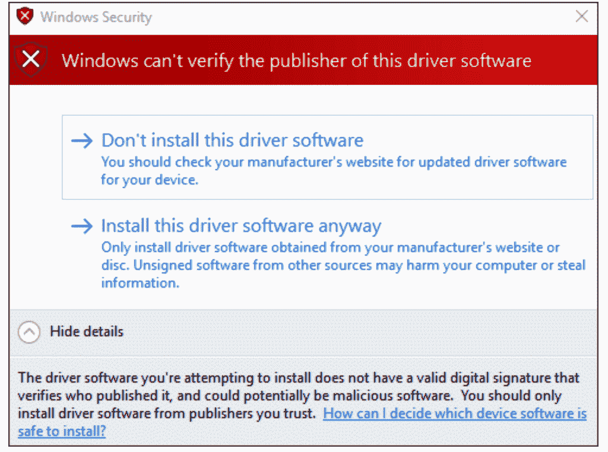

<!--yml
category: 未分类
date: 0001-01-01 00:00:00
--->

# 带你一步步解析HTTPS

> 原文：[https://zwmst.com/2717.html](https://zwmst.com/2717.html)

   [ *Java基础* ](https://zwmst.com/java%e5%9f%ba%e7%a1%80)*[ <time datetime="2021-09-07T09:22:55+08:00"> 2021-09-07 </time> ](https://zwmst.com/2717.html)  *   [带你一步步解析 HTTPS](#带你一步步解析-https)
    *   [HTTPS 为什么会出现](#https-为什么会出现)
        *   [HTTPS 解决了什么问题](#https-解决了什么问题)
        *   [什么是 HTTPS](#什么是-https)
        *   [HTTPS 做了什么](#https-做了什么)
    *   [什么是 SSL/TLS](#什么是-ssltls)
        *   [认识 SSL/TLS](#认识-ssltls)
        *   [HTTPS 的内核是 HTTP](#https-的内核是-http)
    *   [探究 HTTPS](#探究-https)
        *   [对称加密](#对称加密)
            *   [加密分组](#加密分组)
        *   [非对称加密](#非对称加密)
        *   [混合加密](#混合加密)
        *   [摘要算法](#摘要算法)
        *   [认证](#认证)
    *   [总结](#总结)

下面我们来一起学习一下 HTTPS ，首先问你一个问题，为什么有了 HTTP 之后，还需要有 HTTPS ？我突然有个想法，为什么我们面试的时候需要回答`标准答案`呢？为什么我们不说出我们自己的想法和见解，却要记住一些所谓的标准回答呢？**技术还有正确与否吗**？

## HTTPS 为什么会出现

一个新技术的出现必定是为了解决某种问题的，那么 HTTPS 解决了 HTTP 的什么问题呢？

### HTTPS 解决了什么问题

一个简单的回答可能会是 `HTTP` 它不安全。由于 HTTP 天生明文传输的特性，在 HTTP 的传输过程中，任何人都有可能从中截获、修改或者伪造请求发送，所以可以认为 HTTP 是不安全的；在 HTTP 的传输过程中不会验证通信方的身份，因此 HTTP 信息交换的双方可能会遭到伪装，也就是`没有用户验证`；在 HTTP 的传输过程中，接收方和发送方并`不会验证报文的完整性`，综上，为了结局上述问题，HTTPS 应用而生。


### 什么是 HTTPS

你还记得 HTTP 是怎么定义的吗？HTTP 是一种 `超文本传输协议(Hypertext Transfer Protocol)` 协议，**它 是一个在计算机世界里专门在两点之间传输文字、图片、音频、视频等超文本数据的约定和规范**，那么我们看一下 HTTPS 是如何定义的

`HTTPS` 的全称是 `Hypertext Transfer Protocol Secure`，它用来在计算机网络上的两个端系统之间进行`安全的交换信息(secure communication)`，它相当于在 HTTP 的基础上加了一个 `Secure 安全`的词眼，那么我们可以给出一个 HTTPS 的定义：**HTTPS 是一个在计算机世界里专门在两点之间安全的传输文字、图片、音频、视频等超文本数据的约定和规范**。 HTTPS 是 HTTP 协议的一种扩展，它本身并不保传输的证安全性，那么谁来保证安全性呢？在 HTTPS 中，使用`传输层安全性(TLS)`或`安全套接字层(SSL)`对通信协议进行加密。也就是 HTTP + SSL(TLS) = HTTPS。


### HTTPS 做了什么

HTTPS 协议提供了三个关键的指标

*   `加密(Encryption)`， HTTPS 通过对数据加密来使其免受窃听者对数据的监听，这就意味着当用户在浏览网站时，没有人能够监听他和网站之间的信息交换，或者跟踪用户的活动，访问记录等，从而窃取用户信息。

*   `数据一致性(Data integrity)`，数据在传输的过程中不会被窃听者所修改，用户发送的数据会`完整`的传输到服务端，保证用户发的是什么，服务器接收的就是什么。

*   `身份认证(Authentication)`，是指确认对方的真实身份，也就是`证明你是你`（可以比作人脸识别），它可以防止中间人攻击并建立用户信任。

有了上面三个关键指标的保证，用户就可以和服务器进行安全的交换信息了。那么，既然你说了 HTTPS 的种种好处，那么我怎么知道网站是用 HTTPS 的还是 HTTP 的呢？给你两幅图应该就可以解释了。


HTTPS 协议其实非常简单，RFC 文档很小，只有短短的 7 页，里面规定了新的协议名，默认`端口号443`，至于其他的**应答模式、报文结构、请求方法、URI、头字段、连接管理**等等都完全沿用 HTTP，没有任何新的东西。

也就是说，除了协议名称和默认端口号外（HTTP 默认端口 80），HTTPS 协议在语法、语义上和 HTTP 一样，HTTP 有的，HTTPS 也照单全收。那么，HTTPS 如何做到 HTTP 所不能做到的`安全性呢`？关键在于这个 `S` 也就是 `SSL/TLS` 。

## 什么是 SSL/TLS

### 认识 SSL/TLS

`TLS(Transport Layer Security)` 是 `SSL(Secure Socket Layer)` 的后续版本，它们是用于在互联网两台计算机之间用于`身份验证`和`加密`的一种协议。

> 注意：在互联网中，很多名称都可以进行互换。

我们都知道一些在线业务（比如在线支付）最重要的一个步骤是创建一个值得信赖的交易环境，能够让客户安心的进行交易，SSL/TLS 就保证了这一点，SSL/TLS 通过将称为 `X.509` 证书的数字文档将网站和公司的实体信息绑定到`加密密钥`来进行工作。每一个`密钥对(key pairs)` 都有一个 `私有密钥(private key)` 和 `公有密钥(public key)`，私有密钥是独有的，一般位于服务器上，用于解密由公共密钥加密过的信息；公有密钥是公有的，与服务器进行交互的每个人都可以持有公有密钥，用公钥加密的信息只能由私有密钥来解密。

> 什么是 `X.509`：X.509 是`公开密钥`证书的标准格式，这个文档将加密密钥与（个人或组织）进行安全的关联。
> 
> X.509 主要应用如下
> 
> *   SSL/TLS 和 HTTPS 用于经过身份验证和加密的 Web 浏览
> *   通过 [S/MIME](https://www.ssl.com/article/sending-secure-email-with-s-mime/) 协议签名和加密的电子邮件
> *   代码签名：它指的是使用数字证书对软件应用程序进行签名以安全分发和安装的过程。
> 
> 
> 
> 通过使用由知名公共证书颁发机构（例如SSL.com）颁发的证书对软件进行数字签名，开发人员可以向最终用户保证他们希望安装的软件是由已知且受信任的开发人员发布；并且签名后未被篡改或损害。
> 
> *   还可用于文档签名
>     
>     
> *   还可用于客户端认证
>     
>     
> *   政府签发的电子身份证（详见 [https://www.ssl.com/article/pki-and-digital-certificates-for-government/](https://www.ssl.com/article/pki-and-digital-certificates-for-government/)）
>     
>     
> 
> 我们后面还会讨论。

### HTTPS 的内核是 HTTP

HTTPS 并不是一项新的应用层协议，只是 HTTP 通信接口部分由 SSL 和 TLS 替代而已。通常情况下，HTTP 会先直接和 TCP 进行通信。在使用 SSL 的 HTTPS 后，则会先演变为和 SSL 进行通信，然后再由 SSL 和 TCP 进行通信。也就是说，**HTTPS 就是身披了一层 SSL 的 HTTP**。（我都喜欢把骚粉留在最后。。。）


SSL 是一个独立的协议，不只有 HTTP 可以使用，其他应用层协议也可以使用，比如 `SMTP(电子邮件协议)`、`Telnet(远程登录协议)` 等都可以使用。

## 探究 HTTPS

我说，你起这么牛逼的名字干嘛，还想吹牛批？你 HTTPS 不就抱上了 TLS/SSL 的大腿么，咋这么牛批哄哄的，还想探究 HTTPS，瞎胡闹，赶紧改成 TLS 是我主，赞美我主。

SSL 即`安全套接字层`，它在 OSI 七层网络模型中处于第五层，SSL 在 1999 年被 `IETF(互联网工程组)`更名为 TLS ，即`传输安全层`，直到现在，TLS 一共出现过三个版本，1.1、1.2 和 1.3 ，目前最广泛使用的是 1.2，所以接下来的探讨都是基于 TLS 1.2 的版本上的。

TLS 用于两个通信应用程序之间提供保密性和数据完整性。TLS 由**记录协议、握手协议、警告协议、变更密码规范协议、扩展协议**等几个子协议组成，综合使用了**对称加密、非对称加密、身份认证**等许多密码学前沿技术（如果你觉得一项技术很简单，那你只是没有学到位，任何技术都是有美感的，牛逼的人只是欣赏，并不是贬低）。

说了这么半天，我们还没有看到 TLS 的命名规范呢，下面举一个 TLS 例子来看一下 TLS 的结构（可以参考 [https://www.iana.org/assignments/tls-parameters/tls-parameters.xhtml](https://www.iana.org/assignments/tls-parameters/tls-parameters.xhtml)）

```
ECDHE-ECDSA-AES256-GCM-SHA384
```

这是啥意思呢？我刚开始看也有点懵啊，但其实是有套路的，因为 TLS 的密码套件比较规范，基本格式就是 **密钥交换算法 – 签名算法 – 对称加密算法 – 摘要算法** 组成的一个密码串，有时候还有`分组模式`，我们先来看一下刚刚是什么意思

使用 ECDHE 进行密钥交换，使用 ECDSA 进行签名和认证，然后使用 AES 作为对称加密算法，密钥的长度是 256 位，使用 GCM 作为分组模式，最后使用 SHA384 作为摘要算法。

TLS 在根本上使用`对称加密`和 `非对称加密` 两种形式。

### 对称加密

在了解对称加密前，我们先来了解一下`密码学`的东西，在密码学中，有几个概念：**明文、密文、加密、解密**

*   `明文(Plaintext)`，一般认为明文是有意义的字符或者比特集，或者是通过某种公开编码就能获得的消息。明文通常用 m 或 p 表示
*   `密文(Ciphertext)`，对明文进行某种加密后就变成了密文
*   `加密(Encrypt)`，把原始的信息（明文）转换为密文的信息变换过程
*   `解密(Decrypt)`，把已经加密的信息恢复成明文的过程。

`对称加密(Symmetrical Encryption)`顾名思义就是指**加密和解密时使用的密钥都是同样的密钥**。只要保证了密钥的安全性，那么整个通信过程也就是具有了机密性。


TLS 里面有比较多的加密算法可供使用，比如 DES、3DES、AES、ChaCha20、TDEA、Blowfish、RC2、RC4、RC5、IDEA、SKIPJACK 等。目前最常用的是 AES-128, AES-192、AES-256 和 ChaCha20。

`DES` 的全称是 `Data Encryption Standard(数据加密标准)` ，它是用于数字数据加密的对称密钥算法。尽管其 56 位的短密钥长度使它对于现代应用程序来说太不安全了，但它在加密技术的发展中具有很大的影响力。

`3DES` 是从原始数据加密标准（DES）衍生过来的加密算法，它在 90 年代后变得很重要，但是后面由于更加高级的算法出现，3DES 变得不再重要。

AES-128, AES-192 和 AES-256 都是属于 AES ，AES 的全称是`Advanced Encryption Standard(高级加密标准)`，它是 DES 算法的替代者，安全强度很高，性能也很好，是应用最广泛的对称加密算法。

`ChaCha20` 是 Google 设计的另一种加密算法，密钥长度固定为 256 位，纯软件运行性能要超过 AES，曾经在移动客户端上比较流行，但 ARMv8 之后也加入了 AES 硬件优化，所以现在不再具有明显的优势，但仍然算得上是一个不错算法。

（其他可自行搜索）

#### 加密分组

对称加密算法还有一个`分组模式` 的概念，对于 GCM 分组模式，只有和 AES，CAMELLIA 和 ARIA 搭配使用，而 AES 显然是最受欢迎和部署最广泛的选择，它可以让算法用固定长度的密钥加密任意长度的明文。

最早有 ECB、CBC、CFB、OFB 等几种分组模式，但都陆续被发现有安全漏洞，所以现在基本都不怎么用了。最新的分组模式被称为 `AEAD（Authenticated Encryption with Associated Data）`，在加密的同时增加了认证的功能，常用的是 GCM、CCM 和 Poly1305。

比如 `ECDHE_ECDSA_AES128_GCM_SHA256` ，表示的是具有 128 位密钥， AES256 将表示 256 位密钥。GCM 表示具有 128 位块的分组密码的现代认证的关联数据加密（AEAD）操作模式。

我们上面谈到了对称加密，对称加密的加密方和解密方都使用同一个`密钥`，也就是说，加密方必须对原始数据进行加密，然后再把密钥交给解密方进行解密，然后才能解密数据，这就会造成什么问题？这就好比《小兵张嘎》去送信（信已经被加密过），但是嘎子还拿着解密的密码，那嘎子要是在途中被鬼子发现了，那这信可就是被完全的暴露了。所以，对称加密存在风险。

### 非对称加密

`非对称加密(Asymmetrical Encryption)` 也被称为`公钥加密`，相对于对称加密来说，非对称加密是一种新的改良加密方式。密钥通过网络传输交换，它能够确保及时密钥被拦截，也不会暴露数据信息。非对称加密中有两个密钥，一个是公钥，一个是私钥，公钥进行加密，私钥进行解密。公开密钥可供任何人使用，私钥只有你自己能够知道。


使用公钥加密的文本只能使用私钥解密，同时，使用私钥加密的文本也可以使用公钥解密。公钥不需要具有安全性，因为公钥需要在网络间进行传输，非对称加密可以解决`密钥交换`的问题。网站保管私钥，在网上任意分发公钥，你想要登录网站只要用公钥加密就行了，密文只能由私钥持有者才能解密。而黑客因为没有私钥，所以就无法破解密文。

非对称加密算法的设计要比对称算法难得多（我们不会探讨具体的加密方式），常见的比如 DH、DSA、RSA、ECC 等。

其中 `RSA` 加密算法是最重要的、最出名的一个了。例如 `DHE_RSA_CAMELLIA128_GCM_SHA256`。它的安全性基于 `整数分解`，使用两个超大素数的乘积作为生成密钥的材料，想要从公钥推算出私钥是非常困难的。

`ECC（Elliptic Curve Cryptography）`也是非对称加密算法的一种，它基于`椭圆曲线离散对数`的数学难题，使用特定的曲线方程和基点生成公钥和私钥， ECDHE 用于密钥交换，ECDSA 用于数字签名。

TLS 是使用`对称加密`和`非对称加密` 的混合加密方式来实现机密性。

### 混合加密

RSA 的运算速度非常慢，而 AES 的加密速度比较快，而 TLS 正是使用了这种`混合加密`方式。在通信刚开始的时候使用非对称算法，比如 RSA、ECDHE ，首先解决`密钥交换`的问题。然后用随机数产生对称算法使用的`会话密钥（session key）`，再用`公钥加密`。对方拿到密文后用`私钥解密`，取出会话密钥。这样，双方就实现了对称密钥的安全交换。


现在我们使用混合加密的方式实现了机密性，是不是就能够安全的传输数据了呢？还不够，在机密性的基础上还要加上`完整性`、`身份认证`的特性，才能实现真正的安全。而实现完整性的主要手段是 `摘要算法(Digest Algorithm)`

### 摘要算法

如何实现完整性呢？在 TLS 中，实现完整性的手段主要是 `摘要算法(Digest Algorithm)`。摘要算法你不清楚的话，MD5 你应该清楚，MD5 的全称是 `Message Digest Algorithm 5`，它是属于`密码哈希算法(cryptographic hash algorithm)`的一种，MD5 可用于从任意长度的字符串创建 128 位字符串值。尽管 MD5 存在不安全因素，但是仍然沿用至今。MD5 最常用于`验证文件`的完整性。但是，它还用于其他安全协议和应用程序中，例如 SSH、SSL 和 IPSec。一些应用程序通过向明文加盐值或多次应用哈希函数来增强 MD5 算法。

> 什么是加盐？在密码学中，`盐`就是一项随机数据，用作哈希数据，密码或密码的`单向`函数的附加输入。盐用于保护存储中的密码。例如
> 
> 
> 
> 什么是单向？就是在说这种算法没有密钥可以进行解密，只能进行单向加密，加密后的数据无法解密，不能逆推出原文。

我们再回到摘要算法的讨论上来，其实你可以把摘要算法理解成一种特殊的压缩算法，它能够把任意长度的数据`压缩`成一种固定长度的字符串，这就好像是给数据加了一把锁。


除了常用的 MD5 是加密算法外，`SHA-1(Secure Hash Algorithm 1)` 也是一种常用的加密算法，不过 SHA-1 也是不安全的加密算法，在 TLS 里面被禁止使用。目前 TLS 推荐使用的是 SHA-1 的后继者：`SHA-2`。

SHA-2 的全称是`Secure Hash Algorithm 2` ，它在 2001 年被推出，它在 SHA-1 的基础上做了重大的修改，SHA-2 系列包含六个哈希函数，其摘要（哈希值）分别为 224、256、384 或 512 位：**SHA-224, SHA-256, SHA-384, SHA-512**。分别能够生成 28 字节、32 字节、48 字节、64 字节的摘要。

有了 SHA-2 的保护，就能够实现数据的完整性，哪怕你在文件中改变一个标点符号，增加一个空格，生成的文件摘要也会完全不同，不过 SHA-2 是基于明文的加密方式，还是不够安全，那应该用什么呢？

安全性更高的加密方式是使用 `HMAC`，在理解什么是 HMAC 前，你需要先知道一下什么是 MAC。

MAC 的全称是`message authentication code`，它通过 MAC 算法从消息和密钥生成，MAC 值允许验证者（也拥有秘密密钥）检测到消息内容的任何更改，从而保护了消息的数据完整性。

HMAC 是 MAC 更进一步的拓展，它是使用 MAC 值 + Hash 值的组合方式，HMAC 的计算中可以使用任何加密哈希函数，例如 SHA-256 等。


现在我们又解决了完整性的问题，那么就只剩下一个问题了，那就是`认证`，认证怎么做的呢？我们再向服务器发送数据的过程中，黑客（攻击者）有可能伪装成任何一方来窃取信息。它可以伪装成你，来向服务器发送信息，也可以伪装称为服务器，接受你发送的信息。那么怎么解决这个问题呢？

### 认证

如何确定你自己的唯一性呢？我们在上面的叙述过程中出现过公钥加密，私钥解密的这个概念。提到的私钥只有你一个人所有，能够辨别唯一性，所以我们可以把顺序调换一下，变成私钥加密，公钥解密。使用私钥再加上摘要算法，就能够实现`数字签名`，从而实现认证。


到现在，综合使用对称加密、非对称加密和摘要算法，我们已经实现了**加密、数据认证、认证**，那么是不是就安全了呢？非也，这里还存在一个**数字签名的认证问题**。因为私钥是是自己的，公钥是谁都可以发布，所以必须发布经过认证的公钥，才能解决公钥的信任问题。

所以引入了 `CA`，CA 的全称是 `Certificate Authority`，证书认证机构，你必须让 CA 颁布具有认证过的公钥，才能解决公钥的信任问题。

全世界具有认证的 CA 就几家，分别颁布了 DV、OV、EV 三种，区别在于可信程度。DV 是最低的，只是域名级别的可信，EV 是最高的，经过了法律和审计的严格核查，可以证明网站拥有者的身份（在浏览器地址栏会显示出公司的名字，例如 Apple、GitHub 的网站）。不同的信任等级的机构一起形成了层级关系。


通常情况下，数字证书的申请人将生成由私钥和公钥以及证书`签名请求（CSR）`组成的密钥对。CSR是一个编码的文本文件，其中包含公钥和其他将包含在证书中的信息（例如域名，组织，电子邮件地址等）。密钥对和 CSR生成通常在将要安装证书的服务器上完成，并且 CSR 中包含的信息类型取决于证书的验证级别。与公钥不同，申请人的私钥是安全的，永远不要向 CA（或其他任何人）展示。

生成 CSR 后，申请人将其发送给 CA，CA 会验证其包含的信息是否正确，如果正确，则使用颁发的私钥对证书进行数字签名，然后将其发送给申请人。


## 总结

本篇文章我们主要讲述了 HTTPS 为什么会出现 ，HTTPS 解决了 HTTP 的什么问题，HTTPS 和 HTTP 的关系是什么，TLS 和 SSL 是什么，TLS 和 SSL 解决了什么问题？如何实现一个真正安全的数据传输？*