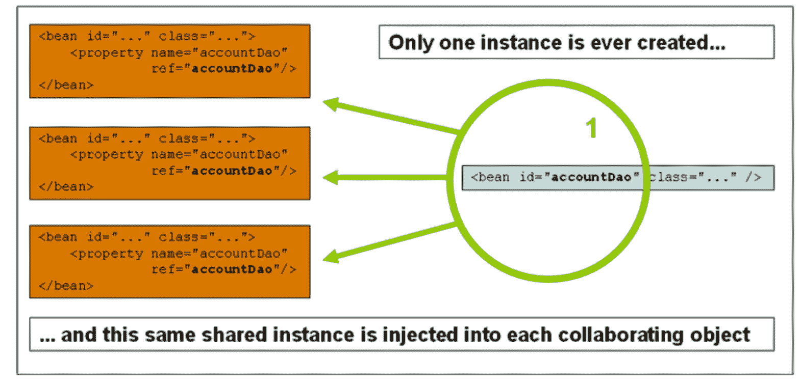
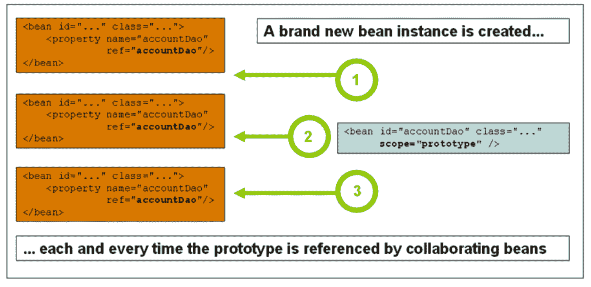

<!--yml
category: 未分类
date: 0001-01-01 00:00:00
-->

# @Bean注解全解析

> 原文：[https://zwmst.com/4706.html](https://zwmst.com/4706.html)

   [ *Java基础* ](https://zwmst.com/java%e5%9f%ba%e7%a1%80)*[ <time datetime="2021-10-10T15:40:52+08:00"> 2021-10-10 </time> ](https://zwmst.com/4706.html)  随着SpringBoot的流行，基于注解式开发的热潮逐渐覆盖了基于XML纯配置的开发，而作为Spring中最核心的bean当然也能够使用注解的方式进行表示。**所以本篇就来详细的讨论一下作为Spring中的Bean到底都有哪些用法。**

## @Bean 基础声明

Spring的@Bean注解用于告诉方法，产生一个Bean对象，然后这个Bean对象交给Spring管理。产生这个Bean对象的方法Spring只会调用一次，随后这个Spring将会将这个Bean对象放在自己的IOC容器中。

SpringIOC 容器管理一个或者多个bean，这些bean都需要在@Configuration注解下进行创建，在一个方法上使用@Bean注解就表明这个方法需要交给Spring进行管理。

快速搭建一个maven项目并配置好所需要的Spring 依赖

```
<dependency>
  <groupId>org.springframework</groupId>
  <artifactId>spring-context</artifactId>
  <version>4.3.13.RELEASE</version>
</dependency>

<dependency>
  <groupId>org.springframework</groupId>
  <artifactId>spring-beans</artifactId>
  <version>4.3.13.RELEASE</version>
</dependency>

<dependency>
  <groupId>org.springframework</groupId>
  <artifactId>spring-core</artifactId>
  <version>4.3.13.RELEASE</version>
</dependency>

<dependency>
  <groupId>org.springframework</groupId>
  <artifactId>spring-web</artifactId>
  <version>4.3.13.RELEASE</version>
</dependency>
```

在src根目录下创建一个`AppConfig`的配置类，这个配置类也就是管理一个或多个bean 的配置类，并在其内部声明一个**myBean**的bean，并创建其对应的实体类

```
@Configuration
public class AppConfig {

    // 使用@Bean 注解表明myBean需要交给Spring进行管理
    // 未指定bean 的名称，默认采用的是 "方法名" + "首字母小写"的配置方式
    @Bean
    public MyBean myBean(){
        return new MyBean();
    }
}

public class MyBean {

    public MyBean(){
        System.out.println("MyBean Initializing");
    }
}
```

在对应的test文件夹下创建一个测试类`SpringBeanApplicationTests`，测试上述代码的正确性

```
public class SpringBeanApplicationTests {

    public static void main(String[] args) {
        ApplicationContext context = new AnnotationConfigApplicationContext(AppConfig.class);
        context.getBean("myBean");
    }
}
```

输出 : MyBean Initializing

随着SpringBoot的流行，我们现在更多采用基于注解式的配置从而替换掉了基于XML的配置，所以本篇文章我们主要探讨基于注解的@Bean以及和其他注解的使用。

## @Bean 基本构成及其使用

在简单介绍了一下如何声明一个Bean组件，并将其交给Spring进行管理之后，下面我们来介绍一下Spring 的基本构成

```
@Target({ElementType.METHOD, ElementType.ANNOTATION_TYPE})
@Retention(RetentionPolicy.RUNTIME)
@Documented
public @interface Bean {

    @AliasFor("name")
    String[] value() default {};

    @AliasFor("value")
    String[] name() default {};

    Autowire autowire() default Autowire.NO;

    String initMethod() default "";

    String destroyMethod() default AbstractBeanDefinition.INFER_METHOD;

}
```

@Bean不仅可以作用在方法上，也可以作用在注解类型上，在运行时提供注册。

**value**： name属性的别名，在不需要其他属性时使用，也就是说value 就是默认值

**name**： 此bean 的名称，或多个名称，主要的bean的名称加别名。如果未指定，则bean的名称是带注解方法的名称。如果指定了，方法的名称就会忽略，如果没有其他属性声明的话，bean的名称和别名可能通过value属性配置

**autowire** ： 此注解的方法表示自动装配的类型，返回一个`Autowire`类型的枚举，我们来看一下`Autowire`枚举类型的概念

```
// 枚举确定自动装配状态：即，bean是否应该使用setter注入由Spring容器自动注入其依赖项。
// 这是Spring DI的核心概念
public enum Autowire {

  // 常量，表示根本没有自动装配。
    NO(AutowireCapableBeanFactory.AUTOWIRE_NO),
    // 常量，通过名称进行自动装配
    BY_NAME(AutowireCapableBeanFactory.AUTOWIRE_BY_NAME),
    // 常量，通过类型进行自动装配
    BY_TYPE(AutowireCapableBeanFactory.AUTOWIRE_BY_TYPE);

    private final int value;
    Autowire(int value) {
        this.value = value;
    }
    public int value() {
        return this.value;
    }
    public boolean isAutowire() {
        return (this == BY_NAME || this == BY_TYPE);
    }
}
```

autowire的默认值为`No`，默认表示不通过自动装配。

**initMethod**: 这个可选择的方法在bean实例化的时候调用，`InitializationBean`接口允许bean在合适的时机通过设置注解的初始化属性从而调用初始化方法，InitializationBean 接口有一个定义好的初始化方法

```
void afterPropertiesSet() throws Exception;
```

> Spring不推荐使用InitializationBean 来调用其初始化方法，因为它不必要地将代码耦合到Spring。Spring推荐使用`@PostConstruct`注解或者为POJO类指定其初始化方法这两种方式来完成初始化。

**不推荐使用：**

```
public class InitBean implements InitializingBean {

    public void afterPropertiesSet() {}
}
```

**destroyMethod**: 方法的可选择名称在调用bean示例在关闭上下文的时候，例如JDBC的close()方法，或者SqlSession的close()方法。`DisposableBean` 接口的实现允许在bean销毁的时候进行回调调用，DisposableBean 接口之后一个单个的方法

```
void destroy() throws Exception;
```

> Spring不推荐使用DisposableBean 的方式来初始化其方法，因为它会将不必要的代码耦合到Spring。作为替代性的建议，Spring 推荐使用`@PreDestory`注解或者为`@Bean`注解提供 destroyMethod 属性，

**不推荐使用：**

```
public class DestroyBean {

    public void cleanup() {}
}
```

`推荐使用：`

```
public class MyBean {

    public MyBean(){
        System.out.println("MyBean Initializing");
    }

    public void init(){
        System.out.println("Bean 初始化方法被调用");
    }

    public void destroy(){
        System.out.println("Bean 销毁方法被调用");
    }
}

@Configuration
public class AppConfig {

//    @Bean
    @Bean(initMethod = "init", destroyMethod = "destroy")
    public MyBean myBean(){
        return new MyBean();
    }

}
```

修改一下测试类，测试其初始化方法和销毁方法在何时会被调用

```
public class SpringBeanApplicationTests {

    public static void main(String[] args) {

        // ------------------------------ 测试一  ------------------------------
        ApplicationContext context = new AnnotationConfigApplicationContext(AppConfig.class);
//        context.getBean("myBean");

        // 变体
        context.getBean("myBean");
        ((AnnotationConfigApplicationContext) context).destroy();
//      ((AnnotationConfigApplicationContext) context).close();
    }
}
```

> 初始化方法在得到Bean的实例的时候就会被调用，销毁方法在容器销毁或者容器关闭的时候会被调用。

## @Bean 注解与其他注解产生的火花

在上面的一个小节中我们了解到了@Bean注解的几个属性，但是对于@Bean注解的功能来讲这有点太看不起bean了，@Bean另外一个重要的功能是能够和其他注解产生化学反应，如果你还不了解这些注解的话，那么请继续往下读，你会有收获的

这一节我们主要探讨`@profile,@scope,@lazy,@depends-on @primary等注解`

### @Profile 注解

@Profile的作用是把一些meta-data进行分类，分成Active和InActive这两种状态，然后你可以选择在active 和在Inactive这两种状态下配置bean，在Inactive状态通常的注解有一个！操作符，通常写为：@Profile("!p"),这里的p是Profile的名字。

**三种设置方式：**

*   可以通过ConfigurableEnvironment.setActiveProfiles()以编程的方式激活

*   可以通过AbstractEnvironment.ACTIVE_PROFILES_PROPERTY_NAME (spring.profiles.active )属性设置为

    JVM属性

*   作为环境变量，或作为web.xml 应用程序的Servlet 上下文参数。也可以通过@ActiveProfiles 注解在集成测试中以声明方式激活配置文件。

**作用域**

*   作为类级别的注释在任意类或者直接与@Component 进行关联，包括@Configuration 类
*   作为原注解，可以自定义注解
*   作为方法的注解作用在任何方法

**注意**:

```
如果一个配置类使用了Profile 标签或者@Profile 作用在任何类中都必须进行启用才会生效，如果@Profile({"p1","!p2"}) 标识两个属性，那么p1 是启用状态 而p2 是非启用状态的。
```

现有一个POJO类为Subject学科类，里面有两个属性，一个是like(理科)属性，一个是wenke(文科)属性，分别有两个配置类，一个是`AppConfigWithActiveProfile` ，一个是`AppConfigWithInactiveProfile`，当系统环境是 "like"的时候就注册 AppConfigWithActiveProfile ，如果是 "wenke"，就注册 AppConfigWithInactiveProfile，来看一下这个需求如何实现

Subject.java

```
// 学科
public class Subject {

    // 理科
    private String like;
    // 文科
    private String wenke;

   get and set ...

    @Override
    public String toString() {
        return "Subject{" +
                "like='" + like + '\'' +
                ", wenke='" + wenke + '\'' +
                '}';
    }
}
```

AppConfigWithActiveProfile.java 注册Profile 为like 的时候

```
@Profile("like")
@Configuration
public class AppConfigWithActiveProfile {

    @Bean
    public Subject subject(){
        Subject subject = new Subject();
        subject.setLike("物理");
        return subject;
    }

}
```

AppConfigWithInactiveProfile.java 注册Profile 为wenke 的时候

```
@Profile("wenke")
@Configuration
public class AppConfigWithInactiveProfile {

    @Bean
    public Subject subject(){
        Subject subject = new Subject();
        subject.setWenke("历史");
        return subject;
    }
}
```

修改一下对应的测试类，设置系统环境，当Profile 为like 和 wenke 的时候分别注册各自对应的属性

```
// ------------------------------ 测试 profile  ------------------------------
AnnotationConfigApplicationContext context = new AnnotationConfigApplicationContext();
// 激活 like 的profile
context.getEnvironment().setActiveProfiles("like");
context.register(AppConfigWithActiveProfile.class,AppConfigWithInactiveProfile.class);
context.refresh();
Subject subject = (Subject) context.getBean("subject");
System.out.println("subject = " + subject);
```

> 把context.getEnvironment().setActiveProfiles("wenke") 设置为wenke，观察其对应的输出内容发生了变化，这就是@Profile的作用，有一层可选择性注册的意味。

### @Scope 注解

在Spring中对于bean的默认处理都是单例的，我们通过上下文容器.getBean方法拿到bean容器，并对其进行实例化，这个实例化的过程其实只进行一次，即多次getBean 获取的对象都是同一个对象，也就相当于这个bean的实例在IOC容器中是public的，对于所有的bean请求来讲都可以共享此bean。



那么假如我不想把这个bean被所有的请求共享或者说每次调用我都想让它生成一个bean实例该怎么处理呢？

**多例Bean**

bean的非单例原型范围会使每次发出对该特定bean的请求时都创建新的bean实例，也就是说，bean被注入另一个bean，或者通过对容器的getBean()方法调用来请求它，可以用如下图来表示：



通过一个示例来说明bean的多个实例

新建一个`AppConfigWithAliasAndScope`配置类，用来定义多例的bean，

```
@Configuration
public class AppConfigWithAliasAndScope {

    /**
     * 为myBean起两个名字，b1 和 b2
     * @Scope 默认为 singleton，但是可以指定其作用域
     * prototype 是多例的，即每一次调用都会生成一个新的实例。
     */
    @Bean({"b1","b2"})
    @Scope("prototype")
    public MyBean myBean(){
        return new MyBean();
    }
}
```

测试一下多例的情况：

```
// ------------------------------ 测试scope  ------------------------------
ApplicationContext context = new AnnotationConfigApplicationContext(AppConfigWithAliasAndScope.class);
MyBean myBean = (MyBean) context.getBean("b1");
MyBean myBean2 = (MyBean) context.getBean("b2");
System.out.println(myBean);
System.out.println(myBean2);
```

**其他情况**

除了多例的情况下，Spring还为我们定义了其他情况：

| Scope | Descriptionn |
| --- | --- |
| singleton | 默认单例的bean定义信息，对于每个IOC容器来说都是单例对象 |
| prototype | bean对象的定义为任意数量的对象实例 |
| request | bean对象的定义为一次HTTP请求的生命周期，也就是说，每个HTTP请求都有自己的bean实例，它是在单个bean定义的后面创建的。仅仅在web-aware的上下文中有效 |
| session | bean对象的定义为一次HTTP会话的生命周期。仅仅在web-aware的上下文中有效 |
| application | bean对象的定义范围在ServletContext生命周期内。仅仅在web-aware的上下文中有效 |
| websocket | bean对象的定义为WebSocket的生命周期内。仅仅在web-aware的上下文中有效 |

> singleton和prototype 一般都用在普通的Java项目中，而request、session、application、websocket都用于web应用中。

**request、session、application、websocket**的作用范围

你可以体会到 request、session、application、websocket 的作用范围在当你使用web-aware的ApplicationContext应用程序上下文的时候，比如`XmlWebApplicationContext`的实现类。如果你使用了像是`ClassPathXmlApplicationContext`的上下文环境时，就会抛出`IllegalStateException`因为Spring不认识这个作用范围。

### @Lazy 注解

`@Lazy` : 表明一个bean 是否延迟加载，可以作用在方法上，表示这个方法被延迟加载；可以作用在@Component (或者由@Component 作为原注解) 注释的类上，表明这个类中所有的bean 都被延迟加载。如果没有@Lazy注释，或者@Lazy 被设置为false，那么该bean 就会急切渴望被加载；除了上面两种作用域，@Lazy 还可以作用在@Autowired和@Inject注释的属性上，在这种情况下，它将为该字段创建一个惰性代理，作为使用ObjectFactory或Provider的默认方法。下面来演示一下：

```
@Lazy
@Configuration
@ComponentScan(basePackages = "com.spring.configuration.pojo")
public class AppConfigWithLazy {

    @Bean
    public MyBean myBean(){
        System.out.println("myBean Initialized");
        return new MyBean();
    }

    @Bean
    public MyBean IfLazyInit(){
        System.out.println("initialized");
        return new MyBean();
    }
}
```

*   修改测试类

```
public class SpringConfigurationApplication {

    public static void main(String[] args) {

        AnnotationConfigApplicationContext context = new AnnotationConfigApplicationContext(AppConfigWithLazy.class);

        // 获取启动过程中的bean 定义的名称
        for(String str : context.getBeanDefinitionNames()){
            System.out.println("str = " + str);
        }
    }
}
```

输出你会发现没有关于bean的定义信息，但是当把@Lazy 注释拿掉，你会发现输出了关于bean的初始化信息

### @DependsOn 注解

指当前bean所依赖的bean。任何指定的bean都能保证在此bean创建之前由IOC容器创建。在bean没有通过属性或构造函数参数显式依赖于另一个bean的情况下很少使用，可能直接使用在任何直接或者间接使用 Component 或者Bean 注解表明的类上。来看一下具体的用法

新建三个Bean，分别是FirstBean、SecondBean、ThirdBean三个普通的bean，新建`AppConfigWithDependsOn`并配置它们之间的依赖关系

```
public class FirstBean {

    @Autowired
    private SecondBean secondBean;

    @Autowired
    private ThirdBean thirdBean;

    public FirstBean() {
        System.out.println("FirstBean Initialized via Constuctor");
    }
}

public class SecondBean {

    public SecondBean() {
        System.out.println("SecondBean Initialized via Constuctor");
    }
}

public class ThirdBean {

    public ThirdBean() {
        System.out.println("ThirdBean Initialized via Constuctor");
    }
}

@Configuration
public class AppConfigWithDependsOn {

    @Bean("firstBean")
    @DependsOn(value = {
            "secondBean",
            "thirdBean"
    })
    public FirstBean firstBean() {
        return new FirstBean();
    }

    @Bean("secondBean")
    public SecondBean secondBean() {
        return new SecondBean();
    }

    @Bean("thirdBean")
    public ThirdBean thirdBean() {
        return new ThirdBean();
    }
}
```

使用测试类进行测试，如下

```
// ------------------------------ 测试 DependsOn  ------------------------------
AnnotationConfigApplicationContext context = new AnnotationConfigApplicationContext(AppConfigWithDependsOn.class);
context.getBean(FirstBean.class);
context.close();
```

输出 :

```
SecondBean Initialized via Constuctor
ThirdBean Initialized via Constuctor
FirstBean Initialized via Constuctor
```

由于firstBean 的创建过程首先需要依赖`secondBean` 和 `thirdBean`的创建，所以secondBean 首先被加载其次是thirdBean 最后是firstBean。

如果把@DependsOn 注解加在`AppConfigWithDependsOn` 类上则它们的初始化顺序就会变为 firstBean、secondBean、thirdBean

### @Primary 注解

指示当多个候选者有资格自动装配依赖项时，应优先考虑bean。此注解在语义上就等同于在Spring XML中定义的bean 元素的primary属性。注意： 除非使用component-scanning进行组件扫描，否则在类级别上使用@Primary不会有作用。如果@Primary 注解定义在XML中，那么@Primary 的注解元注解就会忽略，相反使用<bean primary="true|false"></bean>

**@Primary 的两种使用方式**

*   与@Bean 一起使用，定义在方法上，方法级别的注解
*   与@Component 一起使用，定义在类上，类级别的注解

通过一则示例来演示一下：

新建一个`AppConfigWithPrimary`类，在方法级别上定义@Primary注解

```
@Configuration
public class AppConfigWithPrimary {

    @Bean
    public MyBean myBeanOne(){
        return new MyBean();
    }

    @Bean
    @Primary
    public MyBean myBeanTwo(){
        return new MyBean();
    }
}
```

上面代码定义了两个bean ，其中myBeanTwo 由@Primary 进行标注，表示它首先会进行注册，使用测试类进行测试

```
// ------------------------------ 测试 Primary  ------------------------------
AnnotationConfigApplicationContext context = new AnnotationConfigApplicationContext(AppConfigWithPrimary.class);
MyBean bean = context.getBean(MyBean.class);
System.out.println(bean);
```

> 你可以尝试放开@Primary ，使用测试类测试的话会发现出现报错信息，因为你尝试获取的是MyBean.class,而我们代码中定义了两个MyBean 的类型，所以需要@Primary 注解表明哪一个bean需要优先被获取。

文章参考：

[spring @Profile的运用示例](https://www.cnblogs.com/1540340840qls/p/7942017.html)

[https://www.javaguides.net/2018/10/spring-dependson-annotation-example.html](https://www.javaguides.net/2018/10/spring-dependson-annotation-example.html)*