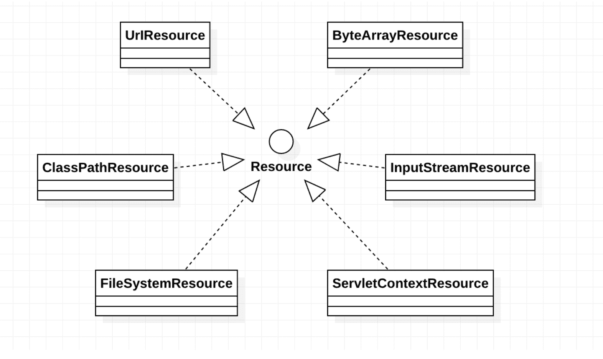

<!--yml
category: 未分类
date: 0001-01-01 00:00:00
--->

# Resource体系介绍

> 原文：[https://zwmst.com/4716.html](https://zwmst.com/4716.html)

   [ *Java基础* ](https://zwmst.com/java%e5%9f%ba%e7%a1%80)*[ <time datetime="2021-10-10T15:42:13+08:00"> 2021-10-10 </time> ](https://zwmst.com/4716.html)  ## Resource介绍

在使用spring作为容器进行项目开发中会有很多的配置文件，这些配置文件都是通过Spring的Resource接口来实现加载，但是，Resource对于所有低级资源的访问都不够充分。例如，没有标准化的URL实现可用于访问需要从类路径或相对于`ServletContext`获取的资源。（更多关于`ServletContext`的理解，请访问https://www.cnblogs.com/cxuanBlog/p/10927813.html）虽然可以为专用的URL前缀注册新的处理程序（类似于http :)这样的前缀的现有处理程序，但这通常非常复杂，并且URL接口仍然缺少一些理想的功能，例如检查存在的方法被指向的资源。

### JavaDoc解释

从实际类型的底层资源（例如文件或类路径资源）中抽象出来的资源描述符的接口。

### Resource接口方法

Spring的Resource接口旨在成为一个更有能力的接口，用于抽象对低级资源的访问。以下清单显示了Resource接口定义

```
public interface Resource extends InputStreamSource {

  boolean exists();

  default boolean isReadable() {
        return true;
    }

  default boolean isOpen() {
        return false;
    }

  default boolean isFile() {
        return false;
    }

  URL getURL() throws IOException;

  URI getURI() throws IOException;

  File getFile() throws IOException;

  default ReadableByteChannel readableChannel() throws IOException {
        return Channels.newChannel(getInputStream());
    }

  long contentLength() throws IOException;

  long lastModified() throws IOException;

  Resource createRelative(String relativePath) throws IOException;

    String getFilename();

  String getDescription();
}
```

Resource接口继承了`InputStreamSource`接口，提供了很多`InputStreamSource`所没有的方法

下面来看一下`InputStreamSource`接口，只有一个方法

```
public interface InputStreamSource {

    InputStream getInputStream() throws IOException;

}
```

**其中一些大部分重要的接口是：**

*   `getInputStream()`: 找到并打开资源，返回一个InputStream以从资源中读取。预计每次调用都会返回一个新的InputStream()，调用者有责任关闭每个流
*   `exists()`: 返回一个布尔值，表明某个资源是否以物理形式存在
*   `isOpen`: 返回一个布尔值，指示此资源是否具有开放流的句柄。如果为true，InputStream就不能够多次读取，只能够读取一次并且及时关闭以避免内存泄漏。对于所有常规资源实现，返回false，但是**InputStreamResource**除外。
*   `getDescription()`: 返回资源的描述，用来输出错误的日志。这通常是完全限定的文件名或资源的实际URL。

其他方法：

*   `isReadable()`: 表明资源的目录读取是否通过getInputStream()进行读取。
*   `isFile()`: 表明这个资源是否代表了一个文件系统的文件。
*   `getURL()`: 返回一个URL句柄，如果资源不能够被解析为URL，将抛出IOException
*   `getURI()`: 返回一个资源的URI句柄
*   `getFile()`: 返回某个文件，如果资源不能够被解析称为绝对路径，将会抛出FileNotFoundException
*   `lastModified()`: 资源最后一次修改的时间戳
*   `createRelative()`: 创建此资源的相关资源
*   `getFilename()`: 资源的文件名是什么 例如：最后一部分的文件名 myfile.txt

## Resource的实现类

Resource 接口是 Spring 资源访问策略的抽象，它本身并不提供任何资源访问实现，具体的资源访问由该接口的实现类完成——每个实现类代表一种资源访问策略。

### 基础类介绍

Resource一般包括这些实现类：**UrlResource、ClassPathResource、FileSystemResource、ServletContextResource、InputStreamResource、ByteArrayResource**

#### 使用UrlResource访问网络资源

访问网络资源的实现类。Resource的一个实现类用来定位URL中的资源。它支持URL的绝对路径，用来作为file: 端口的一个资源，创建一个maven项目，配置Spring依赖(不再赘述)和dom4j 的依赖，并在根目录下创建一个books.xml。

代码表示：

```
public class UrlResourceTest {

    public static void loadAndReadUrlResource(String path) throws Exception{
        // 创建一个 Resource 对象，指定从文件系统里读取资源，相对路径
        UrlResource resource = new UrlResource(path);
        // 绝对路径
//        UrlResource resource = new UrlResource("file:///Users/mr.l/test/CXuan-Spring/CXuan-Spring-Resource/books.xml");
        // 获取文件名
        System.out.println("resource.getFileName = " + resource.getFilename());
        // 获取文件描述
        System.out.println("resource.getDescription = "+ resource.getDescription());
        SAXReader reader = new SAXReader();
        System.out.println(resource.getFile());
        Document document = reader.read("file:///Users/mr.l/test/CXuan-Spring/CXuan-Spring-Resource/books.xml");
        Element parent = document.getRootElement();
        List<Element> elements = parent.elements();
        for(Element element : elements){
            // 获取name,description,price
            System.out.println(element.getName() + " = " +element.getText());
        }
    }

    public static void main(String[] args) throws Exception {
        loadAndReadUrlResource("file:books.xml");
    }

}
```

上面程序使用UrlResource来访问网络资源，也可以通过file 前缀访问本地资源，上述代码就是这样做的。如果要访问网络资源，可以有两种形式

*   http:－该前缀用于访问基于 HTTP 协议的网络资源。
*   ftp:－该前缀用于访问基于 FTP 协议的网络资源。

#### 使用ClassPathResource 访问类加载路径下的资源

ClassPathResource 用来访问类加载路径下的资源，相对于其他的 Resource 实现类，其主要优势是方便访问类加载路径里的资源，尤其对于 Web 应用，ClassPathResource 可自动搜索位于 WEB-INF/classes 下的资源文件，无须使用绝对路径访问。

```
public class ClassPathResourceTest {

    public static void loadAndReadUrlResource(String path) throws Exception{
        // 创建一个 Resource 对象，指定从文件系统里读取资源，相对路径
        ClassPathResource resource = new ClassPathResource(path);
        // 绝对路径
//        UrlResource resource = new UrlResource("file:///Users/mr.l/test/CXuan-Spring/CXuan-Spring-Resource/books.xml");
        // 获取文件名
        System.out.println("resource.getFileName = " + resource.getFilename());
        // 获取文件描述
        System.out.println("resource.getDescription = "+ resource.getDescription());
        SAXReader reader = new SAXReader();
        System.out.println(resource.getPath());
        Document document = reader.read("file:///Users/mr.l/test/CXuan-Spring/CXuan-Spring-Resource/books.xml");
        Element parent = document.getRootElement();
        List<Element> elements = parent.elements();
        for(Element element : elements){
            // 获取name,description,price
            System.out.println(element.getName() + " = " +element.getText());
        }
    }

    public static void main(String[] args) throws Exception {
        loadAndReadUrlResource("books.xml");
    }
}
```

除了以上新建方式的不同，其他代码和上述代码一致，这就是 Spring 资源访问的优势：Spring 的资源访问消除了底层资源访问的差异，允许程序以一致的方式来访问不同的底层资源。

#### 使用FileSystemResource 访问文件资源系统

Spring 提供的 FileSystemResource 类用于访问文件系统资源，使用 FileSystemResource 来访问文件系统资源并没有太大的优势，因为 Java 提供的 File 类也可用于访问文件系统资源。

当然使用 FileSystemResource 也可消除底层资源访问的差异，程序通过统一的 Resource API 来进行资源访问。下面程序是使用 FileSystemResource 来访问文件系统资源的示例程序。

```
public class FileSystemResourceTest {

    public static void loadAndReadUrlResource(String path) throws Exception{
        // 创建一个 Resource 对象，指定从文件系统里读取资源，相对路径
        FileSystemResource resource = new FileSystemResource(path);
        // 绝对路径
//        UrlResource resource = new UrlResource("file:///Users/mr.l/test/CXuan-Spring/CXuan-Spring-Resource/books.xml");
        // 获取文件名
        System.out.println("resource.getFileName = " + resource.getFilename());
        // 获取文件描述
        System.out.println("resource.getDescription = "+ resource.getDescription());
        SAXReader reader = new SAXReader();
        System.out.println(resource.getFile());
        Document document = reader.read("file:///Users/mr.l/test/CXuan-Spring/CXuan-Spring-Resource/books.xml");
        Element parent = document.getRootElement();
        List<Element> elements = parent.elements();
        for(Element element : elements){
            // 获取name,description,price
            System.out.println(element.getName() + " = " +element.getText());
        }
    }

    public static void main(String[] args) throws Exception {
        loadAndReadUrlResource("books.xml");
    }
}
```

FileSystemResource 实例可使用 FileSystemResource 构造器显式地创建。但更多的时候它都是隐式创建的，执行 Spring 的某个方法时，该方法接受一个代表资源路径的字符串参数，当 Spring 识别该字符串参数中包含 file: 前缀后，系统将会自动创建 FileSystemResource 对象。

#### ServletContextResource

这是ServletContext资源的Resource实现，它解释相关Web应用程序根目录中的相对路径。

它始终支持流(stream)访问和URL访问，但只有在扩展Web应用程序存档且资源实际位于文件系统上时才允许java.io.File访问。无论它是在文件系统上扩展还是直接从JAR或其他地方（如数据库）访问，实际上都依赖于Servlet容器。

#### InputStreamResource

InputStreamResource 是给定的输入流(InputStream)的Resource实现。它的使用场景在没有特定的资源实现的时候使用(感觉和@Component 的适用场景很相似)。

与其他Resource实现相比，这是已打开资源的描述符。 因此，它的**isOpen()**方法返回true。如果需要将资源描述符保留在某处或者需要多次读取流，请不要使用它。

#### ByteArrayResource

字节数组的Resource实现类。通过给定的数组创建了一个**ByteArrayInputStream**。

它对于从任何给定的字节数组加载内容非常有用，而无需求助于单次使用的InputStreamResource。

### Resource类图与策略模式

上述Resource实现类与Resource顶级接口之间的关系可以用下面的UML关系模型来表示



#### 策略模式

上述流程图是不是对同一行为的不同实现方式，这种实现方式像极了策略模式？具体关于策略模式的文章，请参考

[https://www.runoob.com/design-pattern/strategy-pattern.html](https://www.runoob.com/design-pattern/strategy-pattern.html)

## ResourceLoader 接口

**ResourceLoader**接口旨在由可以返回(即加载)Resource实例的对象实现，该接口实现类的实例将获得一个 ResourceLoader 的引用。下面是ResourceLoader的定义

```
public interface ResourceLoader {

    //该接口仅包含这个方法，该方法用于返回一个 Resource 实例。ApplicationContext 的实现类都实现       ResourceLoader 接口，因此 ApplicationContext 可用于直接获取 Resource 实例
    Resource getResource(String location);

}
```

所有的应用程序上下文都实现了**ResourceLoader**接口。因此，所有的应用程序上下文都可能会获取**Resource**实例。

在特定应用程序上下文上调用getResource（）并且指定的位置路径没有特定前缀时，将返回适合该特定应用程序上下文的Resource类型。 例如，假设针对ClassPathXmlApplicationContext实例执行了以下代码：

```
Resource template = ctx.getResource("some/resource/path/myTemplate.txt");
```

你暂时不知道具体的上下文资源类型是什么，假设指定的是`ClassPathXmlApplicationContext`，上述代码就会返回`ClassPathResource`，如果执行上面相同的方法的是`FileSystemXmlApplicationContext`，上述代码就会返回的是`FileSystemResource`，对于web系统来说，如果上下文容器时候`WebApplicationContext`，那么返回的将是`ServletContextResource`，它同样会为每个上下文返回适当的对象。因此，您可以以适合特定应用程序上下文的方式加载资源。

另一方面，你可能强制使用`ClassPathResource`，忽略应用程序的上下文类型，通过添加特定的前缀**classpath:**，以下示例说明了这一点。

```
Resource template = ctx.getResource("classpath:some/resource/path/myTemplate.txt");
```

同样的，你能够强制使用`UrlResource`通过使用特定的前缀：java.net.URL。下述两个例子分别表示使用`http`和`file`前缀。

```
Resource template = ctx.getResource("file:///some/resource/path/myTemplate.txt");

Resource template = ctx.getResource("https://myhost.com/resource/path/myTemplate.txt");
```

下列表格对资源类型和前缀进行更好的汇总：

| Prefix | Example | Explanation |
| --- | --- | --- |
| classpath: | classpath:com/myapp/config.xml | 从类路径加载 |
| file: | file:///data/config.xml | 从文件系统加载作为URL，查阅FileSystemResource |
| http: | [https://myserver/logo.png](https://myserver/logo.png) | 加载作为URL |
| (none) | /data/config.xml | 依赖于ApplicationContext |

### ResourceLoaderAware 接口

这个`ResourceLoaderAware`接口是一个特殊的回调接口，用于标识希望随ResourceLoader引用提供的组件，下面是ResourceLoaderAware 接口的定义

```
public interface ResourceLoaderAware extends Aware {

    void setResourceLoader(ResourceLoader resourceLoader);
} 
```

ResourceLoaderAware 接口用于指定该接口的实现类必须持有一个 ResourceLoader 实例。

类似于`BeanNameAware`，`BeanFactoryAware`接口，`ResourceLoaderAware`接口也提供了一个**setResourceLoader()**方法，该方法由Spring容器负责，Spring 容器会将一个 ResourceLoader 对象作为该方法的参数传入。

当然了，一个 bean 若想加载指定路径下的资源，除了刚才提到的实现 ResourcesLoaderAware 接口之外（将 ApplicationContext 作为一个 ResourceLoader 对象注入），bean 也可以实现 ApplicationContextAware 接口，这样可以直接使用应用上下文来加载资源。但总的来说，在需求满足都满足的情况下，最好是使用的专用 ResourceLoader 接口，因为这样代码只会与接口耦合，而不会与整个 spring ApplicationContext 耦合。与 ResourceLoader 接口耦合，抛开 spring 来看，就是提供了一个加载资源的工具类接口。由于ApplicationContext也是一个ResourceLoader，因此bean还可以实现ApplicationContextAware接口并直接使用提供的应用程序上下文来加载资源。但是，通常情况下，如果有需要的话最好还是使用特定的ResourceLoader接口。

在应用程序的组件中，除了实现 ResourceLoaderAware 接口，也可采取另外一种替代方案——依赖于 ResourceLoader 的自动装配。传统的构造函数注入和byType自动装配模式(如自动装配协作者中所述)能够分别为构造函数参数或setter方法参数提供ResourceLoader。若为了获得更大的灵活性(包括属性注入的能力和多参方法)，可以考虑使用基于注解的新注入方式。使用注解 [@Autowiring](https://github.com/Autowiring) 标记 ResourceLoader 变量，便可将其注入到成员属性、构造参数或方法参数中。

### 使用Resource作为属性

前面介绍了 Spring 提供的资源访问策略，但这些依赖访问策略要么需要使用 Resource 实现类，要么需要使用 ApplicationContext 来获取资源。实际上，当应用程序中的 Bean 实例需要访问资源时，Spring 有更好的解决方法：直接利用依赖注入。

从这个意义上来看，Spring 框架不仅充分利用了策略模式来简化资源访问，而且还将策略模式和 IoC 进行充分地结合，最大程度地简化了 Spring 资源访问。

归纳起来，如果 Bean 实例需要访问资源，有如下两种解决方案：

*   代码中获取 Resource 实例。
*   使用依赖注入。

对于第一种方式的资源访问，当程序获取 Resource 实例时，总需要提供 Resource 所在的位置，不管通过 FileSystemResource 创建实例，还是通过 ClassPathResource 创建实例，或者通过 ApplicationContext 的 getResource() 方法获取实例，都需要提供资源位置。这意味着：资源所在的物理位置将被耦合到代码中，如果资源位置发生改变，则必须改写程序。因此，通常建议采用第二种方法，让 Spring 为 Bean 实例依赖注入资源。

以下示例说明了这一点(可以使用set方法注入)：

```
public class TestBean {

    private Resource resource;

    public Resource getResource() {
        return resource;
    }

    public void setResource(Resource resource) {
        this.resource = resource;
    }

    public void parse() throws Exception {
        // 获取文件名
        System.out.println("resource.getFileName = " + resource.getFilename());
        // 获取文件描述
        System.out.println("resource.getDescription = "+ resource.getDescription());
        SAXReader reader = new SAXReader();
        Document document = reader.read("file:///Users/mr.l/test/CXuan-Spring/CXuan-Spring-Resource/books.xml");
        Element parent = document.getRootElement();
        List<Element> elements = parent.elements();
        for(Element element : elements){
            // 获取name,description,price
            System.out.println(element.getName() + " = " +element.getText());
        }
    }

    public static void main(String[] args) throws Exception {
        TestBean testBean = new TestBean();
        testBean.setResource(new ClassPathResource("beans.xml"));
        testBean.parse();
    }
}
```

上面配置文件配置了资源的位置，并使用了 classpath: 前缀，这指明让 Spring 从类加载路径里加载 book.xml 文件。与前面类似的是，此处的前缀也可采用 http:、ftp: 等，这些前缀将强制 Spring 采用怎样的资源访问策略（也就是指定具体使用哪个 Resource 实现类）；如果不采用任何前缀，则 Spring 将采用与该 ApplicationContext 相同的资源访问策略来访问资源。

```
<property name="template" value="classpath:some/resource/path/myTemplate.txt">
<property name="template" value="file:///some/resource/path/myTemplate.txt"/>
```

### 应用程序上下文和资源路径

本节介绍如何使用资源创建应用程序上下文，包括使用XML的快捷方式，如何使用通配符以及其他详细信息。

#### 构造应用程序上下文

应用程序上下文构造函数（对于特定的应用程序上下文类型）通常将字符串或字符串数组作为资源的位置路径，例如构成上下文定义的XML文件。

当这样的位置路径没有前缀时，从该路径构建并用于加载bean定义的特定资源类型取决于并且适合于特定的应用程序上下文。 例如，请考虑以下示例，该示例创建ClassPathXmlApplicationContext：

```
ApplicationContext ctx = new ClassPathXmlApplicationContext("conf/appContext.xml");
```

bean 定义从类路径中加载，因为ClassPathResource被使用了，然而，考虑以下例子，创建了一个`FileSystemXmlApplicationContext`:

```
ApplicationContext ctx = new FileSystemXmlApplicationContext("conf/appContext.xml");
```

现在bean的定义信息会从文件系统中加载，请注意，在位置路径上使用特殊类路径前缀或标准URL前缀会覆盖为加载定义而创建的默认资源类型。 请考虑以下示例：

```
ApplicationContext ctx = new FileSystemXmlApplicationContext("classpath:conf/appContext.xml");
```

创建 Spring 容器时，系统将从类加载路径来搜索 appContext.xml；但使用 ApplicationContext 来访问资源时，依然采用的是 FileSystemResource 实现类，这与 FileSystemXmlApplicationContext 的访问策略是一致的。这表明：通过 classpath: 前缀指定资源访问策略仅仅对当次访问有效，程序后面进行资源访问时，还是会根据 AppliactionContext 的实现类来选择对应的资源访问策略。

#### 应用程序上下文路径中的通配符

上下文构造资源的路径可能是一些简单路径，但是对于每一个映射来说，不可能只有简单路径，也会有特殊复杂的路径出现，这就需要使用到路径通配符(ant-style)。

> **ant-style示例**
> 
> ```
> /WEB-INF/*-context.xml
> com/mycompany/**/applicationContext.xml
> file:C:/some/path/*-context.xml
> classpath:com/mycompany/**/applicationContext.xml
> ```

**classpath* 和 classpath**的区别：

classpath*: 当使用 classpath* :时前缀来指定 XML 配置文件时，系统将搜索类加载路径，找出所有与文件名的文件，分别装载文件中的配置定义，最后合并成一个 ApplicationContext。

```
public static void main(String[] args) throws Exception { 
  // 使用 classpath* 装载多份配置文件输出 ApplicationContext 实例。
  ApplicationContext ctx = new FileSystemXmlApplicationContext("classpath*:bean.xml");
  System.out.println(ctx); 
}
```

如果不是采用 classpath*: 前缀，而是改为使用 classpath: 前缀，Spring 只加载第一份符合条件的 XML 文件，例如如下代码

```
ApplicationContext ctx = new FileSystemXmlApplicationContext("classpath:bean.xml");
```

当使用 classpath: 前缀时，系统通过类加载路径搜索 bean.xml 文件，如果找到文件名匹配的文件，系统立即停止搜索，装载该文件，即使有多份文件名匹配的文件，系统只装载第一份文件。

**路径匹配**

另外，还有一种可以一次性装载多份配置文件的方式：指定配置文件时指定使用通配符，例如如下代码：

```
ApplicationContext ctx = new ClassPathXmlApplicationContext("bean*.xml");
```

除此之外，Spring 甚至允许将 classpath*: 前缀和通配符结合使用，如下语句也是合法的：

```
ApplicationContext ctx = new FileSystemXmlApplicationContext("classpath*:bean*.xml");
```

**file 前缀的用法**

相对路径的写法：

```
ApplicationContext ctx = new FileSystemXmlApplicationContext("bean.xml");
```

绝对路径的写法：

```
ApplicationContext ctx = new FileSystemXmlApplicationContext("/bean.xml");
```

如果程序中需要访问绝对路径，则不要直接使用 FileSystemResource 或 FileSystemXmlApplicationContext 来指定绝对路径。建议强制使用 file: 前缀来区分相对路径和绝对路径，例如如下两行代码

```
ApplicationContext ctx = new FileSystemXmlApplicationContext("file:bean.xml"); 
ApplicationContext ctx = new FileSystemXmlApplicationContext("file:/bean.xml");
```*