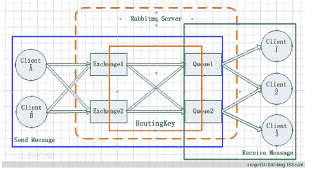

<!--yml
category: 未分类
date: 0001-01-01 00:00:00
--->

# 1239.RabbitMQ结构

> 原文：[https://zwmst.com/5785.html](https://zwmst.com/5785.html)

   [ *RabbitMQ* ](https://zwmst.com/rabbitmq)*[ <time datetime="2021-10-31T06:21:15+08:00"> 2021-10-30 </time> ](https://zwmst.com/5785.html)  

1.  Broker：简单来说就是消息队列服务器实体。
2.  Exchange：消息交换机，它指定消息按什么规则，路由到哪个队列。
3.  Queue：消息队列载体，每个消息都会被投⼊到⼀个或多个队列。
4.  Binding：绑定，它的作⽤就是把exchange和queue按照路由规则绑定起来。
5.  Routing Key：路由关键字，exchange根据这个关键字进⾏消息投递。
6.  vhost：虚拟主机，⼀个broker⾥可以开设多个vhost，⽤作不同⽤户的权限分离。
7.  producer：消息⽣产者，就是投递消息的程序。
8.  consumer：消息消费者，就是接受消息的程序。
9.  channel：消息通道，在客户端的每个连接⾥，可建⽴多个channel，每个channel代表⼀个会话任务。*