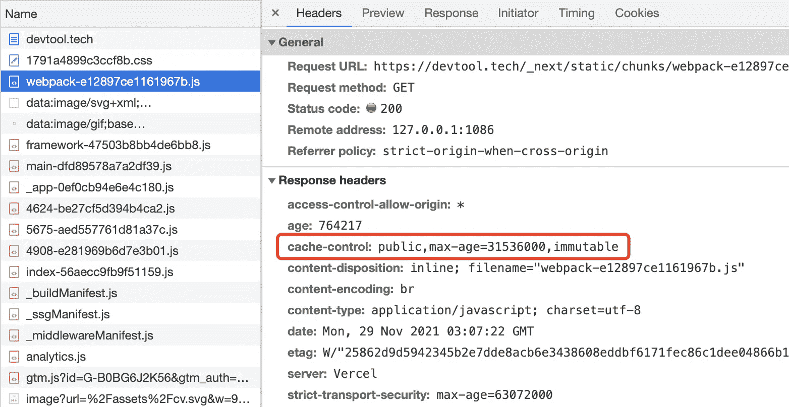
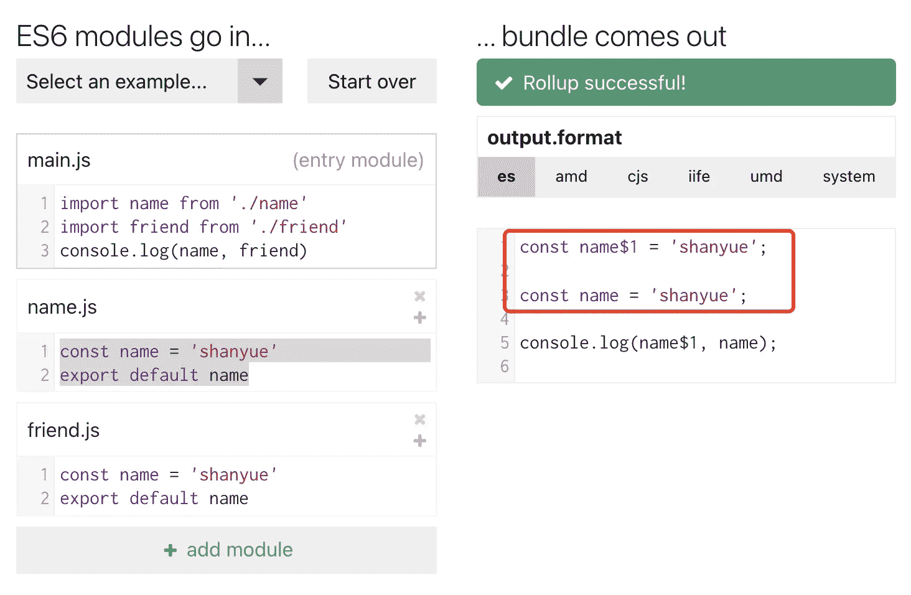
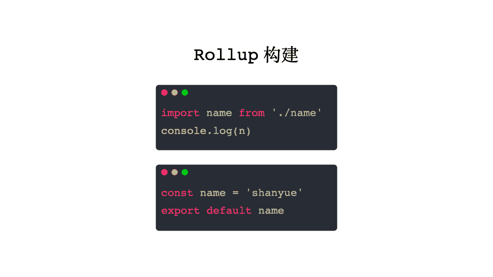
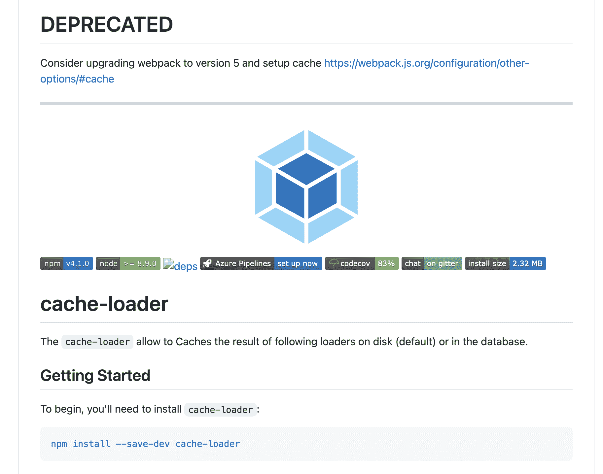
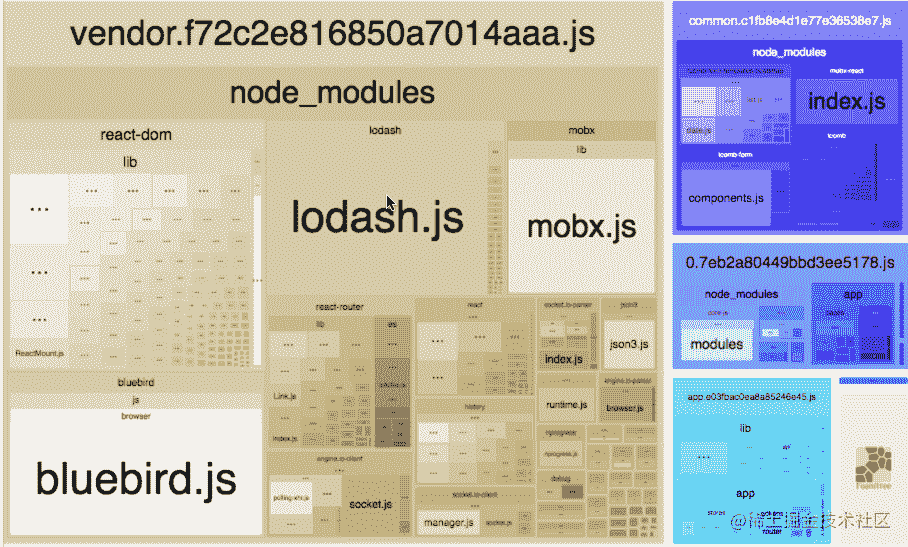

# webpack

# webpack 是用来做什么的，原理是什么

> 原文：[https://q.shanyue.tech/fe/webpack/73.html](https://q.shanyue.tech/fe/webpack/73.html)

Issue

欢迎在 Gtihub Issue 中回答此问题: [Issue 73(opens new window)](https://github.com/shfshanyue/Daily-Question/issues/73)

Author

回答者: [lf75152798(opens new window)](https://github.com/lf75152798)

https://juejin.im/post/5e01de37f265da33ab637daf?utm_source=gold_browser_extension

Author

回答者: [spicylemonhaha(opens new window)](https://github.com/spicylemonhaha)

感觉没有怎么说到原理的东西哇

# webpack 中的 loader 的作用是什么

> 原文：[https://q.shanyue.tech/fe/webpack/74.html](https://q.shanyue.tech/fe/webpack/74.html)

Issue

欢迎在 Gtihub Issue 中回答此问题: [Issue 74(opens new window)](https://github.com/shfshanyue/Daily-Question/issues/74)

Author

回答者: [wang120140(opens new window)](https://github.com/wang120140)

哎 lodaer 的作用就是处理单个文件的 跳到这啥都没有

Author

回答者: [Linya-IronMan(opens new window)](https://github.com/Linya-IronMan)

`webpack`是基于 node 的，只能处理 `JS`和 `JSON`文件，loader 的作用是用来处理其他类型的文件（less\vue....等） 可以将 less 转成 css 文件，将 `jsx`处理成 `JS`文件，将其他版本的 ES 处理成浏览器能识别的 ES 版本

Author

回答者: [shfshanyue(opens new window)](https://github.com/shfshanyue)

`loader` 用以对某个文件进行 `import` 或者 `require`，在此过程中可能会涉及到解析与编译，如 `js` 通过 `babel` 进行编译。

以下是 `url-loader` 的源码，用以转化为 Base64 URL 的一个 loader，从中可以看出它把源代码 `content` 转化为被 webpack 支持的模块 `module.exports = ***`

```
function getEncodedData(generator, mimetype, encoding, content, resourcePath) {
  if (generator) {
    return generator(content, mimetype, encoding, resourcePath);
  }

  return `data:${mimetype}${encoding ? `;${encoding}` : ""},${content.toString(
    // eslint-disable-next-line no-undefined
    encoding || undefined
  )}`;
}

export default function loader(content) {
  // Loader Options
  const options = getOptions(this) || {};

  validate(schema, options, {
    name: "URL Loader",
    baseDataPath: "options",
  });

  if (shouldTransform(options.limit, content.length)) {
    const { resourcePath } = this;
    const mimetype = getMimetype(options.mimetype, resourcePath);
    const encoding = getEncoding(options.encoding);

    if (typeof content === "string") {
      // eslint-disable-next-line no-param-reassign
      content = Buffer.from(content);
    }

    const encodedData = getEncodedData(
      options.generator,
      mimetype,
      encoding,
      content,
      resourcePath
    );

    const esModule =
      typeof options.esModule !== "undefined" ? options.esModule : true;

    return `${
      esModule ? "export default" : "module.exports ="
    }  ${JSON.stringify(encodedData)}`;
  }

  // 忽略
}

// Loader Mode
export const raw = true; 
```

# 有没有自己写过一个 webpack 的 loader

> 原文：[https://q.shanyue.tech/fe/webpack/75.html](https://q.shanyue.tech/fe/webpack/75.html)

Issue

欢迎在 Gtihub Issue 中回答此问题: [Issue 75(opens new window)](https://github.com/shfshanyue/Daily-Question/issues/75)

Author

回答者: [wang120140(opens new window)](https://github.com/wang120140)

我看过源码 没有写过

# webpack 中 plugin 的作用是什么，有没有自己写过

> 原文：[https://q.shanyue.tech/fe/webpack/76.html](https://q.shanyue.tech/fe/webpack/76.html)

Issue

欢迎在 Gtihub Issue 中回答此问题: [Issue 76(opens new window)](https://github.com/shfshanyue/Daily-Question/issues/76)

Author

回答者: [swingpenguin(opens new window)](https://github.com/swingpenguin)

loaders 的作用是转换其他类型的语言到 JS 语言, plugins 可以做其他所有 loaders 做不了的事情, 比如:

*   bundle optimization(bundle 优化)
*   assets management(assets 管理)
*   injection of environment variables(注入环境变量)
*   etc.

实际上 plugins 是 webpack 的基石, webpack 就是在 plugin system 上建立起来的.

为了使用 plugins, 我们需要 **require()** 并将它加入 **plugins** 数组.

```
// webpack.config.js

const HtmlWebpackPlugin = require("html-webpack-plugin");
const webpack = require("webpack"); //to access built-in plugins

module.exports = {
  module: {
    rules: [{ test: /\.txt$/, use: "raw-loader" }],
  },
  plugins: [new HtmlWebpackPlugin({ template: "./src/index.html" })],
}; 
```

在上面的例子中, **html-webpack-plugin**为我们的应用程序生成了一个 html 文件并自动注入所有生成的 bundle.

[webpack 提供的 plugin 列表(opens new window)](https://webpack.js.org/plugins/)

reference: [webpack 官方文档(opens new window)](https://webpack.js.org/concepts/)

# 使用 webpack 时如何优化项目体积

> 原文：[https://q.shanyue.tech/fe/webpack/78.html](https://q.shanyue.tech/fe/webpack/78.html)

Issue

欢迎在 Gtihub Issue 中回答此问题: [Issue 78(opens new window)](https://github.com/shfshanyue/Daily-Question/issues/78)

Author

回答者: [izhangjinzhe(opens new window)](https://github.com/izhangjinzhe)

使用用 uglyfly 进行代码压缩，使用 commonsChunk 分离第三方代码

Author

回答者: [Michael-lzg(opens new window)](https://github.com/Michael-lzg)

按需加载，代码压缩，代码分割，CDN 优化，gzip 加速

Author

回答者: [wjw-gavin(opens new window)](https://github.com/wjw-gavin)

多入口情况下，使用 CommonsChunkPlugin 来提取公共代码 通过 externals 配置来提取常用库 使用 Happypack 实现多线程加速编译 使用 Tree-shaking 剔除多余代码

# webpack 中什么是 HMR，原理是什么

> 原文：[https://q.shanyue.tech/fe/webpack/79.html](https://q.shanyue.tech/fe/webpack/79.html)

Issue

欢迎在 Gtihub Issue 中回答此问题: [Issue 79(opens new window)](https://github.com/shfshanyue/Daily-Question/issues/79)

Author

回答者: [wjw-gavin(opens new window)](https://github.com/wjw-gavin)

HMR（Hot Module Replacement），热更新又称热替换，基于 webpack-dev-server。 第一步：webpack 对文件系统进行 watch 打包到内存中 第二步：devServer 通知浏览器端文件发生改变，在这一阶段，sockjs 是服务端和浏览器端之间的桥梁，在启动 devServer 的时候，sockjs 在服务端和浏览器端建立了一个 webSocket 长连接，以便将 webpack 编译和打包的各个阶段状态告知浏览器 第三步：webpack-dev-server/client 接收到服务端消息做出响应 第四步：webpack 接收到最新 hash 值验证并请求模块代码 第五步：HotModuleReplacement.runtime 对模块进行热更新 第六步：调用 accept 方法，及时将新后的内容插入到页面中

Author

回答者: [shfshanyue(opens new window)](https://github.com/shfshanyue)

@wjw-gavin 可以把其中的 npm 包列出来，比如 webpack 如何对 fs 进行 watch 的

Author

回答者: [shfshanyue(opens new window)](https://github.com/shfshanyue)

HMR，Hot Module Replacement，热模块替换，见名思意，即无需刷新在内存环境中即可替换掉过旧模块。与 Live Reload 相对应。

> PS: Live Reload，当代码进行更新后，在浏览器自动刷新以获取最新前端代码。

在 webpack 的运行时中 `__webpack__modules__` 用以维护所有的模块。

而热模块替换的原理，即通过 `chunk` 的方式加载最新的 `modules`，找到 `__webpack__modules__` 中对应的模块逐一替换，并删除其上下缓存。

其精简数据结构用以下代码表示:

```
// webpack 运行时代码
const __webpack_modules = [
  (module, exports, __webpack_require__) => {
    __webpack_require__(0);
  },
  () => {
    console.log("这是一号模块");
  },
];

// HMR Chunk 代码
// JSONP 异步加载的所需要更新的 modules，并在 __webpack_modules__ 中进行替换
self["webpackHotUpdate"](0, {
  1: () => {
    console.log("这是最新的一号模块");
  },
}); 
```

其下为更具体更完整的流程，每一步都涉及众多，有兴趣的可阅读 `webpack-dev-server` 及开发环境 webpack 运行时的源码。

1.  `webpack-dev-server` 将打包输出 bundle 使用内存型文件系统控制，而非真实的文件系统。此时使用的是 [memfs(opens new window)](https://github.com/streamich/memfs) 模拟 node.js `fs` API
2.  每当文件发生变更时，`webpack` 将会重新编译，`webpack-dev-server` 将会监控到此时文件变更事件，并找到其对应的 `module`。此时使用的是 [chokidar(opens new window)](https://github.com/paulmillr/chokidar) 监控文件变更
3.  `webpack-dev-server` 将会把变更模块通知到浏览器端，此时使用 `websocket` 与浏览器进行交流。此时使用的是 [ws(opens new window)](https://github.com/websockets/ws)
4.  浏览器根据 `websocket` 接收到 hash，并通过 hash 以 JSONP 的方式请求更新模块的 chunk
5.  浏览器加载 chunk，并使用新的模块对旧模块进行热替换，并删除其缓存

# 使用 webpack 打包时，如何更好地利用 long term cache

> 原文：[https://q.shanyue.tech/fe/webpack/81.html](https://q.shanyue.tech/fe/webpack/81.html)

Issue

欢迎在 Gtihub Issue 中回答此问题: [Issue 81(opens new window)](https://github.com/shfshanyue/Daily-Question/issues/81)

Author

回答者: [SageSanyue(opens new window)](https://github.com/SageSanyue)

查阅了很多前辈的资料，总结大致如下：（最后附上链接） long term cache 即“持久性缓存” Use [chunkhash] to add a content-dependent cache-buster to each file. Use compiler stats to get the file names when requiring resources in HTML. Generate the chunk-manifest JSON and inline it into the HTML page before loading resources. Ensure that the entry point chunk containing the bootstrapping code doesn’t change its hash over time for the same set of dependencies.

1.使用 [chunkhash] 为每个文件增加一个内容相关的缓存清道夫； Separate development and production configs and use [name].js for development and [name].[chunkhash].js in production.

2.使用编译统计在 HTML 中获取资源时取得文件名；[html-webpack-plugin(opens new window)](https://github.com/jantimon/html-webpack-plugin)

3.生成 JSON 格式的模块清单文件，并在 HTML 页面加载资源之前内联进去； To fix that, we should use [chunk-manifest-webpack-plugin(opens new window)](https://github.com/diurnalist/chunk-manifest-webpack-plugin) which will extract that manifest to a separate JSON file.

4.保证包含启动代码的入口块不会对于同样的依赖生成不同的哈希值；（3.x 以前的版本是使用 CommonsChunkPlugin 来做代码分离的——将公共库(vendor)和应用程序代码分离开来，并创建一个显式的 vendor chunk 以防止它频繁更改。而 webpack 4.x 则是把相关的功能包到了 optimization.splitChunks 中，直接使用该配置就可以实现代码分离。）

[代码示例(opens new window)](https://github.com/okonet/webpack-long-term-cache-demo)版本："webpack": "^1.10.1" 资料来源： [webpack 中文文档(opens new window)](https://www.webpackjs.com/guides/caching/) [Webpack Freestyle 之 Long Term Cache(opens new window)](https://zhuanlan.zhihu.com/p/27710902) [Long-term caching of static assets with Webpack(opens new window)](https://codeburst.io/long-term-caching-of-static-assets-with-webpack-1ecb139adb95#.9ro7cpngr) [用 webpack 实现持久化缓存(opens new window)](https://sebastianblade.com/using-webpack-to-achieve-long-term-cache/#webpack) [Webpack 的静态资源持久缓存(opens new window)](https://zcfy.cc/article/long-term-caching-of-static-assets-with-webpack-1204.html)

Author

回答者: [shfshanyue(opens new window)](https://github.com/shfshanyue)

@SageSanyue 目前更推荐使用 `contenthash`，而不是 `chunkhash`

Author

回答者: [shfshanyue(opens new window)](https://github.com/shfshanyue)

# Long Term Cache

使用 `webpack` 等打包器进行打包时，每个资源都可生成一个带有 hash 的路径。如

*   `build/main.071b73.js`
*   `build/main.94474e.css`
*   `build/logo.18bac8.png`

此处对添加 `hash` 的资源设置永久缓存，可大幅度提高该网站的缓存能力，从而大幅度提高网站的二次加载性能。

通过在服务器端/网关端对资源设置以下 Response Header，进行强缓存一年时间，称为永久缓存，即 `Long Term Cache`。

```
Cache-Control: public,max-age=31536000,immutable 
```

**而当源文件内容发生变更时，资源的 `hash` 发生变化，生成新的可永久缓存的资源地址。**

因此在实践中，可对打包处理后带有 hash 资源的所有文件设置永久缓存。

如果前端通过 docker/k8s/helm 进行部署，可由团队人员自行在构建 nginx 镜像时进行添加响应头字段。此处可作为前端性能优化的 kpi/okr。

可在浏览器控制台 Network 中查看响应头来验证所属项目是否已成功添加永久缓存。



## 一个问题与更强的永久缓存

假设有两个文件: `index.js` 和 `lib.js`，且 index 依赖于 lib，其内容如下。

**index.js**

```
// index.js
import("./lib").then((o) => console.log(o)); 
```

**lib.js**

```
export const a = 3; 
```

由 webpack 等打包器打包后将会生生两个 chunk (为了方便讲解，以下 aaaaaa 为 hash 值)

*   `index.aaaaaa.js`
*   `lib.aaaaaa.js`

*问: 假设 lib.js 文件内容发生变更，index.js 由于引用了 lib.js，可能包含其文件名，那么它的 hash 是否会发生变动*

答: 不一定。打包后的 `index.js` 中引用 lib 时并不会包含 `lib.aaaaaa.js`，而是采用 chunkId 的形式，如果 chunkId 是固定的话，则不会发生变更。

```
// 打包前
import("./lib");

// 打包后，201 为固定的 chunkId (chunkIds = deterministic 时)
__webpack_require__.e(/* import() | lib */ 201); 
```

在 webpack 中，通过 `optimization.chunkIds` 可设置确定的 chunId，来增强 Long Term Cache 能力。

```
{
  optimization: {
    chunkIds: 'deterministic'
  }
} 
```

设置该选项且 `lib.js` 内容发生变更后，打包 chunk 如下，仅仅 `lib.js` 路径发生了变更。

*   `index.aaaaaa.js`
*   `lib.bbbbbb.js`

# 随着 http2 的发展，webpack 有没有更好的打包方案

> 原文：[https://q.shanyue.tech/fe/webpack/83.html](https://q.shanyue.tech/fe/webpack/83.html)

Issue

欢迎在 Gtihub Issue 中回答此问题: [Issue 83(opens new window)](https://github.com/shfshanyue/Daily-Question/issues/83)

# Tree Shaking 的原理是什么

> 原文：[https://q.shanyue.tech/fe/webpack/87.html](https://q.shanyue.tech/fe/webpack/87.html)

Issue

欢迎在 Gtihub Issue 中回答此问题: [Issue 87(opens new window)](https://github.com/shfshanyue/Daily-Question/issues/87)

Author

回答者: [coderyyx(opens new window)](https://github.com/coderyyx)

应该是基于 es6 modules 的静态分析

Author

回答者: [libin1991(opens new window)](https://github.com/libin1991)

AST

Author

回答者: [shfshanyue(opens new window)](https://github.com/shfshanyue)

`Tree Shaking` 指基于 ES Module 进行静态分析，通过 AST 将用不到的函数进行移除，从而减小打包体积。

有例为证:

> 以下示例可在 [Rollup Repl(opens new window)](https://rollupjs.org/repl/?version=2.58.0&shareable=JTdCJTIybW9kdWxlcyUyMiUzQSU1QiU3QiUyMm5hbWUlMjIlM0ElMjJtYWluLmpzJTIyJTJDJTIyY29kZSUyMiUzQSUyMiUyRiolMjBUUkVFLVNIQUtJTkclMjAqJTJGJTVDbmltcG9ydCUyMCU3QiUyMGN1YmUlMjAlN0QlMjBmcm9tJTIwJy4lMkZtYXRocy5qcyclM0IlNUNuJTVDbmNvbnNvbGUubG9nKCUyMGN1YmUoJTIwNSUyMCklMjApJTNCJTIwJTJGJTJGJTIwMTI1JTIyJTJDJTIyaXNFbnRyeSUyMiUzQXRydWUlN0QlMkMlN0IlMjJuYW1lJTIyJTNBJTIybWF0aHMuanMlMjIlMkMlMjJjb2RlJTIyJTNBJTIyJTJGJTJGJTIwbWF0aHMuanMlNUNuJTVDbiUyRiUyRiUyMFRoaXMlMjBmdW5jdGlvbiUyMGlzbid0JTIwdXNlZCUyMGFueXdoZXJlJTJDJTIwc28lNUNuJTJGJTJGJTIwUm9sbHVwJTIwZXhjbHVkZXMlMjBpdCUyMGZyb20lMjB0aGUlMjBidW5kbGUuLi4lNUNuZXhwb3J0JTIwZnVuY3Rpb24lMjBzcXVhcmUlMjAoJTIweCUyMCklMjAlN0IlNUNuJTVDdHJldHVybiUyMHglMjAqJTIweCUzQiU1Q24lN0QlNUNuJTVDbiUyRiUyRiUyMFRoaXMlMjBmdW5jdGlvbiUyMGdldHMlMjBpbmNsdWRlZCU1Q25leHBvcnQlMjBmdW5jdGlvbiUyMGN1YmUlMjAoJTIweCUyMCklMjAlN0IlNUNuJTVDdCUyRiUyRiUyMHJld3JpdGUlMjB0aGlzJTIwYXMlMjAlNjBzcXVhcmUoJTIweCUyMCklMjAqJTIweCU2MCU1Q24lNUN0JTJGJTJGJTIwYW5kJTIwc2VlJTIwd2hhdCUyMGhhcHBlbnMhJTVDbiU1Q3RyZXR1cm4lMjB4JTIwKiUyMHglMjAqJTIweCUzQiU1Q24lN0QlMjIlMkMlMjJpc0VudHJ5JTIyJTNBZmFsc2UlN0QlNUQlMkMlMjJvcHRpb25zJTIyJTNBJTdCJTIyZm9ybWF0JTIyJTNBJTIyZXMlMjIlMkMlMjJuYW1lJTIyJTNBJTIybXlCdW5kbGUlMjIlMkMlMjJhbWQlMjIlM0ElN0IlMjJpZCUyMiUzQSUyMiUyMiU3RCUyQyUyMmdsb2JhbHMlMjIlM0ElN0IlN0QlN0QlMkMlMjJleGFtcGxlJTIyJTNBJTIyMDIlMjIlN0Q=) 中进行在线演示

```
/* TREE-SHAKING */
import { sum } from "./maths.js";

console.log(sum(5, 5)); // 10 
```

```
// maths.js

export function sum(x, y) {
  return x + y;
}

// 由于 sub 函数没有引用到，最终将不会对它进行打包
export function sub(x, y) {
  return x - y;
} 
```

最终打包过程中，`sub` 没有被引用到，将不会对它进行打包。以下为打包后代码。

```
// maths.js

function sum(x, y) {
  return x + y;
}

/* TREE-SHAKING */

console.log(sum(5, 5)); 
```

## `import *`

当使用语法 `import *` 时，Tree Shaking 依然生效。

```
import * as maths from "./maths";

// Tree Shaking 依然生效
maths.sum(3, 4);
maths["sum"](3, 4); 
```

`import * as maths`，其中 `maths` 的数据结构是固定的，无复杂数据，通过 AST 分析可查知其引用关系。

```
const maths = {
  sum() {},
  sub() {},
}; 
```

## JSON TreeShaking

`Tree Shaking` 甚至可对 JSON 进行优化。原理是因为 JSON 格式简单，通过 AST 容易预测结果，不像 JS 对象有复杂的类型与副作用。

```
{
  "a": 3,
  "b": 4
} 
```

```
import obj from "./main.json";

// obj.b 由于未使用到，仍旧不会被打包
console.log(obj.a); 
```

## 引入支持 Tree Shaking 的 Package

为了减小生产环境体积，我们可以**使用一些支持 ES 的 package，比如使用 `lodash-es` 替代 `lodash`**。

我们可以在 [npm.devtool.tech(opens new window)](https://npm.devtool.tech/lodash-es) 中查看某个库是否支持 Tree Shaking。


# vue-loader 的实现原理是什么

> 原文：[https://q.shanyue.tech/fe/webpack/92.html](https://q.shanyue.tech/fe/webpack/92.html)

Issue

欢迎在 Gtihub Issue 中回答此问题: [Issue 92(opens new window)](https://github.com/shfshanyue/Daily-Question/issues/92)

Author

回答者: [hwb2017(opens new window)](https://github.com/hwb2017)

vue-loader 会把 sfc 中的内容拆分为 template，script，style 三个“虚拟模块”，然后分别匹配 webpack 配置中对应的 rules，比如 script 模块会匹配所有跟处理 JavaScript 或 TypeScript 相关的 loader。

template 中的内容会通过 vue compiler 转换为 render 函数后合并到 script “虚拟模块”中。

scoped style 会经过 vue-loader/style-post-loader 的处理，成为只匹配特定元素的私有样式。

参考 [vue-loader README(opens new window)](https://github.com/vuejs/vue-loader/blob/master/README.md)

# 对于已经 import 但未实际使用的模块使用 webpack 还会对它打包吗？

> 原文：[https://q.shanyue.tech/fe/webpack/204.html](https://q.shanyue.tech/fe/webpack/204.html)

Issue

欢迎在 Gtihub Issue 中回答此问题: [Issue 204(opens new window)](https://github.com/shfshanyue/Daily-Question/issues/204)

Author

回答者: [blank121(opens new window)](https://github.com/blank121)

如果开启了 tree shaking 应该不会打包。

Author

回答者: [varlinux(opens new window)](https://github.com/varlinux)

tree shaking 通过扫描所有 ES6 的 export，找出被 import 的内容并添加到最终代码中。tree shaking 的使用时 **源码必须遵循 ES6 的模块规范 (import & export)，如果是 CommonJS 规范 (require) 则无法使用。** 也就是说，需要给 babel 里面配置一下"es6 不要解析"：

```
// .babelrc

{
    "presets": [
        ["es2015", {"modules": false}]
    ]
} 
```

tree shaking 在 webpack2.0 里面需要进行手动设置，webpack3 和 webpack4 里面为默认设置。

### 一、对于方法的处理

**通过 tree shaking 设置后，webpack 里面会将没有使用的方法标记为： `unused harmony export xxx`，但代码仍然保留。（webpack 编译后的源码里面仍然包含没有使用的方法）** 随后使用`UglifyJSPlugin`进行第二步，将已经标记的没有使用的方法进行删除。

### 二、对于类的处理

**与标记方法不同，webpack 打包时会将整个类进行标记，也就是说，即使类里面的方法没有被使用也会进行打包编译。** 这表明 webpack tree shaking 只处理顶层内容，例如类和对象内部都不会再被分别处理。 综上所述，可以得出 **“对于已经 import 但未实际使用的模块使用 webpack 还会对它打包”** 。 当然，想要精简代码是可以实现的，具体文章参考：[Webpack 之 treeShaking(opens new window)](https://www.jianshu.com/p/cf930283d404)

Author

回答者: [hwb2017(opens new window)](https://github.com/hwb2017)

模块/文件级别的 tree shaking，如果模块没有导入但是模块内的函数存在副作用(对外部变量进行读写)的话，也会被打包。解决方法是在模块所在的 npm 包的 package.json 中增加 sideEffects: false, 表示所有的模块/文件都是没有副作用的，或者有副作用的话被删了也没关系

参考 https://webpack.js.org/guides/tree-shaking/

# Code Splitting 的原理是什么

> 原文：[https://q.shanyue.tech/fe/webpack/206.html](https://q.shanyue.tech/fe/webpack/206.html)

Issue

欢迎在 Gtihub Issue 中回答此问题: [Issue 206(opens new window)](https://github.com/shfshanyue/Daily-Question/issues/206)

Author

回答者: [yt253284494(opens new window)](https://github.com/yt253284494)

https://www.toutiao.com/i6790221102615364108/

# 使用 webpack 如何分包

> 原文：[https://q.shanyue.tech/fe/webpack/603.html](https://q.shanyue.tech/fe/webpack/603.html)

Issue

欢迎在 Gtihub Issue 中回答此问题: [Issue 603(opens new window)](https://github.com/shfshanyue/Daily-Question/issues/603)

# 如何压缩前端项目中 JS 的体积

> 原文：[https://q.shanyue.tech/fe/webpack/644.html](https://q.shanyue.tech/fe/webpack/644.html)

Issue

欢迎在 Gtihub Issue 中回答此问题: [Issue 644(opens new window)](https://github.com/shfshanyue/Daily-Question/issues/644)

Author

回答者: [shfshanyue(opens new window)](https://github.com/shfshanyue)

1.  [terser(opens new window)](https://github.com/terser/terser) 或者 [uglify(opens new window)](https://github.com/mishoo/UglifyJS)，及流行的使用 Rust 编写的 `swc` 压缩混淆化 JS。
2.  `gzip` 或者 `brotli` 压缩，在网关处(nginx)开启
3.  使用 `webpack-bundle-analyzer` 分析打包体积，替换占用较大体积的库，如 `moment` -> `dayjs`
4.  使用支持 Tree-Shaking 的库，对无引用的库或函数进行删除，如 `lodash` -> `lodash/es`
5.  对无法 Tree Shaking 的库，进行按需引入模块，如使用 `import Button from 'antd/lib/Button'`，此处可手写 `babel-plugin` 自动完成，但不推荐
6.  使用 babel (css 为 postcss) 时采用 `browserlist`，越先进的浏览器所需要的 polyfill 越少，体积更小
7.  code spliting，路由懒加载，只加载当前路由的包，按需加载其余的 chunk，首页 JS 体积变小 (PS: 次条不减小总体积，但减小首页体积)
8.  使用 webpack 的 splitChunksPlugin，把运行时、被引用多次的库进行分包，在分包时要注意避免某一个库被多次引用多次打包。此时分为多个 chunk，虽不能把总体积变小，但可提高加载性能 (PS: 此条不减小总体积，但可提升加载性能)

Author

回答者: [1689851268(opens new window)](https://github.com/1689851268)

压缩的具体操作

1.  去除多余字符，eg：空格，换行、注释
2.  压缩变量名，函数名、属性名
3.  使用更简单的表达，eg：合并声明、布尔值简化

# webpack 的 runtime 做了什么事情

> 原文：[https://q.shanyue.tech/fe/webpack/729.html](https://q.shanyue.tech/fe/webpack/729.html)

Issue

欢迎在 Gtihub Issue 中回答此问题: [Issue 729(opens new window)](https://github.com/shfshanyue/Daily-Question/issues/729)

Author

回答者: [shfshanyue(opens new window)](https://github.com/shfshanyue)

## Webpack Runtime

`webpack` 的 runtime，也就是 webpack 最后生成的代码，做了以下三件事:

1.  `__webpack_modules__`: 维护一个所有模块的数组。将入口模块解析为 AST，根据 AST 深度优先搜索所有的模块，并构建出这个模块数组。每个模块都由一个包裹函数 `(module, module.exports, __webpack_require__)` 对模块进行包裹构成。
2.  `__webpack_require__(moduleId)`: 手动实现加载一个模块。对已加载过的模块进行缓存，对未加载过的模块，执行 id 定位到 `__webpack_modules__` 中的包裹函数，执行并返回 `module.exports`，并缓存
3.  `__webpack_require__(0)`: 运行第一个模块，即运行入口模块

另外，当涉及到多个 chunk 的打包方式中，比如 `code spliting`，webpack 中会有 `jsonp` 加载 chunk 的运行时代码。

以下是 `webpack runtime` 的最简代码，配置示例可见 [node-examples(opens new window)](https://github.com/shfshanyue/node-examples/blob/master/engineering/webpack/cjs/example/main.js)

```
/******/ var __webpack_modules__ = [
  ,
  /* 0 */ /* 1 */
  /***/ (module) => {
    module.exports = (...args) => args.reduce((x, y) => x + y, 0);

    /***/
  },
  /******/
];
/************************************************************************/
/******/ // The module cache
/******/ var __webpack_module_cache__ = {};
/******/
/******/ // The require function
/******/ function __webpack_require__(moduleId) {
  /******/ // Check if module is in cache
  /******/ var cachedModule = __webpack_module_cache__[moduleId];
  /******/ if (cachedModule !== undefined) {
    /******/ return cachedModule.exports;
    /******/
  }
  /******/ // Create a new module (and put it into the cache)
  /******/ var module = (__webpack_module_cache__[moduleId] = {
    /******/ // no module.id needed
    /******/ // no module.loaded needed
    /******/ exports: {},
    /******/
  });
  /******/
  /******/ // Execute the module function
  /******/ __webpack_modules__[moduleId](
    module,
    module.exports,
    __webpack_require__
  );
  /******/
  /******/ // Return the exports of the module
  /******/ return module.exports;
  /******/
}
/******/
/************************************************************************/
var __webpack_exports__ = {};
// This entry need to be wrapped in an IIFE because it need to be isolated against other modules in the chunk.
(() => {
  const sum = __webpack_require__(1);

  sum(3, 8);
})(); 
```

对 `webpack runtime` 做进一步的精简，代码如下

```
const __webpack_modules__ = [() => {}];
const __webpack_require__ = (id) => {
  const module = { exports: {} };
  const m = __webpack_modules__[id](module, __webpack_require__);
  return module.exports;
};

__webpack_require__(0); 
```

使用动画表示 Webpack 的输入输出:


## Rollup

在 Rollup 中，并不会将所有模块置于 `modules` 中使用 Module Wrapper 进行维护，**它仅仅将所有模块铺平展开**。

试举一例:

```
// index.js
import name from "./name";
console.log(name); 
```

```
// name.js
const name = "shanyue";
export default name; 
```

在打包后，直接把所有模块平铺展开即可，可见[实时示例(opens new window)](https://rollupjs.org/repl/?version=2.62.0&shareable=JTdCJTIybW9kdWxlcyUyMiUzQSU1QiU3QiUyMm5hbWUlMjIlM0ElMjJtYWluLmpzJTIyJTJDJTIyY29kZSUyMiUzQSUyMmltcG9ydCUyMG5hbWUlMjBmcm9tJTIwJy4lMkZuYW1lJyU1Q25jb25zb2xlLmxvZyhuYW1lKSUyMiUyQyUyMmlzRW50cnklMjIlM0F0cnVlJTdEJTJDJTdCJTIybmFtZSUyMiUzQSUyMm5hbWUuanMlMjIlMkMlMjJjb2RlJTIyJTNBJTIyY29uc3QlMjBuYW1lJTIwJTNEJTIwJ3NoYW55dWUnJTVDbmV4cG9ydCUyMGRlZmF1bHQlMjBuYW1lJTIyJTJDJTIyaXNFbnRyeSUyMiUzQWZhbHNlJTdEJTVEJTJDJTIyb3B0aW9ucyUyMiUzQSU3QiUyMmZvcm1hdCUyMiUzQSUyMmVzJTIyJTJDJTIybmFtZSUyMiUzQSUyMm15QnVuZGxlJTIyJTJDJTIyYW1kJTIyJTNBJTdCJTIyaWQlMjIlM0ElMjIlMjIlN0QlMkMlMjJnbG9iYWxzJTIyJTNBJTdCJTdEJTdEJTJDJTIyZXhhbXBsZSUyMiUzQW51bGwlN0Q=)

```
// output.js
const name = "shanyue";
console.log(name); 
```

对于 Rollup 这种方案，当两个模块中发生变量冲突如何解决？很简单，直接重新命名，看示例:



使用动画表示 Rollup 的输入输出:



# webpack 中的 code spliting 是如何动态加载 chunk 的？

> 原文：[https://q.shanyue.tech/fe/webpack/733.html](https://q.shanyue.tech/fe/webpack/733.html)

Issue

欢迎在 Gtihub Issue 中回答此问题: [Issue 733(opens new window)](https://github.com/shfshanyue/Daily-Question/issues/733)

Author

回答者: [shfshanyue(opens new window)](https://github.com/shfshanyue)

一个 `webpack` 的运行时，包括最重要的两个数据结构：

1.  `__webpack_modules__`: 维护一个所有模块的数组。将入口模块解析为 AST，根据 AST 深度优先搜索所有的模块，并构建出这个模块数组。每个模块都由一个包裹函数 `(module, module.exports, __webpack_require__)` 对模块进行包裹构成。
2.  `__webpack_require__(moduleId)`: 手动实现加载一个模块。对已加载过的模块进行缓存，对未加载过的模块，根据 id 定位到 `__webpack_modules__` 中的包裹函数，执行并返回 `module.exports`，并缓存。

## code spliting

在 webpack 中，通过 `import()` 可实现 code spliting。假设我们有以下文件:

```
// 以下为 index.js 内容
import("./sum").then((m) => {
  m.default(3, 4);
});

// 以下为 sum.js 内容
const sum = (x, y) => x + y;
export default sum; 
```

我们将使用以下简单的 `webpack` 配置进行打包，具体示例可参考 [node-examples:code-spliting(opens new window)](https://github.com/shfshanyue/node-examples/blob/master/engineering/webpack/code-spliting/build.js)

```
{
  entry: './index.js',
  mode: 'none',
  output: {
    filename: '[name].[contenthash].js',
    chunkFilename: 'chunk.[name].[id].[contenthash].js',
    path: path.resolve(__dirname, 'dist/deterministic'),
    clean: true
  },
  optimization: {
    moduleIds: 'deterministic',
    chunkIds: 'deterministic'
  }
} 
```

## 运行时解析

通过观察打包后的文件 `dist/deterministic/main.xxxxxx.js`，可以发现: 使用 `import()` 加载数据时，以上代码将被 `webpack` 编译为以下代码

```
__webpack_require__
  .e(/* import() | sum */ 644)
  .then(__webpack_require__.bind(__webpack_require__, 709))
  .then((m) => {
    m.default(3, 4);
  }); 
```

此时 `644` 为 chunkId，观察 `chunk.sum.xxxx.js` 文件，以下为 `sum` 函数所构建而成的 chunk:

```
"use strict";
(self["webpackChunk"] = self["webpackChunk"] || []).push([
  [644],
  {
    /***/ 709: /***/ (
      __unused_webpack_module,
      __webpack_exports__,
      __webpack_require__
    ) => {
      __webpack_require__.r(__webpack_exports__);
      /* harmony export */ __webpack_require__.d(__webpack_exports__, {
        /* harmony export */ default: () => __WEBPACK_DEFAULT_EXPORT__,
        /* harmony export */
      });
      const sum = (x, y) => x + y;

      /* harmony default export */ const __WEBPACK_DEFAULT_EXPORT__ = sum;

      /***/
    },
  },
]); 
```

以下两个数据结构是加载 `chunk` 的关键:

1.  `__webpack_require__.e`: 加载 chunk。该函数将使用 `document.createElement('script')` 异步加载 chunk 并封装为 Promise。
2.  `self["webpackChunk"].push`: JSONP cllaback，收集 modules 至 `__webpack_modules__`，并将 `__webpack_require__.e` 的 Promise 进行 resolve。

实际上，在 `webpack` 中可配置 `output.chunkLoading` 来选择加载 chunk 的方式，比如选择通过 `import()` 的方式进行加载。(由于在生产环境需要考虑 import 的兼容性，目前还是 JSONP 方式较多)

```
{
  entry: './index.js',
  mode: 'none',
  output: {
    filename: 'main.[contenthash].js',
    chunkFilename: '[name].chunk.[chunkhash].js',
    path: path.resolve(__dirname, 'dist/import'),
    clean: true,
    // 默认为 `jsonp`
    chunkLoading: 'import'
  }
}) 
```

可参考示例 [webpack 运行时代码(opens new window)](https://github.com/shfshanyue/node-examples/blob/master/engineering/webpack/code-spliting/example/runtime.js) 中查看加载一个 chunk 的实现。

# 打包器(webpack/rollup) 如何将打包后的 js 资源注入 html 中

> 原文：[https://q.shanyue.tech/fe/webpack/735.html](https://q.shanyue.tech/fe/webpack/735.html)

Issue

欢迎在 Gtihub Issue 中回答此问题: [Issue 735(opens new window)](https://github.com/shfshanyue/Daily-Question/issues/735)

Author

回答者: [shfshanyue(opens new window)](https://github.com/shfshanyue)

如果最终打包生成的 `main.js` 既没有做 code spliting，也没有做 `hash` 化路径。大可以通过在 `index.html` 中手动控制 JS 资源。

```
<body>
  <script src="main.js" defer />
</body> 
```

但往往事与愿违:

1.  `main.js` 即我们最终生成的文件带有 hash 值，如 `main.8a9b3c.js`。
2.  由于长期缓存优化的需要，入口文件不仅只有一个，还包括由第三方模块打包而成的 `verdor.js`，同样带有 hash。
3.  脚本地址同时需要注入 `publicPath`，而在生产环境与测试环境的 publicPath 并不一致

因此需要有一个插件自动做这种事情。在 webpack 的世界里，它是 [html-webpak-plugin(opens new window)](https://github.com/jantimon/html-webpack-plugin)，在 rollup 的世界里，它是 [@rollup/plugin-html(opens new window)](https://github.com/rollup/plugins/tree/master/packages/html)。

**而注入的原理为当打包器已生成 entryPoint 文件资源后，获得其文件名及 `publicPath`，并将其注入到 html 中**

以 `html-webpack-plugin` 为例，它在 `compilation` 处理资源的 `processAssets` 获得其打包生成的资源。伪代码如下，可在 [mini-node:html-webpack-plugin(opens new window)](https://github.com/shfshanyue/mini-code/tree/master/code/html-webpack-plugin) 获得源码并运行示例。

```
class HtmlWebpackPlugin {
  constructor(options) {
    this.options = options || {};
  }

  apply(compiler) {
    const webpack = compiler.webpack;

    compiler.hooks.thisCompilation.tap("HtmlWebpackPlugin", (compilation) => {
      // compilation 是 webpack 中最重要的对象，文档见 [compilation-object](https://webpack.js.org/api/compilation-object/#compilation-object-methods)

      compilation.hooks.processAssets.tapAsync(
        {
          name: "HtmlWebpackPlugin",

          // processAssets 处理资源的时机，此阶段为资源已优化后，更多阶段见文档
          // https://webpack.js.org/api/compilation-hooks/#list-of-asset-processing-stages
          stage: webpack.Compilation.PROCESS_ASSETS_STAGE_OPTIMIZE_INLINE,
        },
        (compilationAssets, callback) => {
          // compilationAssets 将得到所有生成的资源，如各个 chunk.js、各个 image、css

          // 获取 webpac.output.publicPath 选项，(PS: publicPath 选项有可能是通过函数设置)
          const publicPath = getPublicPath(compilation);

          // 本示例仅仅考虑单个 entryPoint 的情况
          // compilation.entrypoints 可获取入口文件信息
          const entryNames = Array.from(compilation.entrypoints.keys());

          // entryPoint.getFiles() 将获取到该入口的所有资源，并能够保证加载顺序！！！如 runtime-chunk -> main-chunk
          const assets = entryNames
            .map((entryName) =>
              compilation.entrypoints.get(entryName).getFiles()
            )
            .flat();
          const scripts = assets.map((src) => publicPath + src);
          const content = html({
            title: this.options.title || "Demo",
            scripts,
          });

          // emitAsset 用以生成资源文件，也是最重要的一步
          compilation.emitAsset(
            "index.html",
            new webpack.sources.RawSource(content)
          );
          callback();
        }
      );
    });
  }
} 
```

# 打包器(webpack/rollup) 如何加载 json、image 等非 Javascript 资源

> 原文：[https://q.shanyue.tech/fe/webpack/736.html](https://q.shanyue.tech/fe/webpack/736.html)

Issue

欢迎在 Gtihub Issue 中回答此问题: [Issue 736(opens new window)](https://github.com/shfshanyue/Daily-Question/issues/736)

Author

回答者: [shfshanyue(opens new window)](https://github.com/shfshanyue)

在前端中，网页只能加载 `javascript` 脚本资源，即便在 node，也只能加载 `javascript` 与 `json` 资源。那类似 `webpack`、`rollup` 及 `vite` 这类工具是如何加载图片、JSON 资源的呢？

在 `webpack` 等打包工具中，号称**一切皆是模块**。


当 `webpack` 在这类打包器中，需要加载 JSON 等非 Javascript 资源时，则通过模块加载器(`loader`)将它们转化为模块的形式。

以 JSON 为例:

```
// user.json 中内容
{
  "id": 10086,
  "name": "shanyue",
  "github": "https://github.com/shfshanyue"
} 
```

在现代前端中，我们把它视为 `module` 时，使用 `import` 引入资源。

```
import user from "./user.json"; 
```

而我们的打包器，如 `webpack` 与 `rollup`，将通过以下方式来加载 JSON 资源。

这样它将被视为普通的一副 Javascript

```
// 实际上的 user.json 被编译为以下内容
export default {
  id: 10086,
  name: "shanyue",
  github: "https://github.com/shfshanyue",
}; 
```

在 webpack 中通过 loader 处理此类非 JS 资源，以下为一个 `json-loader` 的示例:

> [mini-code:json-loader(opens new window)](https://github.com/shfshanyue/mini-code/tree/master/code/json-loader) 中可见最小实现及示例。

```
module.exports = function (source) {
  const json = typeof source === "string" ? source : JSON.stringify(source);
  return `module.exports = ${json}`;
}; 
```

那图片是如何处理的呢？

```
import mainImage from "main.png";

; 
```

更简单，它将替换为它自身的路径。示例如下

```
export default `$PUBLIC_URL/assets/image/main.png`; 
```

那如何加载一个 CSS 脚本呢？此处涉及到各种 DOM API，以及如何将它抽成一个 `.css` 文件，复杂很多，下一篇介绍。

# 打包器(webpack/rollup) 如何加载 style 样式资源

> 原文：[https://q.shanyue.tech/fe/webpack/737.html](https://q.shanyue.tech/fe/webpack/737.html)

Issue

欢迎在 Gtihub Issue 中回答此问题: [Issue 737(opens new window)](https://github.com/shfshanyue/Daily-Question/issues/737)

Author

回答者: [okbug(opens new window)](https://github.com/okbug)

style-loader 的原理是，创建一个 style 标签，并且把样式资源写到这个 style 的 innerHTML 中

Author

回答者: [shfshanyue(opens new window)](https://github.com/shfshanyue)

在打包器，比如 webpack 中，需要借用 `loader` 将非 JS 资源转化成可识别为 Javascript 的 module。

## 现状

在 webpack 中，处理 css 稍微比较费劲，需要借用两个 loader 来做成这件事情:

```
module.exports = {
  module: {
    rules: [
      {
        test: /\.css$/,
        use: ["style-loader", "css-loader"],
      },
    ],
  },
}; 
```

1.  [css-loader(opens new window)](https://github.com/webpack-contrib/css-loader): 处理 CSS 中的 `url` 与 `@import`，并将其视为模块引入，此处是通过 postcss 来解析处理，postcss 对于工程化中 css 处理的影响力可见一斑。
2.  [style-loader(opens new window)](https://github.com/webpack-contrib/style-loader): 将样式注入到 DOM 中

```
@import url(./basic.css);

.bg {
  background: url(./shanyue.png);
} 
```

## 原理

如果说现代前端中 Javascript 与 CSS 是其中最重要的两种资源，那么 `Babel` 与 `PostCSS` 就是前端工程化中最有影响力的两个编译器。

`css-loader` 的原理就是 postcss，借用 `postcss-value-parser` 解析 CSS 为 AST，并将 CSS 中的 `url()` 与 `@import` 解析为模块。

`style-loader` 用以将 CSS 注入到 DOM 中，原理为使用 DOM API 手动构建 `style` 标签，并将 CSS 内容注入到 `style` 中。

在其源码实现中，借用了许多运行时代码 [style loader runtime(opens new window)](https://github.com/webpack-contrib/style-loader/tree/master/src/runtime)，而最简单的实现仅仅需要几行代码:

```
module.exports = function (source) {
  return ` function injectCss(css) {
  const style = document.createElement('style')
  style.appendChild(document.createTextNode(css))
  document.head.appendChild(style)
}

injectCss(\`${source}\`) `;
}; 
```

使用 DOM API 加载 CSS 资源，由于 CSS 需要在 JS 资源加载完后通过 DOM API 控制加载，容易出现页面抖动，在线上低效且性能低下。且对于 SSR 极度不友好。

由于性能需要，在线上通常需要单独加载 CSS 资源，这要求打包器能够将 CSS 打包，此时需要借助于 [mini-css-extract-plugin(opens new window)](https://github.com/webpack-contrib/mini-css-extract-plugin) 将 CSS 单独抽离出来。

深入 webpack 中如何抽离 CSS 的源码有助于加深对 webpack 的理解。

Author

回答者: [qiutian00(opens new window)](https://github.com/qiutian00)

学习学习

# 如何提升 webpack 构建资源的速度

> 原文：[https://q.shanyue.tech/fe/webpack/738.html](https://q.shanyue.tech/fe/webpack/738.html)

Issue

欢迎在 Gtihub Issue 中回答此问题: [Issue 738(opens new window)](https://github.com/shfshanyue/Daily-Question/issues/738)

Author

回答者: [shfshanyue(opens new window)](https://github.com/shfshanyue)

使用 [speed-measure-webpack-plugin(opens new window)](https://github.com/stephencookdev/speed-measure-webpack-plugin) 可评估每个 loader/plugin 的执行耗时。

## 更快的 loader: swc

在 `webpack` 中耗时最久的当属负责 AST 转换的 loader。

当 loader 进行编译时的 AST 操作均为 CPU 密集型任务，使用 Javascript 性能低下，此时可采用高性能语言 rust 编写的 `swc`。

比如 Javascript 转化由 `babel` 转化为更快的 [swc(opens new window)](https://swc.rs/)。

```
module: {
  rules: [
    {
      test: /\.m?js$/,
      exclude: /(node_modules)/,
      use: {
        loader: "swc-loader",
      },
    },
  ];
} 
```

## 持久化缓存: cache

`webpack5` 内置了关于缓存的插件，可通过 [cache 字段(opens new window)](https://webpack.js.org/configuration/cache/)配置开启。

它将 `Module`、`Chunk`、`ModuleChunk` 等信息序列化到磁盘中，二次构建避免重复编译计算，编译速度得到很大提升。

```
{
  cache: {
    type: "filesystem";
  }
} 
```

如对一个 JS 文件配置了 `eslint`、`typescript`、`babel` 等 `loader`，他将有可能执行五次编译，被五次解析为 AST

1.  `acorn`: 用以依赖分析，解析为 `acorn` 的 AST
2.  `eslint-parser`: 用以 lint，解析为 `espree` 的 AST
3.  `typescript`: 用以 ts，解析为 `typescript` 的 AST
4.  `babel`: 用以转化为低版本，解析为 `@babel/parser` 的 AST
5.  `terser`: 用以压缩混淆，解析为 `acorn` 的 AST

而当开启了持久化缓存功能，最耗时的 AST 解析将能够从磁盘的缓存中获取，再次编译时无需再次进行解析 AST。

**得益于持久化缓存，二次编译甚至可得到与 Unbundle 的 vite 等相近的开发体验**

在 webpack4 中，可使用 [cache-loader(opens new window)](https://github.com/webpack-contrib/cache-loader) 仅仅对 `loader` 进行缓存。需要注意的是该 loader 目前已是 `@deprecated` 状态。

```
module.exports = {
  module: {
    rules: [
      {
        test: /\.ext$/,
        use: ["cache-loader", ...loaders],
        include: path.resolve("src"),
      },
    ],
  },
}; 
```



## 多进程: thread-loader

[thread-loader(opens new window)](https://github.com/webpack-contrib/thread-loader) 为官方推荐的开启多进程的 `loader`，可对 babel 解析 AST 时开启多线程处理，提升编译的性能。

```
module.exports = {
  module: {
    rules: [
      {
        test: /\.js$/,
        use: [
          {
            loader: "thread-loader",
            options: {
              workers: 8,
            },
          },
          "babel-loader",
        ],
      },
    ],
  },
}; 
```

在 `webpack4` 中，可使用 [happypack plugin(opens new window)](https://github.com/amireh/happypack)，但需要注意的是 `happypack` 已经久不维护了。

# 如何分析前端打包体积

> 原文：[https://q.shanyue.tech/fe/webpack/755.html](https://q.shanyue.tech/fe/webpack/755.html)

Issue

欢迎在 Gtihub Issue 中回答此问题: [Issue 755(opens new window)](https://github.com/shfshanyue/Daily-Question/issues/755)

Author

回答者: [wenreq(opens new window)](https://github.com/wenreq)

1.  安装用于分析包的模块

```
npm install webpack-bundle-analyzer --save-dev 
```

2.  vue.config.js 新增内容

```
module.exports = {
  chainWebpack: (config) => {
    if (process.env.analyzer) {
      config
        .plugin("webpack-bundle-analyzer")
        .use(require("webpack-bundle-analyzer").BundleAnalyzerPlugin);
    }
  },
}; 
```

3.  package.json 新加一条 script -- "analyzer"

```
"scripts": {
  "analyzer": "set analyzer=true && vue-cli-service build"
} 
```

4.  命令行下输入

```
npm run analyzer 
```

如果需要修改默认端口，可按如下修改配置

```
const BundleAnalyzerPlugin =
  require("webpack-bundle-analyzer").BundleAnalyzerPlugin;

module.exports = {
  chainWebpack: (config) => {
    if (process.env.analyzer)
      config
        .plugin("webpack-bundle-analyzer")
        .use(new BundleAnalyzerPlugin({ analyzerPort: 7888 }));
  },
}; 
```

Author

回答者: [1138943712(opens new window)](https://github.com/1138943712)

在最新的的 vue-cli 里面 我这个 4.5 版本里面 在 package.json 的 script 打包的时候加上--report `report:prod": "vue-cli-service build --report`

Author

回答者: [shfshanyue(opens new window)](https://github.com/shfshanyue)

在 webpack 中，可以使用 [webpack-bundle-analyzer(opens new window)](https://github.com/webpack-contrib/webpack-bundle-analyzer) 分析打包后体积分析。

其原理是根据 webpack 打包后的 [Stats(opens new window)](https://webpack.js.org/api/stats/#root) 数据进行分析，在 webpack compiler 的 [done hook(opens new window)](https://webpack.js.org/api/compiler-hooks/#done) 进行处理，见[源码(opens new window)](https://github.com/webpack-contrib/webpack-bundle-analyzer/blob/master/src/BundleAnalyzerPlugin.js#L75)

```
compiler.hooks.done.tapAsync("webpack-bundle-analyzer", (stats) => {}); 
```

在默认配置下，[webpack-bundle-analyzer(opens new window)](https://github.com/webpack-contrib/webpack-bundle-analyzer) 将会启动服务打开一个各个 chunk 下各个 module 占用体积的可视化图。



**你可以通过它，找到在在打包中占用体积最大的模块，并进行优化。**

在查看页面中，有三个体积选项：

1.  `stat`: 每个模块的原始体积
2.  `parsed`: 每个模块经 webpack 打包处理之后的体积，比如 terser 等做了压缩，便会体现在上边
3.  `gzip`: 经 gzip 压缩后的体积

## ANALYZE 环境变量

在实际项目中，往往通过环境变量 `ANALYZE` 配置该插件，代码如下，可见[bundle-analyze/build.js(opens new window)](https://github.com/shfshanyue/node-examples/blob/master/engineering/webpack/bundle-analyzer/build.js)。

```
const webpack = require("webpack");
const BundleAnalyzerPlugin =
  require("webpack-bundle-analyzer").BundleAnalyzerPlugin;

// 1\. BundleAnalyzerPlugin 是如何工作的？
// 2\. Stat、Parsed、Gziped 分别是何意义？
// 3\. terserplugin 对此结果有影响吗？

function f1() {
  return webpack({
    entry: "./index.js",
    mode: "none",
    plugins: [process.env.ANALYZE && new BundleAnalyzerPlugin()],
  });
}

f1().run((err, stat) => {}); 
```

在打包时，通过制定环境变量即可分析打包体积

```
ANALYZE=true npm run build 
```

# webpack 中是如何处理 new URL 资源的

> 原文：[https://q.shanyue.tech/fe/webpack/771.html](https://q.shanyue.tech/fe/webpack/771.html)

Issue

欢迎在 Gtihub Issue 中回答此问题: [Issue 771(opens new window)](https://github.com/shfshanyue/Daily-Question/issues/771)