<!--yml
category: 前端
date: 0001-01-01 00:00:00
-->

# 前端工程化面试题（山月）

# 当新入职一家公司时，如何快速搭建开发环境并让应用跑起来

> 原文：[https://q.shanyue.tech/fe/%E5%89%8D%E7%AB%AF%E5%B7%A5%E7%A8%8B%E5%8C%96/9.html](https://q.shanyue.tech/fe/%E5%89%8D%E7%AB%AF%E5%B7%A5%E7%A8%8B%E5%8C%96/9.html)

Issue

欢迎在 Gtihub Issue 中回答此问题: [Issue 9(opens new window)](https://github.com/shfshanyue/Daily-Question/issues/9)

Author

回答者: [shfshanyue(opens new window)](https://github.com/shfshanyue)

新人入职新上手项目，如何把它跑起来，这是所有人都会碰到的问题：所有人都是从新手开始的。

有可能你会脱口而出：`npm run dev/npm start`，但实际工作中，处处藏坑，往往没这么简单。

1.  查看是否有 `CI/CD`，如果有跟着 `CI/CD` 部署的脚本跑命令
2.  查看是否有 `dockerfile`，如果有跟着 `dockerfile` 跑命令
3.  查看 npm scripts 中是否有 dev/start，尝试 `npm run dev/npm start`
4.  查看是否有文档，如果有跟着文档走。为啥要把文档放到最后一个？原因你懂的

但即便是十分谨慎，也有可能遇到以下几个叫苦不迭、浪费了一下午时间的坑:

1.  前端有可能在**本地环境启动时需要依赖前端构建时所产生的文件**，所以有时需要**先正常部署一遍，再试着按照本地环境启动 (即需要先 `npm run build` 一下，再 `npm run dev/npm start`)**。(比如，一次我们的项目 npm run dev 时需要 webpack DllPlugin 构建后的东西）
2.  别忘了设置环境变量或者配置文件 (.env/consul/k8s-configmap)

因此，设置一个少的 script，可以很好地避免后人踩坑，更重要的是，可以避免后人骂你，

此时可设置 script hooks，如 `prepare`、`postinstall` 自动执行脚本，来完善该项目的基础设施

```
{
  "scripts": {
    "start": "npm run dev",
    "config": "node assets && node config",
    "build": "webpack",
    // 设置一个钩子，在 npm install 后自动执行，此处有可能不是必须的
    "prepare": "npm run build",
    "dev": "webpack-dev-server --inline --progress"
  }
} 
```

## npm run dev 与 npm start 的区别

对于一个**纯生成静态页面打包**的前端项目而言，它们是没有多少区别的：生产环境的部署只依赖于构建生成的资源，更不依赖 npm scripts。可见 [如何部署前端项目(opens new window)](https://shanyue.tech/frontend-engineering/docker.html)。

使用 `create-react-app` 生成的项目，它的 npm script 中只有 `npm start`

```
{
  "start": "react-scripts start",
  "build": "react-scripts build",
  "test": "react-scripts test",
  "eject": "react-scripts eject"
} 
```

使用 `vuepress` 生成的项目，它的 npm script 中只有 `npm run dev`

```
{
  "dev": "vuepress dev",
  "build": "vuepress build"
} 
```

在一个**面向服务端**的项目中，如 `next`、`nuxt` 与 `nest`。dev 与 start 的区别趋于明显，一个为生产环境，一个为开发环境

*   dev: 在开发环境启动项目，一般带有 watch 选项，监听文件变化而重启服务，此时会耗费大量的 CPU 性能，不宜放在生产环境
*   start: 在生产环境启动项目

在 `nest` 项目中进行配置

```
{
  "start": "nest start",
  "dev": "nest start --watch"
} 
```

Author

回答者: [xwxgjs(opens new window)](https://github.com/xwxgjs)

我的意见和楼上相反，应该先大概看一遍文档…… 文档中会描述本地环境的配置方法

```
查看是否有 CI/CD，如果有跟着 CI/CD 部署的脚本跑命令
查看是否有 dockerfile，如果有跟着 dockerfile 跑命令
查看 npm scripts 中是否有 dev/start，尝试 npm run dev/npm start 
```

大部分公司的开发环境都是本地环境，所以什么 CI/CD、Docker 可以先放到一边

npm run dev/npm start 这个是一般的约定，但不是所有的项目都是这样。所以需要先看 package.json 中的 script 来确定

### npm run dev 和 npm start 的区别？

1.  npm start 是 npm run start 的别名，支持 prestart 和 poststart 钩子

Author

回答者: [linlai163(opens new window)](https://github.com/linlai163)

> 我的意见和楼上相反，应该先大概看一遍文档…… 文档中会描述本地环境的配置方法
> 
> ```
> 查看是否有 CI/CD，如果有跟着 CI/CD 部署的脚本跑命令
> 查看是否有 dockerfile，如果有跟着 dockerfile 跑命令
> 查看 npm scripts 中是否有 dev/start，尝试 npm run dev/npm start 
> ```
> 
> 大部分公司的开发环境都是本地环境，所以什么 CI/CD、Docker 可以先放到一边
> 
> npm run dev/npm start 这个是一般的约定，但不是所有的项目都是这样。所以需要先看 package.json 中的 script 来确定
> 
> ### npm run dev 和 npm start 的区别？
> 
> 1.  npm start 是 npm run start 的别名，支持 prestart 和 poststart 钩子

你是真没吃过文档的亏。。。管他什么公司，文档都有坑。

# 网站性能优化都有哪些点

> 原文：[https://q.shanyue.tech/fe/%E5%89%8D%E7%AB%AF%E5%B7%A5%E7%A8%8B%E5%8C%96/84.html](https://q.shanyue.tech/fe/%E5%89%8D%E7%AB%AF%E5%B7%A5%E7%A8%8B%E5%8C%96/84.html)

Issue

欢迎在 Gtihub Issue 中回答此问题: [Issue 84(opens new window)](https://github.com/shfshanyue/Daily-Question/issues/84)

Author

回答者: [wjw-gavin(opens new window)](https://github.com/wjw-gavin)

减少 http 请求次数： CSS Sprites, JS、CSS 源码压缩、图片大小适当控制； 网页 Gzip，CDN 托管，data 缓存 ，图片服务器。 尽量减少内联样式 将脚本放在底部 少用全局变量、缓存 DOM 节点查找的结果 图片预加载 按需加载

Author

回答者: [shfshanyue(opens new window)](https://github.com/shfshanyue)

可参考 Google 的文档 [https://developers.google.com/web/fundamentals/performance/get-started(opens new window)](https://developers.google.com/web/fundamentals/performance/get-started)

Author

回答者: [hwb2017(opens new window)](https://github.com/hwb2017)

https://developers.google.com/web/fundamentals/performance/get-started

根据谷歌 Web 开发者网站总结的性能优化点:

*   资源加载优化
    *   衡量性能指标
        *   Lab Data, 在规范的特定条件下，对 Web 应用的各项指标进行评估，典型工具如谷歌的 lighthouse
        *   RUM，基于真实用户的性能指标监控，包括 FCP，FID，CLS 等，参考 https://web.dev/user-centric-performance-metrics/
        *   瀑布图，借助 performance API 记录整个站点和各个资源的加载时长
    *   优化资源大小(字节数)
        *   评估各资源的用途并评估是否可以直接移除
        *   通过压缩技术(minimize 和 compress)减少文本类资源(CSS,JavaScript,HTML)大小
        *   选择合适的图片格式、裁剪图片、懒加载图片等，通过 picture 标签响应式地返回图片，参考 https://www.jianshu.com/p/607567e488fc
        *   预加载和长期缓存字体，参考 https://web.dev/optimize-webfont-loading/
    *   减少 HTTP 请求次数
        *   合并文本资源，比如使用 webpack 这样的 bundle 技术
        *   合并图片资源，比如雪碧图
        *   内联内容较小的资源到 html 中，比如 data url
    *   善用 HTTP 缓存
        *   本地缓存命中顺序，内存缓存 => Service Worker 缓存 => HTTP 缓存(磁盘缓存) => HTTP/2 Push 缓存，参考 https://calendar.perfplanet.com/2016/a-tale-of-four-caches/
        *   https://web.dev/http-cache/
    *   优化 JavaScript
        *   JavaScript 的处理过程：下载(fetch) => 解压 => 解析(代码转换为 AST) => 编译(AST 转换为字节码) => 执行
        *   死代码消除(Tree Shaking)，减小总体传输文件大小
        *   Code Spliting + 基于路由的按需加载，减小首次渲染的传输文件大小
    *   优化首次渲染路径
        *   渲染路径: DOM 树构建 => CSSOM 树构建 => Render Tree 构建 => 样式计算 => 布局 => 绘制位图 => 合成图层
        *   通过媒体查询避免首次渲染时加载不必要的 CSS 文件
        *   将对页面结构无影响的 JS 文件标记为 async 和 defer，避免阻塞 html 解析
*   渲染优化
    *   使用 requestAnimationFrame 代替 setTimeout 和 setInterval 来更新视图，减少卡顿
    *   将计算密集型的 JavaScript 代码移动到 Web Worker 中执行，避免占用主线程
    *   使用复杂度更低、class 风格的 CSS 选择器；减少频繁变动的 CSS 样式的影响元素个数
    *   使用性能更高的 flex 布局代替 float 布局
    *   避免对 offsetHeight 等 dom 属性的频繁访问，导致重绘和重排操作队列的频繁同步执行
    *   在 performance profiling 之后，将频繁变动的动画部分所属的 dom 元素标记为 will-change，独立构成一个图层

# 你们的前端代码上线部署一次需要多长时间，需要人为干预吗

> 原文：[https://q.shanyue.tech/fe/%E5%89%8D%E7%AB%AF%E5%B7%A5%E7%A8%8B%E5%8C%96/95.html](https://q.shanyue.tech/fe/%E5%89%8D%E7%AB%AF%E5%B7%A5%E7%A8%8B%E5%8C%96/95.html)

更多描述

更短的部署时间，更少的人为干预，更有利于敏捷开发

Issue

欢迎在 Gtihub Issue 中回答此问题: [Issue 95(opens new window)](https://github.com/shfshanyue/Daily-Question/issues/95)

Author

回答者: [shfshanyue(opens new window)](https://github.com/shfshanyue)

TODO

Author

回答者: [DoubleRayWang(opens new window)](https://github.com/DoubleRayWang)

Jenkins+docker

Author

回答者: [Carrie999(opens new window)](https://github.com/Carrie999)

需要 1 个小时，需要

Author

回答者: [shfshanyue(opens new window)](https://github.com/shfshanyue)

@Carrie999 一个小时！！！？这也太久了吧

# 有没有用 npm 发布过 package，如何发布

> 原文：[https://q.shanyue.tech/fe/%E5%89%8D%E7%AB%AF%E5%B7%A5%E7%A8%8B%E5%8C%96/103.html](https://q.shanyue.tech/fe/%E5%89%8D%E7%AB%AF%E5%B7%A5%E7%A8%8B%E5%8C%96/103.html)

Issue

欢迎在 Gtihub Issue 中回答此问题: [Issue 103(opens new window)](https://github.com/shfshanyue/Daily-Question/issues/103)

Author

回答者: [wangkailang(opens new window)](https://github.com/wangkailang)

## 步骤

1.  注册 npm 账号 https://www.npmjs.com/
2.  本地通过命令行 `npm login` 登陆
3.  进入到项目目录下（与 package.json 同级），在 package.json 中指定发布文件、文件夹

```
{
  "name": "pkg-xxx",
  "version": "0.0.1",
  "main": "lib/index.js",
  "module": "esm/index.js",
  "typings": "types/index.d.ts",
  "files": [
    "CHANGELOG.md",
    "lib",
    "esm",
    "dist",
    "types",
  ],
  ...
} 
```

执行 `npm publish --registry=https://registry.npmjs.org/` 即可发布

## 其他

还可以配合 [GitHub Packages(opens new window)](https://docs.github.com/en/free-pro-team@latest/packages/using-github-packages-with-your-projects-ecosystem/configuring-npm-for-use-with-github-packages) 发布

Author

回答者: [Carrie999(opens new window)](https://github.com/Carrie999)

我还会发布 vscode 主题呢，https://marketplace.visualstudio.com/items?itemName=carrie999.cyberpunk-2020 ，看下载量 8k 呢

# js 代码压缩 minify 的原理是什么

> 原文：[https://q.shanyue.tech/fe/%E5%89%8D%E7%AB%AF%E5%B7%A5%E7%A8%8B%E5%8C%96/138.html](https://q.shanyue.tech/fe/%E5%89%8D%E7%AB%AF%E5%B7%A5%E7%A8%8B%E5%8C%96/138.html)

* * *

## title: "【Q137】js 代码压缩 minify 的原理是什么 | js,前端工程化高频面试题" description: "【Q137】js 代码压缩 minify 的原理是什么 字节跳动面试题、阿里腾讯面试题、美团小米面试题。"

更多描述

我们知道 `javascript` 代码经压缩 (uglify) 后，可以使体积变得更小，那它代码压缩的原理是什么。

如果你来做这么一个功能的话，你会怎么去压缩一段 `js` 代码的体积

Issue

欢迎在 Gtihub Issue 中回答此问题: [Issue 138(opens new window)](https://github.com/shfshanyue/Daily-Question/issues/138)

Author

回答者: [shfshanyue(opens new window)](https://github.com/shfshanyue)

https://github.com/mishoo/UglifyJS2

Author

回答者: [libin1991(opens new window)](https://github.com/libin1991)

@shfshanyue 问的是原理，你贴UglifyJS2的地址干嘛

Author

回答者: [everlose(opens new window)](https://github.com/everlose)

uglify 包里有 ast.js 所以它一定是生成了抽象语法树 接着遍历语法树并作出优化，像是替换语法树中的变量，变成a，b，c那样的看不出意义的变量名。还有把 if/else 合并成三元运算符等。 最后输出代码的时候，全都输出成一行。

Author

回答者: [fariellany(opens new window)](https://github.com/fariellany)

> uglify 包里有 ast.js 所以它一定是生成了抽象语法树 接着遍历语法树并作出优化，像是替换语法树中的变量，变成a，b，c那样的看不出意义的变量名。还有把 if/else 合并成三元运算符等。 最后输出代码的时候，全都输出成一行。

非常nice

Author

回答者: [shfshanyue(opens new window)](https://github.com/shfshanyue)

通过 AST 分析，根据选项配置一些策略，来生成一颗更小体积的 AST 并生成代码。

目前前端工程化中使用 [terser(opens new window)](https://terser.org/docs/api-reference#compress-options) 和 [swc(opens new window)](https://swc.rs/docs/configuration/minification) 进行 JS 代码压缩，他们拥有相同的 API。

常见用以压缩 AST 的几种方案如下:

## 去除多余字符: 空格，换行及注释

```
// 对两个数求和
function sum (a, b) {
  return a + b;
} 
```

此时文件大小是 `62 Byte`， **一般来说中文会占用更大的空间。**

多余的空白字符会占用大量的体积，如空格，换行符，另外注释也会占用文件体积。当我们把所有的空白符合注释都去掉之后，代码体积会得到减少。

**去掉多余字符之后，文件大小已经变为 `30 Byte`。** 压缩后代码如下:

```
function sum(a,b){return a+b} 
```

替换掉多余字符后会有什么问题产生呢？

**有，比如多行代码压缩到一行时要注意行尾分号。**

## 压缩变量名：变量名，函数名及属性名

```
function sum (first, second) {
  return first + second;  
} 
```

如以上 `first` 与 `second` 在函数的作用域中，在作用域外不会引用它，此时可以让它们的变量名称更短。但是如果这是一个 `module` 中，`sum` 这个函数也不会被导出呢？那可以把这个函数名也缩短。

```
// 压缩: 缩短变量名
function sum (x, y) {
  return x + y;  
}

// 再压缩: 去除空余字符
function s(x,y){return x+y} 
```

在这个示例中，当完成代码压缩 (`compress`) 时，代码的混淆 (`mangle`) 也捎带完成。 **但此时缩短变量的命名也需要 AST 支持，不至于在作用域中造成命名冲突。**

## 解析程序逻辑：合并声明以及布尔值简化

通过分析代码逻辑，可对代码改写为更精简的形式。

合并声明的示例如下：

```
// 压缩前
const a = 3;
const b = 4;

// 压缩后
const a = 3, b = 4; 
```

布尔值简化的示例如下：

```
// 压缩前
!b && !c && !d && !e

// 压缩后
!(b||c||d||e) 
```

## 解析程序逻辑: 编译预计算

在编译期进行计算，减少运行时的计算量，如下示例:

```
// 压缩前
const ONE_YEAR = 365 * 24 * 60 * 60

// 压缩后
const ONE_YAAR = 31536000 
```

以及一个更复杂的例子，简直是杀手锏级别的优化。

```
// 压缩前
function hello () {
  console.log('hello, world')
}

hello()

// 压缩后
console.log('hello, world') 
```

# 权限设计中的 RABC 是指什么

> 原文：[https://q.shanyue.tech/fe/%E5%89%8D%E7%AB%AF%E5%B7%A5%E7%A8%8B%E5%8C%96/154.html](https://q.shanyue.tech/fe/%E5%89%8D%E7%AB%AF%E5%B7%A5%E7%A8%8B%E5%8C%96/154.html)

Issue

欢迎在 Gtihub Issue 中回答此问题: [Issue 154(opens new window)](https://github.com/shfshanyue/Daily-Question/issues/154)

Author

回答者: [e10101(opens new window)](https://github.com/e10101)

RBAC: Role-Based Access Control?

Author

回答者: [knockkeykey(opens new window)](https://github.com/knockkeykey)

当我们通过角色为某一个用户指定到不同的权限之后，那么该用户就会在 项目中体会到不同权限的功能

# 如何进行代码质量检测

> 原文：[https://q.shanyue.tech/fe/%E5%89%8D%E7%AB%AF%E5%B7%A5%E7%A8%8B%E5%8C%96/157.html](https://q.shanyue.tech/fe/%E5%89%8D%E7%AB%AF%E5%B7%A5%E7%A8%8B%E5%8C%96/157.html)

Issue

欢迎在 Gtihub Issue 中回答此问题: [Issue 157(opens new window)](https://github.com/shfshanyue/Daily-Question/issues/157)

Author

回答者: [shfshanyue(opens new window)](https://github.com/shfshanyue)

圈复杂度(Cyclomatic complexity)描写了代码的复杂度，可以理解为覆盖代码所有场景所需要的最少测试用例数量。CC 越高，代码则越不好维护

Author

回答者: [Carrie999(opens new window)](https://github.com/Carrie999)

code review

# performance API 中什么指标可以衡量首屏时间

> 原文：[https://q.shanyue.tech/fe/%E5%89%8D%E7%AB%AF%E5%B7%A5%E7%A8%8B%E5%8C%96/190.html](https://q.shanyue.tech/fe/%E5%89%8D%E7%AB%AF%E5%B7%A5%E7%A8%8B%E5%8C%96/190.html)

Issue

欢迎在 Gtihub Issue 中回答此问题: [Issue 190(opens new window)](https://github.com/shfshanyue/Daily-Question/issues/190)

Author

回答者: [nieyao(opens new window)](https://github.com/nieyao)

window.performance.timing,详细的可以看下这篇文章[前端性能优化衡量指标(opens new window)](https://serverless-action.com/fontend/fe-optimization/%E5%89%8D%E7%AB%AF%E6%80%A7%E8%83%BD%E4%BC%98%E5%8C%96%E8%A1%A1%E9%87%8F%E6%8C%87%E6%A0%87.html#performance-api)

# 什么是 Open Graph 协议，用来做什么

> 原文：[https://q.shanyue.tech/fe/%E5%89%8D%E7%AB%AF%E5%B7%A5%E7%A8%8B%E5%8C%96/192.html](https://q.shanyue.tech/fe/%E5%89%8D%E7%AB%AF%E5%B7%A5%E7%A8%8B%E5%8C%96/192.html)

Issue

欢迎在 Gtihub Issue 中回答此问题: [Issue 192(opens new window)](https://github.com/shfshanyue/Daily-Question/issues/192)

Author

回答者: [grace-shi(opens new window)](https://github.com/grace-shi)

Open Graph 协议可以让任何一个网页集成到社交图谱中。例如，facebook 就是一种社交图谱(social graph)。 一旦一个网页按照该协议进行集成，这个网页就像是社交图谱的一个节点，例如，你的网页集成了 open graph 协议， 按照协议加入了网页的标题，描述以及图片信息等等，那么你在 facebook 中分享这个网页的时候，facebook 就会按照 你定义的内容来展示这个网页。

这个协议其实很简单，主要是通过在 html 中加入一些元数据（meta）标签来实现，例如 在 head 中加入 meta 标签，property 是以 og(open graph)开头, 后面跟着具体属性，content 里面是属性的值， 下面这段描述的就是一个类型为 video.movie，标题为 The rock，以及 url 和图片信息。这个例子就可以当做是 为 https://www.imdb.com/title/tt0117500/ 实现了 Open Graph 协议、

```
<html prefix="og: http://ogp.me/ns#">
<head>
<title>The Rock (1996)</title>
<meta property="og:title" content="The Rock" />
<meta property="og:type" content="video.movie" />
<meta property="og:url" content="http://www.imdb.com/title/tt0117500/" />
<meta property="og:image" content="http://ia.media-imdb.cimg/rock.jpg" />
...
</head>
...
</html> 
```

结论： 这个协议主要是 Facebook 提出来的，为了更好的展示用户分享的网页的内容，实现这个协议，有助于 SEO 优化，告诉 google 该网页有哪些内容，以及关键词等。

可以快速实现 Open Graph 协议的工具有： Wordpress 的 SEO plugin 使用 Facebook 的 Facebook Page 功能

Reference:

1.  The Open Graph Protocol https://ogp.me/
2.  Open Graph Protocol for Facebook Explained with Examples https://www.optimizesmart.com/how-to-use-open-graph-protocol/

# 简述你们前端项目中资源的缓存配置策略

> 原文：[https://q.shanyue.tech/fe/%E5%89%8D%E7%AB%AF%E5%B7%A5%E7%A8%8B%E5%8C%96/193.html](https://q.shanyue.tech/fe/%E5%89%8D%E7%AB%AF%E5%B7%A5%E7%A8%8B%E5%8C%96/193.html)

Issue

欢迎在 Gtihub Issue 中回答此问题: [Issue 193(opens new window)](https://github.com/shfshanyue/Daily-Question/issues/193)

# 如何加速 npm install

> 原文：[https://q.shanyue.tech/fe/%E5%89%8D%E7%AB%AF%E5%B7%A5%E7%A8%8B%E5%8C%96/194.html](https://q.shanyue.tech/fe/%E5%89%8D%E7%AB%AF%E5%B7%A5%E7%A8%8B%E5%8C%96/194.html)

Issue

欢迎在 Gtihub Issue 中回答此问题: [Issue 194(opens new window)](https://github.com/shfshanyue/Daily-Question/issues/194)

Author

回答者: [CaicoLeung(opens new window)](https://github.com/CaicoLeung)

换成 taobao 源?

Author

回答者: [inlym(opens new window)](https://github.com/inlym)

可以直接使用淘宝源，使用以下命令切换淘宝源： `npm config set registry=https://registry.npm.taobao.org`

另外不建议直接使用 cnpm，实际使用中发现会遇到很多奇怪的错误。

Author

回答者: [wjw-gavin(opens new window)](https://github.com/wjw-gavin)

可以使用**nrm**进行 npm 不同源的切换 https://github.com/Pana/nrm

Author

回答者: [shfshanyue(opens new window)](https://github.com/shfshanyue)

1.  选择时延低的 registry，需要企业技术基础建设支持
2.  `NODE_ENV=production`，只安装生产环境必要的包(如果 dep 与 devDep 没有仔细分割开来，工作量很大，可以放弃)
3.  `CI=true`，npm 会在此环境变量下自动优化
4.  结合 CI 的缓存功能，充分利用 `npm cache`
5.  使用 `npm ci` 代替 `npm i`，既提升速度又保障应用安全性

Author

回答者: [Carrie999(opens new window)](https://github.com/Carrie999)

科学上网，镜像，使用 pnpm

# npm i 与 npm ci 的区别是什么

> 原文：[https://q.shanyue.tech/fe/%E5%89%8D%E7%AB%AF%E5%B7%A5%E7%A8%8B%E5%8C%96/195.html](https://q.shanyue.tech/fe/%E5%89%8D%E7%AB%AF%E5%B7%A5%E7%A8%8B%E5%8C%96/195.html)

Issue

欢迎在 Gtihub Issue 中回答此问题: [Issue 195(opens new window)](https://github.com/shfshanyue/Daily-Question/issues/195)

Author

回答者: [fariellany(opens new window)](https://github.com/fariellany)

npm ci (6.0 版本以上) 1。会删除项目中的 `node_modules` 文件夹； 2\. 会依照项目中的`package.json` 来安装确切版本的依赖项； 3\. 不像 npm install, `npm ci` 不会修改你的 `package-lock.json` 但是它确实期望你的项目中有一个 - package-lock.json 文件 - 如果你没有这个文件， npm ci 将不起作用，此时必须使用 npm install

# package-lock.json 有什么作用，如果项目中没有它会怎么样，举例说明

> 原文：[https://q.shanyue.tech/fe/%E5%89%8D%E7%AB%AF%E5%B7%A5%E7%A8%8B%E5%8C%96/196.html](https://q.shanyue.tech/fe/%E5%89%8D%E7%AB%AF%E5%B7%A5%E7%A8%8B%E5%8C%96/196.html)

Issue

欢迎在 Gtihub Issue 中回答此问题: [Issue 196(opens new window)](https://github.com/shfshanyue/Daily-Question/issues/196)

Author

回答者: [shfshanyue(opens new window)](https://github.com/shfshanyue)

`packagelock.json`/`yarn.lock` 用以锁定版本号，保证开发环境与生产环境的一致性，避免出现不兼容 API 导致生产环境报错

在这个问题之前，需要了解下什么是 `semver`: [什么是 semver(opens new window)](https://github.com/shfshanyue/Daily-Question/issues/534)。

当我们在 `npm i` 某个依赖时，默认的版本号是最新版本号 `^1.2.3`，以 `^` 开头可最大限度地使用新特性，但是某些库不遵循该依赖可能出现问题。

> `^1.2.3` 指 *>=1.2.3 <2.0.0*，可查看 [semver checker(opens new window)](https://devtool.tech/semver)

*一个问题: 当项目中没有 lock 文件时，生产环境的风险是如何产生的?*

演示风险过程如下:

1.  `pkg 1.2.3`: 首次在开发环境安装 pkg 库，为此时最新版本 `1.2.3`，`dependencies` 依赖中显示 `^1.2.3`，实际安装版本为 `1.2.3`
2.  `pkg 1.19.0`: 在生产环境中上线项目，安装 pkg 库，此时最新版本为 `1.19.0`，满足 `dependencies` 中依赖 `^1.2.3` 范围，实际安装版本为 `1.19.0`，**但是 `pkg` 未遵从 semver 规范，在此过程中引入了 Breaking Change，如何此时 `1.19.0` 有问题的话，那生产环境中的 `1.19.0` 将会导致 bug，且难以调试**

而当有了 lock 文件时，每一个依赖的版本号都被锁死在了 lock 文件，每次依赖安装的版本号都从 lock 文件中进行获取，避免了不可测的依赖风险。

1.  `pkg 1.2.3`: 首次在开发环境安装 pkg 库，为此时最新版本 `1.2.3`，`dependencies` 依赖中显示 `^1.2.3`，实际安装版本为 `1.2.3`，**在 lock 中被锁定版本号**
2.  `pkg 1.2.3`: 在生产环境中上线项目，安装 pkg 库，此时 lock 文件中版本号为 `1.2.3`，符合 `dependencies` 中 `^1.2.3` 的范围，将在生产环境安装 `1.2.3`，完美上线。

# 前端如何进行多分支部署

> 原文：[https://q.shanyue.tech/fe/%E5%89%8D%E7%AB%AF%E5%B7%A5%E7%A8%8B%E5%8C%96/201.html](https://q.shanyue.tech/fe/%E5%89%8D%E7%AB%AF%E5%B7%A5%E7%A8%8B%E5%8C%96/201.html)

Issue

欢迎在 Gtihub Issue 中回答此问题: [Issue 201(opens new window)](https://github.com/shfshanyue/Daily-Question/issues/201)

# 主域名的 SEO 是否比二级域名要更好

> 原文：[https://q.shanyue.tech/fe/%E5%89%8D%E7%AB%AF%E5%B7%A5%E7%A8%8B%E5%8C%96/237.html](https://q.shanyue.tech/fe/%E5%89%8D%E7%AB%AF%E5%B7%A5%E7%A8%8B%E5%8C%96/237.html)

Issue

欢迎在 Gtihub Issue 中回答此问题: [Issue 237(opens new window)](https://github.com/shfshanyue/Daily-Question/issues/237)

看场景的。请补充场景。再说这个和前端工程化有啥关系？

# 刚刚启动了一个服务，如何知道这个服务对应的端口号是多少

> 原文：[https://q.shanyue.tech/fe/%E5%89%8D%E7%AB%AF%E5%B7%A5%E7%A8%8B%E5%8C%96/252.html](https://q.shanyue.tech/fe/%E5%89%8D%E7%AB%AF%E5%B7%A5%E7%A8%8B%E5%8C%96/252.html)

Issue

欢迎在 Gtihub Issue 中回答此问题: [Issue 252(opens new window)](https://github.com/shfshanyue/Daily-Question/issues/252)

Author

回答者: [edisonwd(opens new window)](https://github.com/edisonwd)

在 linux 系统中，我通常通过 `ps -aux |grep 服务名` 查看服务端口

# 图片防盗链原理是什么

> 原文：[https://q.shanyue.tech/fe/%E5%89%8D%E7%AB%AF%E5%B7%A5%E7%A8%8B%E5%8C%96/257.html](https://q.shanyue.tech/fe/%E5%89%8D%E7%AB%AF%E5%B7%A5%E7%A8%8B%E5%8C%96/257.html)

Issue

欢迎在 Gtihub Issue 中回答此问题: [Issue 257(opens new window)](https://github.com/shfshanyue/Daily-Question/issues/257)

Author

回答者: [shfshanyue(opens new window)](https://github.com/shfshanyue)

请求头中的 refer 来判断是否屏蔽图片

# 你如何看待 serverless

> 原文：[https://q.shanyue.tech/fe/%E5%89%8D%E7%AB%AF%E5%B7%A5%E7%A8%8B%E5%8C%96/270.html](https://q.shanyue.tech/fe/%E5%89%8D%E7%AB%AF%E5%B7%A5%E7%A8%8B%E5%8C%96/270.html)

Issue

欢迎在 Gtihub Issue 中回答此问题: [Issue 270(opens new window)](https://github.com/shfshanyue/Daily-Question/issues/270)

# 什么是 XSS 攻击，如何避免

> 原文：[https://q.shanyue.tech/fe/%E5%89%8D%E7%AB%AF%E5%B7%A5%E7%A8%8B%E5%8C%96/271.html](https://q.shanyue.tech/fe/%E5%89%8D%E7%AB%AF%E5%B7%A5%E7%A8%8B%E5%8C%96/271.html)

Issue

欢迎在 Gtihub Issue 中回答此问题: [Issue 271(opens new window)](https://github.com/shfshanyue/Daily-Question/issues/271)

Author

回答者: [shfshanyue(opens new window)](https://github.com/shfshanyue)

CSS (Cross Site Scripting)，跨站脚本攻击。可使用以下脚本在指定网站上进行攻击

```
<script> alert("XSS"); </script>

 
```

# 如何查看你们 JS 项目中应采用的 node 版本

> 原文：[https://q.shanyue.tech/fe/%E5%89%8D%E7%AB%AF%E5%B7%A5%E7%A8%8B%E5%8C%96/274.html](https://q.shanyue.tech/fe/%E5%89%8D%E7%AB%AF%E5%B7%A5%E7%A8%8B%E5%8C%96/274.html)

更多描述

当入职新公司，接手一个新的项目时，如何知道这个项目需要的 node 版本是多少

Issue

欢迎在 Gtihub Issue 中回答此问题: [Issue 274(opens new window)](https://github.com/shfshanyue/Daily-Question/issues/274)

Author

回答者: [DoubleRayWang(opens new window)](https://github.com/DoubleRayWang)

如果项目使用的 yarn 和 typescript，可以查看 yarn.lock 里的@types/node@* 的 version

Author

回答者: [shfshanyue(opens new window)](https://github.com/shfshanyue)

1.  `packageJson.engines`，第三方模块都会有，自己的项目中有可能有
2.  `pm2.app[].interpreter`，如果采用 `pm2` 部署，可以查看 interpreter 选项，但不保证该项存在
3.  `FROM`，如果采用 `docker` 部署，查看基础镜像 `Dockerfile` 中 node 的版本号
4.  如果以上方式都不可以，那只有问人了

Author

回答者: [shfshanyue(opens new window)](https://github.com/shfshanyue)

@DoubleRayWang 我试了一下，这种方法应该是不靠谱的

# 如何查看 node_modules(某一文件夹) 的体积有多大

> 原文：[https://q.shanyue.tech/fe/%E5%89%8D%E7%AB%AF%E5%B7%A5%E7%A8%8B%E5%8C%96/278.html](https://q.shanyue.tech/fe/%E5%89%8D%E7%AB%AF%E5%B7%A5%E7%A8%8B%E5%8C%96/278.html)

Issue

欢迎在 Gtihub Issue 中回答此问题: [Issue 278(opens new window)](https://github.com/shfshanyue/Daily-Question/issues/278)

Author

回答者: [shfshanyue(opens new window)](https://github.com/shfshanyue)

`du` (disk usage) 命令可以查看磁盘的使用情况，从它可以看出来文件及目录的大小

```
# -d 搜索深度，0 指当前目录
# -h 以可读性的方式显示大小
$ du -hd 0 node_modules
132M    node_modules 
```

同理，可以使用以下命令查看 `node_modules` 下每个目录所占的大小

```
$ du -hd 1 node_modules 
```

# peerDependency 是为了解决什么问题

> 原文：[https://q.shanyue.tech/fe/%E5%89%8D%E7%AB%AF%E5%B7%A5%E7%A8%8B%E5%8C%96/294.html](https://q.shanyue.tech/fe/%E5%89%8D%E7%AB%AF%E5%B7%A5%E7%A8%8B%E5%8C%96/294.html)

Issue

欢迎在 Gtihub Issue 中回答此问题: [Issue 294(opens new window)](https://github.com/shfshanyue/Daily-Question/issues/294)

Author

回答者: [shfshanyue(opens new window)](https://github.com/shfshanyue)

[https://indepth.dev/npm-peer-dependencies/(opens new window)](https://indepth.dev/npm-peer-dependencies/)

Author

回答者: [micro-kid(opens new window)](https://github.com/micro-kid)

避免重复安装

# semver 指什么，试图解释一下

> 原文：[https://q.shanyue.tech/fe/%E5%89%8D%E7%AB%AF%E5%B7%A5%E7%A8%8B%E5%8C%96/295.html](https://q.shanyue.tech/fe/%E5%89%8D%E7%AB%AF%E5%B7%A5%E7%A8%8B%E5%8C%96/295.html)

Issue

欢迎在 Gtihub Issue 中回答此问题: [Issue 295(opens new window)](https://github.com/shfshanyue/Daily-Question/issues/295)

Author

回答者: [maya1900(opens new window)](https://github.com/maya1900)

语义化版本号。版本格式：主版本号.次版本号.修订号

# optionalDependencies 的使用场景是什么

> 原文：[https://q.shanyue.tech/fe/%E5%89%8D%E7%AB%AF%E5%B7%A5%E7%A8%8B%E5%8C%96/296.html](https://q.shanyue.tech/fe/%E5%89%8D%E7%AB%AF%E5%B7%A5%E7%A8%8B%E5%8C%96/296.html)

Issue

欢迎在 Gtihub Issue 中回答此问题: [Issue 296(opens new window)](https://github.com/shfshanyue/Daily-Question/issues/296)

Author

回答者: [shfshanyue(opens new window)](https://github.com/shfshanyue)

当一个包是可依赖可不依赖时，可采用 `optionalDependencies`，但需要在代码中做好异常处理。

如 [chokidar(opens new window)](https://github.com/paulmillr/chokidar) 对 `fsevents` 的引入

```
{
  "optionalDependencies": {
    "fsevents": "~2.1.2"
  }
} 
```

```
let fsevents;
try {
  fsevents = require("fsevents");
} catch (error) {
  if (process.env.CHOKIDAR_PRINT_FSEVENTS_REQUIRE_ERROR) console.error(error);
} 
```

# package-lock.json 与 yarn.lock 有什么区别

> 原文：[https://q.shanyue.tech/fe/%E5%89%8D%E7%AB%AF%E5%B7%A5%E7%A8%8B%E5%8C%96/298.html](https://q.shanyue.tech/fe/%E5%89%8D%E7%AB%AF%E5%B7%A5%E7%A8%8B%E5%8C%96/298.html)

Issue

欢迎在 Gtihub Issue 中回答此问题: [Issue 298(opens new window)](https://github.com/shfshanyue/Daily-Question/issues/298)

# 如何为你们的前端项目选择状态管理器

> 原文：[https://q.shanyue.tech/fe/%E5%89%8D%E7%AB%AF%E5%B7%A5%E7%A8%8B%E5%8C%96/378.html](https://q.shanyue.tech/fe/%E5%89%8D%E7%AB%AF%E5%B7%A5%E7%A8%8B%E5%8C%96/378.html)

Issue

欢迎在 Gtihub Issue 中回答此问题: [Issue 378(opens new window)](https://github.com/shfshanyue/Daily-Question/issues/378)

# 什么是浏览器的关键渲染路径

> 原文：[https://q.shanyue.tech/fe/%E5%89%8D%E7%AB%AF%E5%B7%A5%E7%A8%8B%E5%8C%96/391.html](https://q.shanyue.tech/fe/%E5%89%8D%E7%AB%AF%E5%B7%A5%E7%A8%8B%E5%8C%96/391.html)

Issue

欢迎在 Gtihub Issue 中回答此问题: [Issue 391(opens new window)](https://github.com/shfshanyue/Daily-Question/issues/391)

Author

回答者: [shfshanyue(opens new window)](https://github.com/shfshanyue)

## 01 DOM

生成 DOM 会从远程下载 Byte，并根据相应的编码 (如 `utf8`) 转化为字符串，通过 AST 解析为 Token，生成 Node 及最后的 DOM。

> 以下图片来自于 [构建 OM - Google Developers(opens new window)](https://developers.google.com/web/fundamentals/performance/critical-rendering-path/constructing-the-object-model)

AST 解析过程可以查看 [https://astexplorer.net/(opens new window)](https://astexplorer.net/)

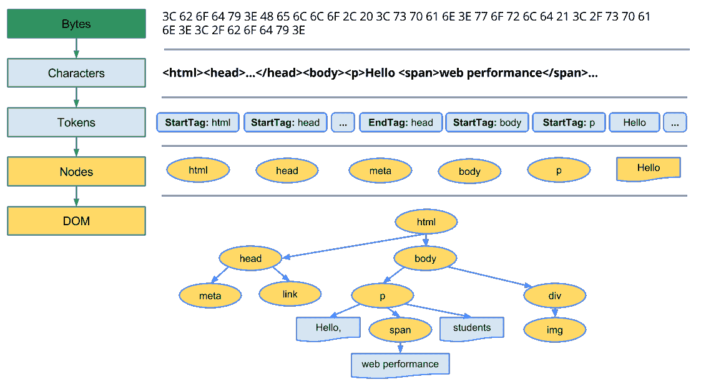

可以通过 devtools 中查看该过程


## 02 CSSOM

当解析 CSS 文件时，最终会生成 CSSOM

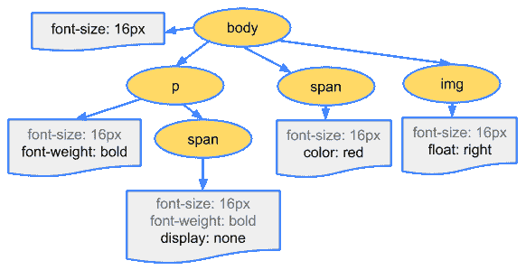

## 03 Render Tree

DOM 与 CSSOM 会一起生成 Render Tree，只包含渲染网页所需的节点。


## 04 Layout

计算每一个元素在设备视口内的确切位置和大小

> 以下图片来自于 [关键渲染路径 - 掘金(opens new window)](https://juejin.im/post/6844903756820119560)


## 05 Paint

将渲染树中的每个节点转换成屏幕上的实际像素，这一步通常称为绘制或栅格化


# 你使用过哪些前端性能分析工具

> 原文：[https://q.shanyue.tech/fe/%E5%89%8D%E7%AB%AF%E5%B7%A5%E7%A8%8B%E5%8C%96/412.html](https://q.shanyue.tech/fe/%E5%89%8D%E7%AB%AF%E5%B7%A5%E7%A8%8B%E5%8C%96/412.html)

Issue

欢迎在 Gtihub Issue 中回答此问题: [Issue 412(opens new window)](https://github.com/shfshanyue/Daily-Question/issues/412)

Author

回答者: [zxhycxq(opens new window)](https://github.com/zxhycxq)

chrome 自带的灯箱

Author

回答者: [shfshanyue(opens new window)](https://github.com/shfshanyue)

最常见且实用的性能工具有两个：

1.  `lighthouse`: 可在 chrome devtools 直接使用，根据个人设备及网络对目标网站进行分析，并提供各种建议
2.  `webpagetest`: 分布式的性能分析工具，可在全球多个区域的服务器资源为你的网站进行分析，并生成相应的报告

# 你有没有重客户端状态前端应用的经验

> 原文：[https://q.shanyue.tech/fe/%E5%89%8D%E7%AB%AF%E5%B7%A5%E7%A8%8B%E5%8C%96/422.html](https://q.shanyue.tech/fe/%E5%89%8D%E7%AB%AF%E5%B7%A5%E7%A8%8B%E5%8C%96/422.html)

Issue

欢迎在 Gtihub Issue 中回答此问题: [Issue 422(opens new window)](https://github.com/shfshanyue/Daily-Question/issues/422)

# 什么是安全的正则表达式

> 原文：[https://q.shanyue.tech/fe/%E5%89%8D%E7%AB%AF%E5%B7%A5%E7%A8%8B%E5%8C%96/430.html](https://q.shanyue.tech/fe/%E5%89%8D%E7%AB%AF%E5%B7%A5%E7%A8%8B%E5%8C%96/430.html)

Issue

欢迎在 Gtihub Issue 中回答此问题: [Issue 430(opens new window)](https://github.com/shfshanyue/Daily-Question/issues/430)

Author

回答者: [shfshanyue(opens new window)](https://github.com/shfshanyue)

下边这个正则表达式能把 CPU 跑挂的正则表达式就是一个定时炸弹，回溯次数进入了指数爆炸般的增长。

> 可以参考文章 [浅析 ReDos 原理与实践(opens new window)](https://www.freebuf.com/articles/network/124422.html)

```
const safe = require("safe-regex");
const re = /(x+x+)+y/;

// 能跑死 CPU 的一个正则
re.test("xxxxxxxxxxxxxxxxxxxxxxxxxxxxxxxxxxxxxxxxxxxxx");

// 使用 safe-regex 判断正则是否安全
safe(re); // false 
```

[safe-regex(opens new window)](https://github.com/substack/safe-regex) 能够发现哪些不安全的正则表达式。

# 在 nginx 中如何配置负载均衡

> 原文：[https://q.shanyue.tech/fe/%E5%89%8D%E7%AB%AF%E5%B7%A5%E7%A8%8B%E5%8C%96/435.html](https://q.shanyue.tech/fe/%E5%89%8D%E7%AB%AF%E5%B7%A5%E7%A8%8B%E5%8C%96/435.html)

Issue

欢迎在 Gtihub Issue 中回答此问题: [Issue 435(opens new window)](https://github.com/shfshanyue/Daily-Question/issues/435)

Author

回答者: [shfshanyue(opens new window)](https://github.com/shfshanyue)

通过 `proxy_pass` 与 `upstream` 即可实现最为简单的负载均衡。如下配置会对流量均匀地导向 `172.168.0.1`，`172.168.0.2` 与 `172.168.0.3` 三个服务器

```
http {
  upstream backend {
      server 172.168.0.1;
      server 172.168.0.2;
      server 172.168.0.3;
  }

  server {
      listen 80;
      location / {
          proxy_pass http://backend;
      }
  }
} 
```

关于负载均衡的策略大致有以下四种种

1.  round_robin，轮询
2.  weighted_round_robin，加权轮询
3.  ip_hash
4.  least_conn

## Round_Robin

轮询，`nginx` 默认的负载均衡策略就是轮询，假设负载三台服务器节点为 A、B、C，则每次流量的负载结果为 ABCABC

## Weighted_Round_Robin

加权轮询，根据关键字 weight 配置权重，如下则平均没来四次请求，会有八次打在 A，会有一次打在 B，一次打在 C

```
upstream backend {
  server 172.168.0.1 weight=8;
  server 172.168.0.2 weight=1;
  server 172.168.0.3 weight=1;
} 
```

## IP_hash

对每次的 IP 地址进行 Hash，进而选择合适的节点，如此，每次用户的流量请求将会打在固定的服务器上，利于缓存，也更利于 AB 测试等。

```
upstream backend {
  server 172.168.0.1;
  server 172.168.0.2;
  server 172.168.0.3;
  ip_hash;
} 
```

## Least Connection

选择连接数最少的服务器节点优先负载

```
upstream backend {
  server 172.168.0.1;
  server 172.168.0.2;
  server 172.168.0.3;
  least_conn;
} 
```

说到最后，**这些负载均衡策略对于应用开发者至关重要，而基础开发者更看重如何实现这些策略**，如这四种负载算法如何实现？请参考以后的文章

# 前端打包时 cjs、es、umd 模块有何不同

> 原文：[https://q.shanyue.tech/fe/%E5%89%8D%E7%AB%AF%E5%B7%A5%E7%A8%8B%E5%8C%96/475.html](https://q.shanyue.tech/fe/%E5%89%8D%E7%AB%AF%E5%B7%A5%E7%A8%8B%E5%8C%96/475.html)

Issue

欢迎在 Gtihub Issue 中回答此问题: [Issue 475(opens new window)](https://github.com/shfshanyue/Daily-Question/issues/475)

Author

回答者: [shfshanyue(opens new window)](https://github.com/shfshanyue)

## cjs (commonjs)

`commonjs` 是 Node 中的模块规范，通过 `require` 及 `exports` 进行导入导出 (进一步延伸的话，`module.exports` 属于 `commonjs2`)

同时，webpack 也对 `cjs` 模块得以解析，因此 `cjs` 模块可以运行在 node 环境及 webpack 环境下的，但不能在浏览器中*直接*使用。但如果你写前端项目在 webpack 中，也可以理解为它在浏览器和 Node 都支持。

比如，著名的全球下载量前十 10 的模块 [ms(opens new window)](https://npm.devtool.tech/ms) 只支持 `commonjs`，但并不影响它在前端项目中使用(通过 webpack)，但是你想通过 cdn 的方式直接在浏览器中引入，估计就会出问题了

```
// sum.js
exports.sum = (x, y) => x + y;

// index.js
const { sum } = require("./sum.js"); 
```

由于 `cjs` 为动态加载，可直接 `require` 一个变量

```
require(`./${a}`); 
```

## esm (es module)

`esm` 是 tc39 对于 ESMAScript 的模块话规范，正因是语言层规范，**因此在 Node 及 浏览器中均会支持**。

它使用 `import/export` 进行模块导入导出.

```
// sum.js
export const sum = (x, y) => x + y;

// index.js
import { sum } from "./sum"; 
```

`esm` 为静态导入，正因如此，可在编译期进行 **Tree Shaking**，减少 js 体积。

如果需要动态导入，tc39 为动态加载模块定义了 API: `import(module)` 。可将以下代码粘贴到控制台执行

```
const ms = await import("https://cdn.skypack.dev/ms@latest");

ms.default(1000); 
```

esm 是未来的趋势，目前一些 CDN 厂商，前端构建工具均致力于 cjs 模块向 esm 的转化，比如 `skypack`、 `snowpack`、`vite` 等。

目前，在浏览器与 node.js 中均原生支持 esm。

*   cjs 模块输出的是一个值的拷贝，esm 输出的是值的引用
*   cjs 模块是运行时加载，esm 是编译时加载

示例: [array-uniq(opens new window)](https://cdn.jsdelivr.net/npm/array-uniq/index.js)

## umd

一种兼容 `cjs` 与 `amd` 的模块，既可以在 node/webpack 环境中被 `require` 引用，也可以在浏览器中直接用 CDN 被 `script.src` 引入。

```
(function (root, factory) {
  if (typeof define === "function" && define.amd) {
    // AMD
    define(["jquery"], factory);
  } else if (typeof exports === "object") {
    // CommonJS
    module.exports = factory(require("jquery"));
  } else {
    // 全局变量
    root.returnExports = factory(root.jQuery);
  }
})(this, function ($) {
  // ...
}); 
```

示例: [react-table(opens new window)](https://cdn.jsdelivr.net/npm/react-table/), [antd(opens new window)](https://cdn.jsdelivr.net/npm/antd/)

这三种模块方案大致如此，部分 npm package 也会同时打包出 commonjs/esm/umd 三种模块化格式，供不同需求的业务使用，比如 [antd(opens new window)](https://cdn.jsdelivr.net/npm/antd/)。

*   [antd 的 cjs(opens new window)](https://cdn.jsdelivr.net/npm/antd@4.17.2/lib/index.js)
*   [antd 的 umd(opens new window)](https://cdn.jsdelivr.net/npm/antd@4.17.2/dist/antd.js)
*   [antd 的 esm(opens new window)](https://cdn.jsdelivr.net/npm/antd@4.17.2/es/index.js)

Author

回答者: [xiyuanyuan(opens new window)](https://github.com/xiyuanyuan)

webpack 打包使用的是 cjs， vite 使用的是 esm，这样理解对吗 rollup 使用的是啥模块化方案？

webpack 也有 tree-shaking 吗和 rollup 的有啥不同

Author

回答者: [songcee(opens new window)](https://github.com/songcee)

已收到你的邮件，谢谢~~~

# 什么是前端工程化

> 原文：[https://q.shanyue.tech/fe/%E5%89%8D%E7%AB%AF%E5%B7%A5%E7%A8%8B%E5%8C%96/495.html](https://q.shanyue.tech/fe/%E5%89%8D%E7%AB%AF%E5%B7%A5%E7%A8%8B%E5%8C%96/495.html)

Issue

欢迎在 Gtihub Issue 中回答此问题: [Issue 495(opens new window)](https://github.com/shfshanyue/Daily-Question/issues/495)

Author

回答者: [haotie1990(opens new window)](https://github.com/haotie1990)

前端工程化的主要目标就是解放生产力、提高生产效率。通过制定一系列的规范，借助工具和框架解决前端开发以及前后端协作过程中的痛点和难度问题。

# JWT 的原理是什么

> 原文：[https://q.shanyue.tech/fe/%E5%89%8D%E7%AB%AF%E5%B7%A5%E7%A8%8B%E5%8C%96/497.html](https://q.shanyue.tech/fe/%E5%89%8D%E7%AB%AF%E5%B7%A5%E7%A8%8B%E5%8C%96/497.html)

Issue

欢迎在 Gtihub Issue 中回答此问题: [Issue 497(opens new window)](https://github.com/shfshanyue/Daily-Question/issues/497)

# 什么是服务器渲染 (SSR)

> 原文：[https://q.shanyue.tech/fe/%E5%89%8D%E7%AB%AF%E5%B7%A5%E7%A8%8B%E5%8C%96/507.html](https://q.shanyue.tech/fe/%E5%89%8D%E7%AB%AF%E5%B7%A5%E7%A8%8B%E5%8C%96/507.html)

Issue

欢迎在 Gtihub Issue 中回答此问题: [Issue 507(opens new window)](https://github.com/shfshanyue/Daily-Question/issues/507)

Author

回答者: [buzuosheng(opens new window)](https://github.com/buzuosheng)

服务端渲染 SSR：在服务端将请求的所有资源生成 HTML，客户端收到后可以直接渲染。

Author

回答者: [shfshanyue(opens new window)](https://github.com/shfshanyue)

1.  `renderToString`
2.  `hydrate`

Author

回答者: [haotie1990(opens new window)](https://github.com/haotie1990)

服务器渲染 (SSR)：将同一个组件渲染为服务器端的 HTML 字符串，将它们直接发送到浏览器，最后将这些静态标记"激活"为客户端上完全可交互的应用程序。这个过程可以成为服务端渲染。

优势：

*   更好的 SEO

*   更快的内容到达时间 (time-to-content)

[Vue.js 服务器端渲染指南(opens new window)](https://ssr.vuejs.org/zh/)

# Core Web Vitals 是什么，它有哪些指标

> 原文：[https://q.shanyue.tech/fe/%E5%89%8D%E7%AB%AF%E5%B7%A5%E7%A8%8B%E5%8C%96/513.html](https://q.shanyue.tech/fe/%E5%89%8D%E7%AB%AF%E5%B7%A5%E7%A8%8B%E5%8C%96/513.html)

Issue

欢迎在 Gtihub Issue 中回答此问题: [Issue 513(opens new window)](https://github.com/shfshanyue/Daily-Question/issues/513)

Author

回答者: [shfshanyue(opens new window)](https://github.com/shfshanyue)

> 见文档 [Web Vitals(opens new window)](https://web.dev/vitals/)

*   LCP: Largest Content Paint
*   FID: Firtst Input Delay
*   CLS: Cumulative Layout Shift

|  | Good | Needs improvement | Poor |
| --- | --- | --- | --- |
| LCP | <=2.5s | <=4s | >4s |
| FID | <=100ms | <=300ms | >300ms |
| CLS | <=0.1 | <=0.25 | >0.25 |

# dependencies 与 devDependencies 有何区别

> 原文：[https://q.shanyue.tech/fe/%E5%89%8D%E7%AB%AF%E5%B7%A5%E7%A8%8B%E5%8C%96/521.html](https://q.shanyue.tech/fe/%E5%89%8D%E7%AB%AF%E5%B7%A5%E7%A8%8B%E5%8C%96/521.html)

Issue

欢迎在 Gtihub Issue 中回答此问题: [Issue 521(opens new window)](https://github.com/shfshanyue/Daily-Question/issues/521)

Author

回答者: [shfshanyue(opens new window)](https://github.com/shfshanyue)

**对于业务代码而讲，它俩区别不大**

当进行业务开发时，严格区分 `dependencies` 与 `devDependencies` 并无必要，实际上，大部分业务对二者也并无严格区别。

当打包时，依靠的是 `Webpack/Rollup` 对代码进行模块依赖分析，与该模块是否在 `dep/devDep` 并无关系，只要在 `node_modules` 上能够找到该 Package 即可。

以至于在 CI 中 `npm i --production` 可加快包安装速度也无必要，因为在 CI 中仍需要 lint、test、build 等。

**对于库 (Package) 开发而言，是有严格区分的**

*   dependencies: 在生产环境中使用
*   devDependencies: 在开发环境中使用，如 webpack/babel/eslint 等

**当在项目中安装一个依赖的 Package 时，该依赖的 `dependencies` 也会安装到项目中，即被下载到 `node_modules` 目录中。但是 `devDependencies` 不会**

因此当我们开发 Package 时，需要注意到我们所引用的 `dependencies` 会被我们的使用者一并下载，而 `devDependencies` 不会。

一些 Package 宣称自己是 `zero dependencies`，一般就是指不依赖任何 `dependencies`，如 [highlight(opens new window)](https://github.com/highlightjs/highlight.js)

> JavaScript syntax highlighter with language auto-detection and zero dependencies.

Author

回答者: [Asarua(opens new window)](https://github.com/Asarua)

生产依赖会随着包一起下载，开发依赖不会，npm i --production 可以只下载生产依赖

Author

回答者: [haotie1990(opens new window)](https://github.com/haotie1990)

**dependencies、devDependencies**

`dependencies`字段指定了项目运行所依赖的模块，`devDependencies`指定项目开发所需要的模块。

当你在软件包目录下执行`npm install`命令时，`dependencies`、`devDependencies`指定的三方软件包均会在`node_modules`目录下安装，若执行`npm install --production`命令，则不会安装`devDependecies`指定的三方软件包。但当软件包作为三方软件包被安装时（`npm install $package`）,则`dependencies`指定的软件包会被安装，`devDependencies`指定指定的软件包不会被安装。

了解`dependencies`和`devDependencies`的作用后，我们在开发软件包时，哪些依赖应该放入`dependencies`，哪些依赖应该放入`devDependencies`中。

首先我们要明确放入`dependencies`中的依赖软件包，是我们的项目在生产环境下运行时必须依赖的软件包，其的部分功能或全部功能通常会被打包到我们工程发布的`bundles`中。而放入`devDependencies`中软件包是我们的工程在开发时依赖的软件包，通常情况下以下的依赖会被放入`devDenpencies`中：

*   格式化代码或错误检查类软件包：`esLint`、`prettier`

*   打包工具及其插件：`webpack`, `gulp`, `parceljs`

*   `babel`及其的插件

*   单元测试类：`enzyme`, `jest`

Author

回答者: [haotie1990(opens new window)](https://github.com/haotie1990)

`peerDependencies`的目的是提示宿主环境去安装满足插件`peerDependencies`所指定依赖的包，然后在插件`import`或者`require`所依赖的包的时候，永远都是引用宿主环境统一安装的`npm`包，最终解决插件与所依赖包不一致的问题。

知道`peerDependencies`的作用后，什么样的软件包依赖需要放入？

当我们开发的工程将作为第三方软件包发布的时候，我们就会用到`peerDependencies`。当我们发布软件包作为三方依赖运行时，并且我们确认或猜测到依赖我们的软件包的工程也会安装和我们软件包相同的三方依赖，我们就可以将这些依赖放入`peerDependencies`中。

# 如何确认你们项目是否依赖某一个依赖项

> 原文：[https://q.shanyue.tech/fe/%E5%89%8D%E7%AB%AF%E5%B7%A5%E7%A8%8B%E5%8C%96/522.html](https://q.shanyue.tech/fe/%E5%89%8D%E7%AB%AF%E5%B7%A5%E7%A8%8B%E5%8C%96/522.html)

更多描述

例: 你们项目中是否引用了 npm 库 [semver(opens new window)](https://npm.devtool.tech/semver)

Issue

欢迎在 Gtihub Issue 中回答此问题: [Issue 522(opens new window)](https://github.com/shfshanyue/Daily-Question/issues/522)

Author

回答者: [shfshanyue(opens new window)](https://github.com/shfshanyue)

```
yarn list | grep xxx 
```

# 当你引入某一个依赖项时，你引入的是该依赖下的哪一个文件

> 原文：[https://q.shanyue.tech/fe/%E5%89%8D%E7%AB%AF%E5%B7%A5%E7%A8%8B%E5%8C%96/523.html](https://q.shanyue.tech/fe/%E5%89%8D%E7%AB%AF%E5%B7%A5%E7%A8%8B%E5%8C%96/523.html)

Issue

欢迎在 Gtihub Issue 中回答此问题: [Issue 523(opens new window)](https://github.com/shfshanyue/Daily-Question/issues/523)

Author

回答者: [Asarua(opens new window)](https://github.com/Asarua)

package.json 中的 main 对应的文件

Author

回答者: [shfshanyue(opens new window)](https://github.com/shfshanyue)

TODO

Author

回答者: [hwb2017(opens new window)](https://github.com/hwb2017)

*   如果 npm 包导出的是 ESM 规范的包，使用 module
*   如果 npm 包只在 web 端使用，并且严禁在 server 端使用，使用 browser
*   如果 npm 包只在 server 端使用，使用 main
*   如果 npm 包在 web 端和 server 端都允许使用，使用 browser 和 main

参考 https://www.cnblogs.com/h2zZhou/p/12929472.html

Author

回答者: [shfshanyue(opens new window)](https://github.com/shfshanyue)

@hwb2017 目前 main、module、exports 是用的最多的几项字段，browser 目前用的越来越少了

# npm workspaces 解决了什么问题

> 原文：[https://q.shanyue.tech/fe/%E5%89%8D%E7%AB%AF%E5%B7%A5%E7%A8%8B%E5%8C%96/524.html](https://q.shanyue.tech/fe/%E5%89%8D%E7%AB%AF%E5%B7%A5%E7%A8%8B%E5%8C%96/524.html)

Issue

欢迎在 Gtihub Issue 中回答此问题: [Issue 524(opens new window)](https://github.com/shfshanyue/Daily-Question/issues/524)

Author

回答者: [shfshanyue(opens new window)](https://github.com/shfshanyue)

多个包难以互相链接

Author

回答者: [haotie1990(opens new window)](https://github.com/haotie1990)

[https://docs.npmjs.com/cli/v7/using-npm/workspaces(opens new window)](https://docs.npmjs.com/cli/v7/using-npm/workspaces)

# 如何为一个项目指定 node 版本号

> 原文：[https://q.shanyue.tech/fe/%E5%89%8D%E7%AB%AF%E5%B7%A5%E7%A8%8B%E5%8C%96/533.html](https://q.shanyue.tech/fe/%E5%89%8D%E7%AB%AF%E5%B7%A5%E7%A8%8B%E5%8C%96/533.html)

Issue

欢迎在 Gtihub Issue 中回答此问题: [Issue 533(opens new window)](https://github.com/shfshanyue/Daily-Question/issues/533)

Author

回答者: [shfshanyue(opens new window)](https://github.com/shfshanyue)

> *   我: 老大，我这个项目本地白屏了，今天调了一天都没找到问题，快来看看
> *   leader: (瞄了一眼) 你的 node 版本号有问题
> *   我: 老大，不能怪我跑挂了，我一个新入职的小前端怎么能够知道这个项目所需的 Node 版本号是多少呢
> *   leader: 怎么不能知道，这说明你水平不到家

指定一个项目所需的 node 最小版本，这属于一个项目的质量工程。

如果对于版本不匹配将会报错(yarn)或警告(npm)，那我们需要在 `package.json` 中的 `engines` 字段中指定 Node 版本号

> 更多质量工程问题，见 [如何保障项目质量(opens new window)](https://github.com/shfshanyue/Daily-Question/issues/552)

```
{
  "engines": {
    "node": ">=14.0.0"
  }
} 
```

一个示例：

**我在本地把项目所需要的 node 版本号改成 `>=16.0.0`，而本地的 node 版本号为 `v10.24.1`**

此时，npm 将会发生警告，提示你本地的 node 版本与此项目不符。

```
npm WARN EBADENGINE Unsupported engine { package: 'next-app@1.0.0',
npm WARN EBADENGINE   required: { node: '>=16.0.0' },
npm WARN EBADENGINE   current: { node: 'v10.24.1', npm: '7.14.0' } } 
```

而 yarn 将会直接报错，提示。

```
error next-app@1.0.0: The engine "node" is incompatible with this module. Expected version ">=16.0.0". Got "10.24.1" 
```

**最为重要的是，项目中某些依赖所需要的 Node 版本号与项目运行时的 Node 版本号不匹配，也会报错(在 yarn 中)**，此时无法正常运行项目，可避免意外发生。

可看一个示例，[engines 示例(opens new window)](https://github.com/shfshanyue/node-examples/tree/master/engineering/package/engines)，其中 `ansi-regex` 该依赖所需的 node 版本号为 `12+`，而此时本地的 node 版本号为 10，使用 yarn 安装报错！

```
// 在 package.json 中，所需 node 版本号需要 >=10
{
  "engines": {
    "node": ">=10.0.0"
  }
}

// 在 package-lock.json 中，所需 node 版本号需要 >=12
{
  "node_modules/ansi-regex": {
    "version": "6.0.1",
    "engines": {
      "node": ">=12"
    }
  }
} 
```


> PS: 如果项目的 package.json 中没有 `engines` 字段，可查看 Dockerfile 中 node 镜像确定项目所需的 node 版本号。

Author

回答者: [qiutian00(opens new window)](https://github.com/qiutian00)

Great!

Author

回答者: [946629031(opens new window)](https://github.com/946629031)

nice job~ !!

# 什么是 semver，~1.2.3 与 ^1.2.3 的版本号范围是多少

> 原文：[https://q.shanyue.tech/fe/%E5%89%8D%E7%AB%AF%E5%B7%A5%E7%A8%8B%E5%8C%96/534.html](https://q.shanyue.tech/fe/%E5%89%8D%E7%AB%AF%E5%B7%A5%E7%A8%8B%E5%8C%96/534.html)

更多描述

当你 `npm install` 时，你安装的是哪一种形式

Issue

欢迎在 Gtihub Issue 中回答此问题: [Issue 534(opens new window)](https://github.com/shfshanyue/Daily-Question/issues/534)

Author

回答者: [shfshanyue(opens new window)](https://github.com/shfshanyue)

`semver`，`Semantic Versioning` 语义化版本的缩写，文档可见 [https://semver.org/(opens new window)](https://semver.org/)，它由 `[major, minor, patch]` 三部分组成，其中

*   `major`: 当你发了一个含有 Breaking Change 的 API
*   `minor`: 当你新增了一个向后兼容的功能时
*   `patch`: 当你修复了一个向后兼容的 Bug 时

假设你的版本库中含有一个函数

```
// 假设原函数
export const sum = (x: number, y: number): number => x + y;

// Patch Version，修复小 Bug
export const sum = (x: number, y: number): number => x + y;

// Minor Version，向后兼容
export const sum = (...rest: number[]): number =>
  rest.reduce((s, x) => s + x, 0);

// Marjor Version，出现 Breaking Change
export const sub = () => {}; 
```

对于 `~1.2.3` 而言，它的版本号范围是 `>=1.2.3 <1.3.0`

对于 `^1.2.3` 而言，它的版本号范围是 `>=1.2.3 <2.0.0`

当我们 `npm i` 时，默认的版本号是 `^`，可最大限度地在向后兼容与新特性之间做取舍，但是有些库有可能不遵循该规则，我们在项目时应当使用 `yarn.lock`/`package-lock.json` 锁定版本号。

我们看看 `package-lock` 的工作流程。

1.  `npm i webpack`，此时下载最新 webpack 版本 `5.58.2`，在 `package.json` 中显示为 `webpack: ^5.58.2`，版本号范围是 `>=5.58.2 < 6.0.0`
2.  在 `package-lock.json` 中全局搜索 `webpack`，发现 webpack 的版本是被锁定的，也是说它是确定的 `webpack: 5.58.2`
3.  经过一个月后，webpack 最新版本为 `5.100.0`，但由于 `webpack` 版本在 `package-lock.json` 中锁死，每次上线时仍然下载 `5.58.2` 版本号
4.  经过一年后，webpack 最新版本为 `6.0.0`，但由于 `webpack` 版本在 `package-lock.json` 中锁死，且 package.json 中 `webpack` 版本号为 `^5.58.2`，与 `package-lock.json` 中为一致的版本范围。每次上线时仍然下载 `5.58.2` 版本号
5.  支线剧情：经过一年后，webpack 最新版本为 `6.0.0`，需要进行升级，此时手动改写 `package.json` 中 `webpack` 版本号为 `^6.0.0`，与 `package-lock.json` 中不是一致的版本范围。此时 `npm i` 将下载 `6.0.0` 最新版本号，并重写 `package-lock.json` 中锁定的版本号为 `6.0.0`

## 一个问题总结:

npm i 某个 package 时会修改 `package-lock.json` 中的版本号吗？

当 `package-lock.json` 该 package 锁死的版本号符合 `package.json` 中的版本号范围时，将以 `package-lock.json` 锁死版本号为主。

当 `package-lock.json` 该 package 锁死的版本号不符合 `package.json` 中的版本号范围时，将会安装该 package 符合 `package.json` 版本号范围的最新版本号，并重写 `package-lock.json`

# package.json 中 main/module/browser/exports 字段有何区别

> 原文：[https://q.shanyue.tech/fe/%E5%89%8D%E7%AB%AF%E5%B7%A5%E7%A8%8B%E5%8C%96/535.html](https://q.shanyue.tech/fe/%E5%89%8D%E7%AB%AF%E5%B7%A5%E7%A8%8B%E5%8C%96/535.html)

Issue

欢迎在 Gtihub Issue 中回答此问题: [Issue 535(opens new window)](https://github.com/shfshanyue/Daily-Question/issues/535)

Author

回答者: [shfshanyue(opens new window)](https://github.com/shfshanyue)

## main

`main` 指 npm package 的入口文件，当我们对某个 package 进行导入时，实际上导入的是 `main` 字段所指向的文件。

`main` 是 CommonJS 时代的产物，也是最古老且最常用的入口文件。

```
// package.json 内容
{
  name: 'midash',
  main: './dist/index.js'
}

// 关于如何引用 package
const midash = require('midash')

// 实际上是通过 main 字段来找到入口文件，等同于该引用
const midash = require('midash/dist/index.js') 
```

## module

随着 ESM 且打包工具的发展，许多 package 会打包 N 份模块化格式进行分发，如 `antd` 既支持 `ES`，也支持 `umd`，将会打包两份。

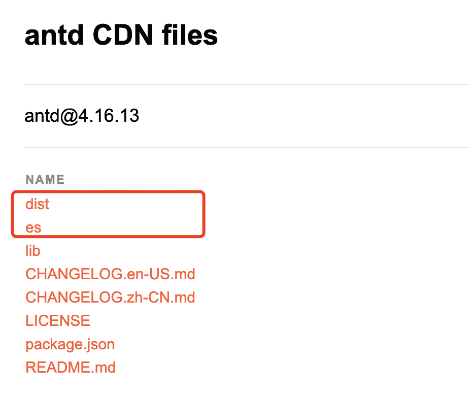

如果使用 `import` 对该库进行导入，则首次寻找 `module` 字段引入，否则引入 `main` 字段。

基于此，许多前端友好的库，都进行了以下分发操作:

1.  对代码进行两份格式打包: `commonjs` 与 `es module`
2.  `module` 字段作为 `es module` 入口
3.  `main` 字段作为 `commonjs` 入口

```
{
  name: 'midash',
  main: './dist/index.js',
  module: './dist/index.mjs'
}

// 以下两者等同
import midash from 'midash'
import midash from 'midash/dist/index.mjs' 
```

如果你的代码只分发一份 `es module` 模块化方案，则直接置于 `main` 字段之中。

## exports

如果说以上两个是刀剑，那 `exports` 至少得是瑞士军刀。

`exports` 可以更容易地控制子目录的访问路径，也被称为 `export map`。

假设我们 Package 的目录如下所示:

```
├── package.json
├── index.js
└── src
    └── get.js 
```

**不在 `exports` 字段中的模块，即使直接访问路径，也无法引用！**

```
// package.json
{
  name: 'midash',
  main: './index.js',
  exports: {
    '.': './dist/index.js',
    'get': './dist/get.js'
  }
}

// 正常工作
import get from 'midash/get'

// 无法正常工作，无法引入
import get from 'midash/dist/get' 
```

`exports` 不仅可根据模块化方案不同选择不同的入口文件，还可以根据环境变量(`NODE_ENV`)、运行环境(`nodejs`/`browser`/`electron`) 导入不同的入口文件。

```
{
  "type": "module",
  "exports": {
    "electron": {
      "node": {
        "development": {
          "module": "./index-electron-node-with-devtools.js",
          "import": "./wrapper-electron-node-with-devtools.js",
          "require": "./index-electron-node-with-devtools.cjs"
        },
        "production": {
          "module": "./index-electron-node-optimized.js",
          "import": "./wrapper-electron-node-optimized.js",
          "require": "./index-electron-node-optimized.cjs"
        },
        "default": "./wrapper-electron-node-process-env.cjs"
      },
      "development": "./index-electron-with-devtools.js",
      "production": "./index-electron-optimized.js",
      "default": "./index-electron-optimized.js"
    },
    "node": {
      "development": {
        "module": "./index-node-with-devtools.js",
        "import": "./wrapper-node-with-devtools.js",
        "require": "./index-node-with-devtools.cjs"
      },
      "production": {
        "module": "./index-node-optimized.js",
        "import": "./wrapper-node-optimized.js",
        "require": "./index-node-optimized.cjs"
      },
      "default": "./wrapper-node-process-env.cjs"
    },
    "development": "./index-with-devtools.js",
    "production": "./index-optimized.js",
    "default": "./index-optimized.js"
  }
} 
```

# npm publish 时 npm script 的生命周期

> 原文：[https://q.shanyue.tech/fe/%E5%89%8D%E7%AB%AF%E5%B7%A5%E7%A8%8B%E5%8C%96/536.html](https://q.shanyue.tech/fe/%E5%89%8D%E7%AB%AF%E5%B7%A5%E7%A8%8B%E5%8C%96/536.html)

Issue

欢迎在 Gtihub Issue 中回答此问题: [Issue 536(opens new window)](https://github.com/shfshanyue/Daily-Question/issues/536)

Author

回答者: [shfshanyue(opens new window)](https://github.com/shfshanyue)

*   prepublishOnly
*   prepack
*   prepare
*   postpack
*   publish
*   postpublish

# 前端项目每次 npm install 之后需要执行一些处理工作，应该怎么办

> 原文：[https://q.shanyue.tech/fe/%E5%89%8D%E7%AB%AF%E5%B7%A5%E7%A8%8B%E5%8C%96/537.html](https://q.shanyue.tech/fe/%E5%89%8D%E7%AB%AF%E5%B7%A5%E7%A8%8B%E5%8C%96/537.html)

更多描述

例如: husky

Issue

欢迎在 Gtihub Issue 中回答此问题: [Issue 537(opens new window)](https://github.com/shfshanyue/Daily-Question/issues/537)

Author

回答者: [shfshanyue(opens new window)](https://github.com/shfshanyue)

使用 npm script 生命周期中的 `npm prepare`，他将会在发包 (publish) 之前以及装包 (install) 之后自动执行。

如果指向在装包之后自动执行，可使用 `npm postinstall`

例如:

[husky(opens new window)](https://github.com/typicode/husky)

```
{
  "prepare": "npm run build & node packages/husky/lib/bin.js install"
} 
```

[vue-cli(opens new window)](https://github.com/vuejs/vue-cli/blob/dev/package.json) 一些著名的仓库会使用 [patch-package(opens new window)](https://github.com/ds300/patch-package) 自动修复 node_modules 中依赖的问题

```
{
  "postinstall": "patch-package"
} 
```

# 你是如何保障你们项目质量的

> 原文：[https://q.shanyue.tech/fe/%E5%89%8D%E7%AB%AF%E5%B7%A5%E7%A8%8B%E5%8C%96/552.html](https://q.shanyue.tech/fe/%E5%89%8D%E7%AB%AF%E5%B7%A5%E7%A8%8B%E5%8C%96/552.html)

Issue

欢迎在 Gtihub Issue 中回答此问题: [Issue 552(opens new window)](https://github.com/shfshanyue/Daily-Question/issues/552)

Author

回答者: [shfshanyue(opens new window)](https://github.com/shfshanyue)

*   lint
*   type
*   test
*   code review
*   git hooks
*   CI

# 如何正确得知某张图片的 MIME 格式

> 原文：[https://q.shanyue.tech/fe/%E5%89%8D%E7%AB%AF%E5%B7%A5%E7%A8%8B%E5%8C%96/591.html](https://q.shanyue.tech/fe/%E5%89%8D%E7%AB%AF%E5%B7%A5%E7%A8%8B%E5%8C%96/591.html)

Issue

欢迎在 Gtihub Issue 中回答此问题: [Issue 591(opens new window)](https://github.com/shfshanyue/Daily-Question/issues/591)

# 现代前端应用应如何配置 HTTP 缓存机制

> 原文：[https://q.shanyue.tech/fe/%E5%89%8D%E7%AB%AF%E5%B7%A5%E7%A8%8B%E5%8C%96/600.html](https://q.shanyue.tech/fe/%E5%89%8D%E7%AB%AF%E5%B7%A5%E7%A8%8B%E5%8C%96/600.html)

Issue

欢迎在 Gtihub Issue 中回答此问题: [Issue 600(opens new window)](https://github.com/shfshanyue/Daily-Question/issues/600)

Author

回答者: [shfshanyue(opens new window)](https://github.com/shfshanyue)

> 参考: [前端项目中的缓存配置(opens new window)](https://shanyue.tech/frontend-engineering/http-cache.html)

关于 http 缓存配置的最佳实践为以下两条：

1.  文件路径中带有 hash 值：一年的强缓存。因为该文件的内容发生变化时，会生成一个带有新的 hash 值的 URL。前端将会发起一个新的 URL 的请求。配置响应头 `Cache-Control: public,max-age=31536000,immutable`
2.  文件路径中不带有 hash 值：协商缓存。大部分为 `public` 下文件。配置响应头 `Cache-Control: no-cache` 与 `etag/last-modified`

但是当处理永久缓存时，切记不可打包为一个大的 `bundle.js`，此时一行业务代码的改变，将导致整个项目的永久缓存失效，此时需要按代码更新频率分为多个 chunk 进行打包，可细粒度控制缓存。


1.  `webpack-runtime`: 应用中的 `webpack` 的版本比较稳定，分离出来，保证长久的永久缓存
2.  `react/react-dom`: `react` 的版本更新频次也较低
3.  `vendor`: 常用的第三方模块打包在一起，如 `lodash`，`classnames` 基本上每个页面都会引用到，但是它们的更新频率会更高一些。另外对低频次使用的第三方模块不要打进来
4.  `pageA`: A 页面，当 A 页面的组件发生变更后，它的缓存将会失效
5.  `pageB`: B 页面
6.  `echarts`: 不常用且过大的第三方模块单独打包
7.  `mathjax`: 不常用且过大的第三方模块单独打包
8.  `jspdf`: 不常用且过大的第三方模块单独打包

在 `webpack5` 中可以使用以下配置:

```
{
  // Automatically split vendor and commons
  // https://twitter.com/wSokra/status/969633336732905474
  // https://medium.com/webpack/webpack-4-code-splitting-chunk-graph-and-the-splitchunks-optimization-be739a861366
  splitChunks: {
    chunks: 'all',
  },
  // Keep the runtime chunk separated to enable long term caching
  // https://twitter.com/wSokra/status/969679223278505985
  // https://github.com/facebook/create-react-app/issues/5358
  runtimeChunk: {
    name: entrypoint => `runtime-${entrypoint.name}`,
  },
} 
```

# 使用 webpack 如何分包

> 原文：[https://q.shanyue.tech/fe/%E5%89%8D%E7%AB%AF%E5%B7%A5%E7%A8%8B%E5%8C%96/603.html](https://q.shanyue.tech/fe/%E5%89%8D%E7%AB%AF%E5%B7%A5%E7%A8%8B%E5%8C%96/603.html)

Issue

欢迎在 Gtihub Issue 中回答此问题: [Issue 603(opens new window)](https://github.com/shfshanyue/Daily-Question/issues/603)

# 引入 BFF 层的优势在哪里

> 原文：[https://q.shanyue.tech/fe/%E5%89%8D%E7%AB%AF%E5%B7%A5%E7%A8%8B%E5%8C%96/613.html](https://q.shanyue.tech/fe/%E5%89%8D%E7%AB%AF%E5%B7%A5%E7%A8%8B%E5%8C%96/613.html)

Issue

欢迎在 Gtihub Issue 中回答此问题: [Issue 613(opens new window)](https://github.com/shfshanyue/Daily-Question/issues/613)

Author

回答者: [shfshanyue(opens new window)](https://github.com/shfshanyue)

BFF 全称 `Backend For Frontend`，一般指在前端与服务器端搭建一层由前端维护的 Node Server 服务，具有以下好处

1.  数据处理。对数据进行校验、清洗及格式化。使得数据更与前端契合
2.  数据聚合。后端无需处理大量的表连接工作，第三方接口聚合工作，业务逻辑简化为各个资源的增删改查，由 BFF 层聚合各个资源的数据，后端可集中处理性能问题、监控问题、消息队列等
3.  权限前移。在 BFF 层统一认证鉴权，后端无需做权限校验，后端可直接部署在集群内网，无需向外网暴露服务，减少了后端的服务度。

但其中也有一些坏处，如以下

1.  引入复杂度，新的 BFF 服务需要一套基础设施的支持，如日志、异常、部署、监控等

# 同一页面三个组件请求同一个 API 发送了三次请求，如何优化

> 原文：[https://q.shanyue.tech/fe/%E5%89%8D%E7%AB%AF%E5%B7%A5%E7%A8%8B%E5%8C%96/642.html](https://q.shanyue.tech/fe/%E5%89%8D%E7%AB%AF%E5%B7%A5%E7%A8%8B%E5%8C%96/642.html)

Issue

欢迎在 Gtihub Issue 中回答此问题: [Issue 642(opens new window)](https://github.com/shfshanyue/Daily-Question/issues/642)

Author

回答者: [shfshanyue(opens new window)](https://github.com/shfshanyue)

```
const fetchUser = (id) => {
  return new Promise((resolve) => {
    setTimeout(() => {
      console.log("Fetch: ", id);
      resolve(id);
    }, 5000);
  });
};

const cache = {};
const cacheFetchUser = (id) => {
  if (cache[id]) {
    return cache[id];
  }
  cache[id] = fetchUser(id);
  return cache[id];
}; 
```

```
cacheFetchUser(3).then((id) => console.log(id))
cacheFetchUser(3).then((id) => console.log(id))
cacheFetchUser(3).then((id) => console.log(id))

// Fetch:  3
​// 3
​// 3
​// 3 
```

# 如何压缩前端项目中 JS 的体积

> 原文：[https://q.shanyue.tech/fe/%E5%89%8D%E7%AB%AF%E5%B7%A5%E7%A8%8B%E5%8C%96/644.html](https://q.shanyue.tech/fe/%E5%89%8D%E7%AB%AF%E5%B7%A5%E7%A8%8B%E5%8C%96/644.html)

Issue

欢迎在 Gtihub Issue 中回答此问题: [Issue 644(opens new window)](https://github.com/shfshanyue/Daily-Question/issues/644)

Author

回答者: [shfshanyue(opens new window)](https://github.com/shfshanyue)

1.  [terser(opens new window)](https://github.com/terser/terser) 或者 [uglify(opens new window)](https://github.com/mishoo/UglifyJS)，及流行的使用 Rust 编写的 `swc` 压缩混淆化 JS。
2.  `gzip` 或者 `brotli` 压缩，在网关处(nginx)开启
3.  使用 `webpack-bundle-analyzer` 分析打包体积，替换占用较大体积的库，如 `moment` -> `dayjs`
4.  使用支持 Tree-Shaking 的库，对无引用的库或函数进行删除，如 `lodash` -> `lodash/es`
5.  对无法 Tree Shaking 的库，进行按需引入模块，如使用 `import Button from 'antd/lib/Button'`，此处可手写 `babel-plugin` 自动完成，但不推荐
6.  使用 babel (css 为 postcss) 时采用 `browserlist`，越先进的浏览器所需要的 polyfill 越少，体积更小
7.  code spliting，路由懒加载，只加载当前路由的包，按需加载其余的 chunk，首页 JS 体积变小 (PS: 次条不减小总体积，但减小首页体积)
8.  使用 webpack 的 splitChunksPlugin，把运行时、被引用多次的库进行分包，在分包时要注意避免某一个库被多次引用多次打包。此时分为多个 chunk，虽不能把总体积变小，但可提高加载性能 (PS: 此条不减小总体积，但可提升加载性能)

Author

回答者: [1689851268(opens new window)](https://github.com/1689851268)

压缩的具体操作

1.  去除多余字符，eg：空格，换行、注释
2.  压缩变量名，函数名、属性名
3.  使用更简单的表达，eg：合并声明、布尔值简化

# 你们项目中使用了哪些依赖/第三方库

> 原文：[https://q.shanyue.tech/fe/%E5%89%8D%E7%AB%AF%E5%B7%A5%E7%A8%8B%E5%8C%96/654.html](https://q.shanyue.tech/fe/%E5%89%8D%E7%AB%AF%E5%B7%A5%E7%A8%8B%E5%8C%96/654.html)

Issue

欢迎在 Gtihub Issue 中回答此问题: [Issue 654(opens new window)](https://github.com/shfshanyue/Daily-Question/issues/654)

Author

回答者: [Mikerui(opens new window)](https://github.com/Mikerui)

lodash axios echarts file-saver patch-package qs sortablejs vue-clipboard2 xlsx watermark-dom

# 如何禁止打开浏览器控制台

> 原文：[https://q.shanyue.tech/fe/%E5%89%8D%E7%AB%AF%E5%B7%A5%E7%A8%8B%E5%8C%96/664.html](https://q.shanyue.tech/fe/%E5%89%8D%E7%AB%AF%E5%B7%A5%E7%A8%8B%E5%8C%96/664.html)

Issue

欢迎在 Gtihub Issue 中回答此问题: [Issue 664(opens new window)](https://github.com/shfshanyue/Daily-Question/issues/664)

Author

回答者: [shfshanyue(opens new window)](https://github.com/shfshanyue)

> https://github.com/AEPKILL/devtools-detector

# 如何提高首屏渲染时间？

> 原文：[https://q.shanyue.tech/fe/%E5%89%8D%E7%AB%AF%E5%B7%A5%E7%A8%8B%E5%8C%96/688.html](https://q.shanyue.tech/fe/%E5%89%8D%E7%AB%AF%E5%B7%A5%E7%A8%8B%E5%8C%96/688.html)

Issue

欢迎在 Gtihub Issue 中回答此问题: [Issue 688(opens new window)](https://github.com/shfshanyue/Daily-Question/issues/688)

Author

回答者: [shfshanyue(opens new window)](https://github.com/shfshanyue)

TODO

Author

回答者: [illumi520(opens new window)](https://github.com/illumi520)

1.  对于 pv 量比较高的页面，比如 b 站等流量图也比较大的，采用 ssr 采用 ssr 如何优化性能
    *   性能瓶颈在于 react-dom render/hydrate 和 server 端的 renderToString
    *   尽量减少 dom 结构， 采用流式渲染，jsonString 一个对象，而不是 literal 对象
    *   server 去获取数据
    *   不同情况不同分析，减少主线程阻塞时间
    *   减少不必要的应用逻辑在服务端运行
2.  减少依赖和包的体积
    *   利用 webpack 的 contenthash 缓存
    *   重复依赖包处理，可以采用 pnpm
    *   采用 code splitting，减少首次请求体积
    *   减少第三方依赖的体积
3.  FP (First Paint) 首次绘制 FCP (First Contentful Paint) 首次内容绘制 LCP (Largest Contentful Paint) 最大内容渲染 DCL (DomContentloaded) FMP(First Meaningful Paint) 首次有效绘制 L (onLoad) TTI (Time to Interactive) 可交互时间 TBT (Total Blocking Time) 页面阻塞总时长 FID (First Input Delay) 首次输入延迟 CLS (Cumulative Layout Shift) 累积布局偏移 SI (Speed Index) 一些性能指标可以监控性能

4.网络 prefetch cdn

# npm 执行命令传递参数时，为何需要双横线

> 原文：[https://q.shanyue.tech/fe/%E5%89%8D%E7%AB%AF%E5%B7%A5%E7%A8%8B%E5%8C%96/719.html](https://q.shanyue.tech/fe/%E5%89%8D%E7%AB%AF%E5%B7%A5%E7%A8%8B%E5%8C%96/719.html)

更多描述

如在`npm script` 中有以下命令：

```
{
  "start": "serve"
} 
```

其中 `serve` 可通过 `--port` 指定端口号：

```
$ npm start -- --port 8080

# 而在 yarn 时无需传递参数
$ yarn start --port 8080 
```

那为什么 npm 执行命令传递参数时，为何需要双横线

Issue

欢迎在 Gtihub Issue 中回答此问题: [Issue 719(opens new window)](https://github.com/shfshanyue/Daily-Question/issues/719)

Author

回答者: [iceycc(opens new window)](https://github.com/iceycc)

https://github.com/npm/npm/pull/5518 npm 脚本执行时会开启一个 shell，执行后面指定的脚本命令或文件， -- 是为了给后面 shell 脚本命令传递参数，类似 node 环境的 process.argv 的吧。

# http client 中如何得知已接收完所有响应数据

> 原文：[https://q.shanyue.tech/fe/%E5%89%8D%E7%AB%AF%E5%B7%A5%E7%A8%8B%E5%8C%96/722.html](https://q.shanyue.tech/fe/%E5%89%8D%E7%AB%AF%E5%B7%A5%E7%A8%8B%E5%8C%96/722.html)

Issue

欢迎在 Gtihub Issue 中回答此问题: [Issue 722(opens new window)](https://github.com/shfshanyue/Daily-Question/issues/722)

# core-js 是做什么用的？

> 原文：[https://q.shanyue.tech/fe/%E5%89%8D%E7%AB%AF%E5%B7%A5%E7%A8%8B%E5%8C%96/734.html](https://q.shanyue.tech/fe/%E5%89%8D%E7%AB%AF%E5%B7%A5%E7%A8%8B%E5%8C%96/734.html)

Issue

欢迎在 Gtihub Issue 中回答此问题: [Issue 734(opens new window)](https://github.com/shfshanyue/Daily-Question/issues/734)

Author

回答者: [Bnm89(opens new window)](https://github.com/Bnm89)

垫片

Author

回答者: [shfshanyue(opens new window)](https://github.com/shfshanyue)

[core-js(opens new window)](https://github.com/zloirock/core-js) 是关于 ES 标准最出名的 `polyfill`，polyfill 意指当浏览器不支持某一最新 API 时，它将帮你实现，中文叫做垫片。你也许每天都与它打交道，但你毫不知情。

> 有一段时间，当你执行 `npm install` 并且项目依赖 `core-js` 时，会发现 `core-js` 的作者正借助于 `npm postinstall` 在找工作。

由于垫片的存在，打包后体积便会增加，所需支持的浏览器版本 ​ 越高，垫片越少，体积就会越小。

以下代码便是 `Array.from`(ES6) 的垫片代码，有了它的存在，在任意浏览器中都可以使用 `Array.from` 这个 API。

```
// Production steps of ECMA-262, Edition 6, 22.1.2.1
if (!Array.from) {
  Array.from = () => { // 省略若干代码 }
} 
```

**而 `core-js` 的伟大之处是它包含了所有 `ES6+` 的 polyfill，并集成在 `babel` 等编译工具之中**

试举一例:

你在开发环境使用了 [Promise.any(opens new window)](https://developer.mozilla.org/zh-CN/docs/Web/JavaScript/Reference/Global_Objects/Promise/any)，而它属于 `ES2021` 新出的 API，在部分浏览器里尚未实现，同时，你又使用了 `ES2020` 新出的操作符 `?.`。

为了使代码能够在大部分浏览器里能够实现，你将会使用 `babel` 或者 `swc` 将代码编译为 ES5。

**但是此时你会发现问题，*如果不做任何配置*，`babel`/`swc` 只能处理操作符，而无法处理新的 API。以下代码会报错**


好消息是，`core-js` 已集成到了 `babel`/`swc` 之中，你可以使用 `@babel/preset-env` 或者 `@babel/polyfill` 进行配置，详见文档 [core-js(opens new window)](https://github.com/zloirock/core-js)。**通过配置，`babel` 编译代码后将会自动包含所需的 polyfill**，如下所示。

*   [点击查看以下代码在线演示(opens new window)](https://babeljs.io/repl#?browsers=defaults%2C%20not%20ie%2011%2C%20not%20ie_mob%2011&build=&builtIns=usage&corejs=3.6&spec=false&loose=false&code_lz=AoJw9gtglgzgpgOgIYDsCeAKA2gZgLoCUCALgBZwoZgAEAvAHzUDGYKMYANoh2AOZUECAKCEs2xajVrUUAVw4cRY9lwQ9-YAPzJtAIwJA&debug=false&forceAllTransforms=true&shippedProposals=false&circleciRepo=&evaluate=false&fileSize=false&timeTravel=false&sourceType=module&lineWrap=true&presets=env&prettier=false&targets=&version=7.15.8&externalPlugins=&assumptions=%7B%7D)

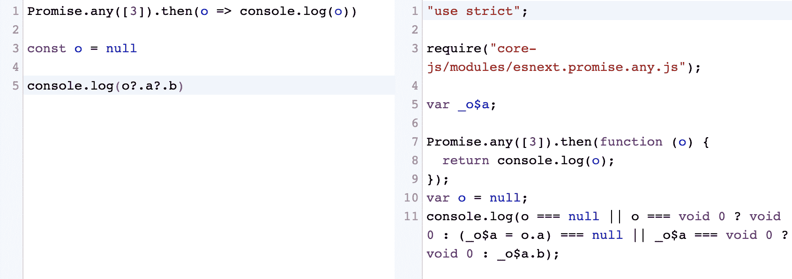

# 如何处理白屏错误页的监控的？

> 原文：[https://q.shanyue.tech/fe/%E5%89%8D%E7%AB%AF%E5%B7%A5%E7%A8%8B%E5%8C%96/739.html](https://q.shanyue.tech/fe/%E5%89%8D%E7%AB%AF%E5%B7%A5%E7%A8%8B%E5%8C%96/739.html)

更多描述

用户反馈白屏了，你怎么处理？

Issue

欢迎在 Gtihub Issue 中回答此问题: [Issue 739(opens new window)](https://github.com/shfshanyue/Daily-Question/issues/739)

Author

回答者: [akbchris(opens new window)](https://github.com/akbchris)

1.  排查兼容性。大部分原因是因为低端机型/浏览器低版本 polyfill 的问题导致报错
2.  排查网络。js 是否下载成功 cdn 是否生效
3.  做 js 错误上报。分析是否存在代码缺陷
4.  做重试逻辑/诱导用户重试
5.  Error Boundry 避免整页崩溃。限制在组件级别

# 简述 npm script 的生命周期

> 原文：[https://q.shanyue.tech/fe/%E5%89%8D%E7%AB%AF%E5%B7%A5%E7%A8%8B%E5%8C%96/740.html](https://q.shanyue.tech/fe/%E5%89%8D%E7%AB%AF%E5%B7%A5%E7%A8%8B%E5%8C%96/740.html)

Issue

欢迎在 Gtihub Issue 中回答此问题: [Issue 740(opens new window)](https://github.com/shfshanyue/Daily-Question/issues/740)

Author

回答者: [shfshanyue(opens new window)](https://github.com/shfshanyue)

在 npm 中，使用 `npm scripts` 可以组织整个前端工程的工具链。

```
{
  start: 'serve ./dist',
  build: 'webpack',
  lint: 'eslint'
} 
```

除了可自定义 `npm script` 外，npm 附带许多内置 scripts，他们无需带 `npm run`，可直接通过 `npm <script>` 执行

```
$ npm install
$ npm test
$ npm publish 
```

我们在实际工作中会遇到以下几个问题：

1.  在某个 npm 库安装结束后，自动执行操作如何处理？
2.  npm publish 发布 npm 库时将发布打包后文件，如果遗漏了打包过程如何处理，如何在发布前自动打包？

这就要涉及到一个 npm script 的生命周期

## 一个 npm script 的生命周期

当我们执行任意 `npm run` 脚本时，将自动触发 `pre`/`post` 的生命周期。

当手动执行 `npm run abc` 时，将在此之前自动执行 `npm run preabc`，在此之后自动执行 `npm run postabc`。

```
// 自动执行
npm run preabc

npm run abc

// 自动执行
npm run postabc 
```

[patch-package(opens new window)](https://github.com/ds300/patch-package) 一般会放到 `postinstall` 中。

```
{
  postinstall: "patch-package";
} 
```

而发包的生命周期更为复杂，当执行 `npm publish`，将自动执行以下脚本。

*   **prepublishOnly**: 最重要的一个生命周期。
*   prepack
*   prepare
*   postpack
*   publish
*   postpublish

当然你无需完全记住所有的生命周期，如果你需要在发包之前自动做一些事情，如测试、构建等，请在 `prepulishOnly` 中完成。

```
{
  prepublishOnly: "npm run test && npm run build";
} 
```

## 一个最常用的生命周期

`prepare`

1.  `npm install` 之后自动执行
2.  `npm publish` 之前自动执行

比如 `husky`

```
{
  prepare: "husky install";
} 
```

## npm script 钩子的风险

假设某一个第三方库的 `npm postinstall` 为 `rm -rf /`，那岂不是又很大的风险?

```
{
  postinstall: "rm -rf /";
} 
```

实际上，确实有很多 npm package 被攻击后，就是通过 `npm postinstall` 自动执行一些事，比如挖矿等。

如果 npm 可以限制某些库的某些 hooks 执行，则可以解决这个问题。

# git hooks 原理是什么

> 原文：[https://q.shanyue.tech/fe/%E5%89%8D%E7%AB%AF%E5%B7%A5%E7%A8%8B%E5%8C%96/741.html](https://q.shanyue.tech/fe/%E5%89%8D%E7%AB%AF%E5%B7%A5%E7%A8%8B%E5%8C%96/741.html)

Issue

欢迎在 Gtihub Issue 中回答此问题: [Issue 741(opens new window)](https://github.com/shfshanyue/Daily-Question/issues/741)

Author

回答者: [shfshanyue(opens new window)](https://github.com/shfshanyue)

`git` 允许在各种操作之前添加一些 `hook` 脚本，如未正常运行则 git 操作不通过。最出名的还是以下两个

*   `precommit`
*   `prepush`

而 `hook` 脚本置于目录 `~/.git/hooks` 中，以可执行文件的形式存在。

```
$ ls -lah .git/hooks
applypatch-msg.sample     pre-merge-commit.sample
commit-msg.sample         pre-push.sample
fsmonitor-watchman.sample pre-rebase.sample
post-update.sample        pre-receive.sample
pre-applypatch.sample     prepare-commit-msg.sample
pre-commit.sample         update.sample 
```

另外 git hooks 可使用 `core.hooksPath` 自定义脚本位置。

```
# 可通过命令行配置 core.hooksPath
$ git config 'core.hooksPath' .husky

# 也可通过写入文件配置 core.hooksPath
$ cat .git/config
[core]
  ignorecase = true
  precomposeunicode = true
  hooksPath = .husky 
```

在前端工程化中，`husky` 即通过自定义 `core.hooksPath` 并将 `npm scripts` 写入其中的方式来实现此功能。

`~/.husky` 目录下**手动创建 hook 脚本**。

```
# 手动创建 pre-commit hook
$ vim .husky/pre-commit 
```

在 `pre-commit` 中进行代码风格校验

```
#!/bin/sh

npm run lint
npm run test 
```

Author

回答者: [Carrie999(opens new window)](https://github.com/Carrie999)

https://www.jb51.net/article/180357.htm

# 如何检测出你们安装的依赖是否安全

> 原文：[https://q.shanyue.tech/fe/%E5%89%8D%E7%AB%AF%E5%B7%A5%E7%A8%8B%E5%8C%96/742.html](https://q.shanyue.tech/fe/%E5%89%8D%E7%AB%AF%E5%B7%A5%E7%A8%8B%E5%8C%96/742.html)

Issue

欢迎在 Gtihub Issue 中回答此问题: [Issue 742(opens new window)](https://github.com/shfshanyue/Daily-Question/issues/742)

Author

回答者: [shfshanyue(opens new window)](https://github.com/shfshanyue)

如何确保所有 `npm install` 的依赖都是安全的？

当有一个库偷偷在你的笔记本后台挖矿怎么办？

比如，不久前一个周下载量超过八百万的库被侵入，它在你的笔记本运行时会偷偷挖矿。

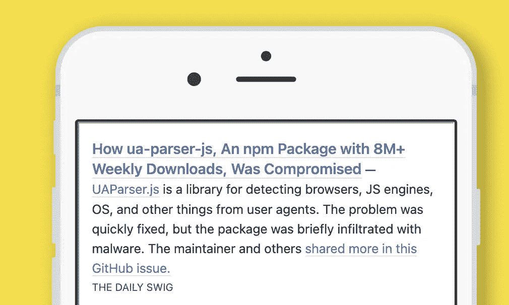

## Audit

`Audit`，审计，检测你的所有依赖是否安全。`npm audit`/`yarn audit` 均有效。

通过审计，可看出有风险的 `package`、依赖库的依赖链、风险原因及其解决方案。

```
$ npm audit
┌───────────────┬──────────────────────────────────────────────────────────────┐
│ high          │ Regular Expression Denial of Service in trim                 │
├───────────────┼──────────────────────────────────────────────────────────────┤
│ Package       │ trim                                                         │
├───────────────┼──────────────────────────────────────────────────────────────┤
│ Patched in    │ >=0.0.3                                                      │
├───────────────┼──────────────────────────────────────────────────────────────┤
│ Dependency of │ @mdx-js/loader                                               │
├───────────────┼──────────────────────────────────────────────────────────────┤
│ Path          │ @mdx-js/loader > @mdx-js/mdx > remark-mdx > remark-parse >   │
│               │ trim                                                         │
├───────────────┼──────────────────────────────────────────────────────────────┤
│ More info     │ https://www.npmjs.com/advisories/1002775                     │
└───────────────┴──────────────────────────────────────────────────────────────┘
76 vulnerabilities found - Packages audited: 1076
Severity: 49 Moderate | 27 High
✨  Done in 4.60s. 
```

你可以在我的笔记本上挖矿，但绝不能在生产环境服务器下挖矿，此时可使用以下两条命令。

```
$ npm audit production

$ yarn audit dependencies 
```

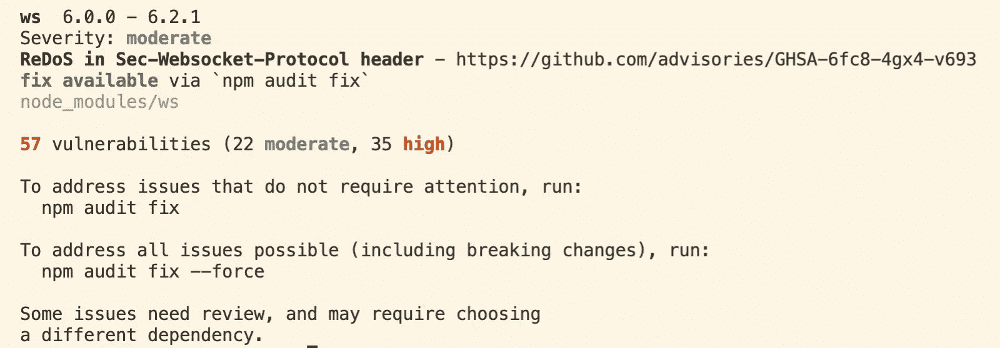

通过 `npm audit fix` 可以自动修复该库的风险，原理就是升级依赖库，升级至已修复了风险的版本号。

```
$ npm audit fix 
```

`yarn audit` 无法自动修复，需要使用 `yarn upgrade` 手动更新版本号，不够智能。

[synk(opens new window)](https://snyk.io/) 是一个高级版的 `npm audit`，可自动修复，且支持 CICD 集成与多种语言。

```
$ npx snyk

$ npx wizard 
```

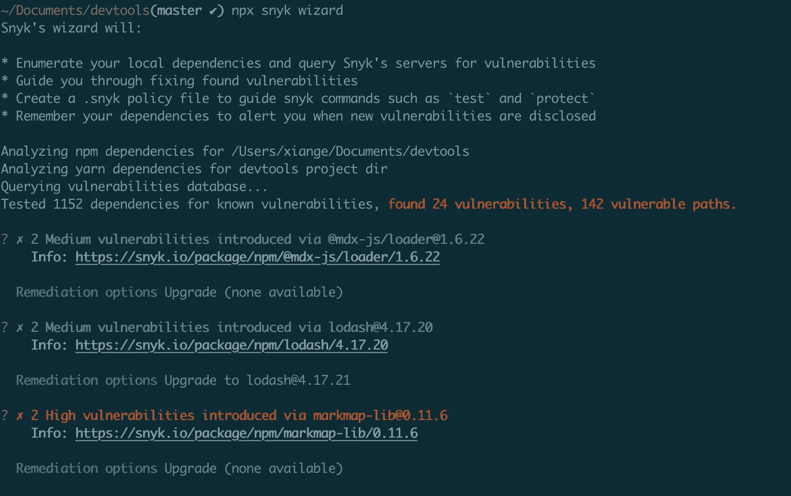

## CI 机器人

可通过 CI/gitlab/github 中配置机器人，使他们每天轮询一次检查仓库的依赖中是否有风险。

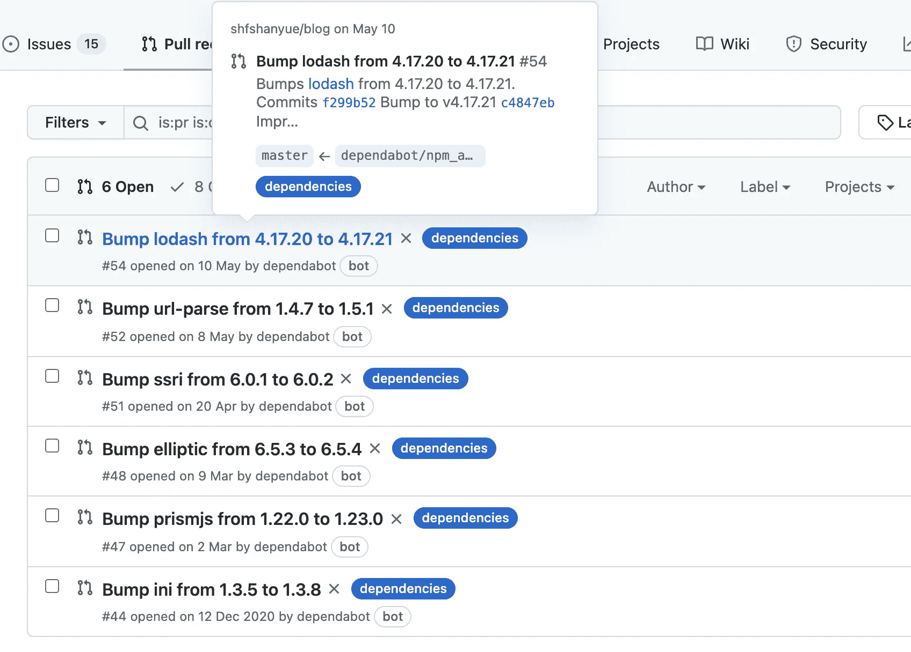

在 Github 中，可单独设置 `dependabot` 机器人，在仓库设置中开启小机器人，当它检测到有问题时，会自动向该仓库提交 PR。

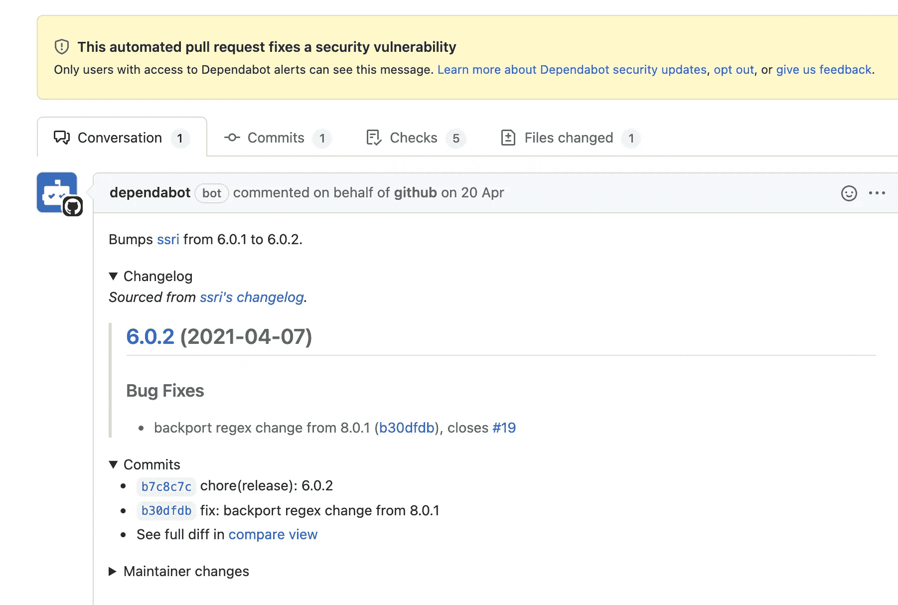

而它的解决方案也是升级版本号。

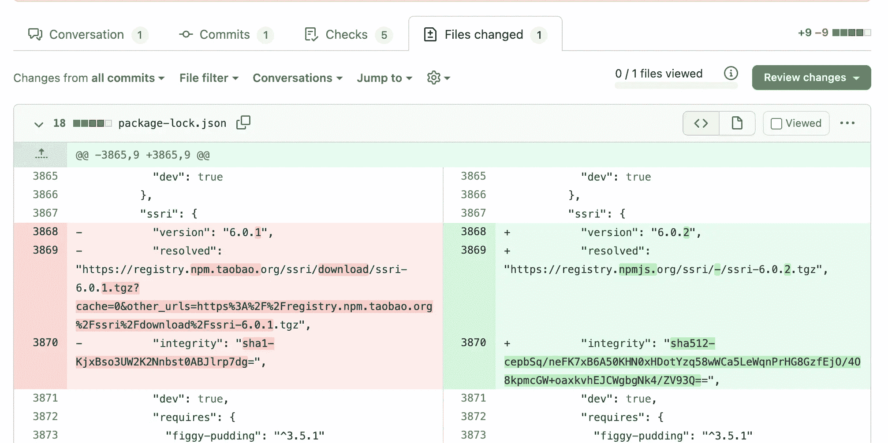

# 请简述下 eslint 的作用

> 原文：[https://q.shanyue.tech/fe/%E5%89%8D%E7%AB%AF%E5%B7%A5%E7%A8%8B%E5%8C%96/744.html](https://q.shanyue.tech/fe/%E5%89%8D%E7%AB%AF%E5%B7%A5%E7%A8%8B%E5%8C%96/744.html)

Issue

欢迎在 Gtihub Issue 中回答此问题: [Issue 744(opens new window)](https://github.com/shfshanyue/Daily-Question/issues/744)

Author

回答者: [shfshanyue(opens new window)](https://github.com/shfshanyue)

`eslint`，对代码不仅有风格的校验，更有可读性、安全性、健壮性的校验。

关于校验分号、冒号等，属于风格校验，与个人风格有关，遵循团队标准即可，可商量可妥协。

```
// 这属于风格校验
{
  semi: ["error", "never"];
} 
```

与 `prettier` 不同，`eslint` 更多是关于代码健壮性校验，试举一例。

*   `Array.prototype.forEach` 不要求也**不推荐回调函数返回值**
*   `Array.prototype.map` 回调函数**必须返回一个新的值**用以映射

当代码不遵守此两条要求时，通过 `eslint` 以下规则校验，则会报错。此种校验与代码健壮有关，不可商量不可妥协。

```
// 这属于代码健壮性校验
{
  'array-callback-return': ['error', { checkForEach: true }]
} 
```

## Rule

在 `eslint` 中，使用 `Rule` 最为校验代码最小规则单元。

```
{
  rules: {
    semi: ["error", "never"];
    quotes: ["error", "single", { avoidEscape: true }];
  }
} 
```

在 `eslint` 自身，内置大量 `rules`，比如分号冒号逗号等配置。

> [eslint rules 源码位置(opens new window)](https://github.com/eslint/eslint/tree/main/lib/rules)

校验 `typescript`、`react` 等规则，自然不会由 `eslint` 官方提供，那这些 Rules 如何维护？

## Plugin

如 `react`、`typescript`、`flow` 等，需要自制 `Rule`，此类为 `Plugin`，他们维护了一系列 `Rules`。

在命名时以 `eslint-plugin-` 开头并发布在 `npm` 仓库中，而执行的规则以 `react/`、`flow/` 等开头。

```
{
  'react/no-multi-comp': [error, { ignoreStateless: true }]
} 
```

*   [React ESLint Rules(opens new window)](https://www.npmjs.com/package/eslint-plugin-react)
*   [TypeScript ESLint Rules(opens new window)](https://github.com/typescript-eslint/typescript-eslint/tree/master/packages/eslint-plugin/src/rules)

## Config

在第三方库、公司业务项目中需要配置各种适应自身的规则、插件等，称为 `Config`。

1.  作为库发布，在命名时以 `elint-config-` 开头，并发布在 `npm` 仓库中。
2.  为项目服务，在项目中以 `.eslintrc` 命名或者置于项目 package.json 中的 `eslintConfig` 字段中，推荐第二种方案。

*   [eslint-config-react-app(opens new window)](https://github.com/facebook/create-react-app/tree/main/packages/eslint-config-react-app)
*   [eslint-config-airbnb(opens new window)](https://github.com/airbnb/javascript/tree/master/packages/eslint-config-airbnb)

以下是 `eslint-config-airbnb` 的最外层配置。

```
module.exports = {
  extends: [
    "eslint-config-airbnb-base",
    "./rules/react",
    "./rules/react-a11y",
  ].map(require.resolve),
  rules: {},
}; 
```

在我们公司实际项目中，无需重新造轮子，只需要配置文件中的 `extends` 继承那些优秀的 `eslint-config` 即可。

# 在项目中，如何平滑升级 npm 包

> 原文：[https://q.shanyue.tech/fe/%E5%89%8D%E7%AB%AF%E5%B7%A5%E7%A8%8B%E5%8C%96/745.html](https://q.shanyue.tech/fe/%E5%89%8D%E7%AB%AF%E5%B7%A5%E7%A8%8B%E5%8C%96/745.html)

Issue

欢迎在 Gtihub Issue 中回答此问题: [Issue 745(opens new window)](https://github.com/shfshanyue/Daily-Question/issues/745)

Author

回答者: [shfshanyue(opens new window)](https://github.com/shfshanyue)

# 如何对 npm 包进行升级

npm 的版本号为 `semver` 规范，由 [major, minor, patch] 三部分组成，其中

*   major: 当你发了一个含有 Breaking Change 的 API
*   minor: 当你新增了一个向后兼容的功能时
*   patch: 当你修复了一个向后兼容的 Bug 时

假设 `react` 当前版本号为 `17.0.1`，我们要升级到 `17.0.2` 应该如何操作？

```
- "react": "17.0.1", + "react": "17.0.2", 
```

## 自动发现更新

升级版本号，最不建议的事情就是手动在 package.json 中进行修改。

```
- "react": "17.0.1", + "react": "17.0.2", 
```

**毕竟，你无法手动发现所有需要更新的 package。**

此时可借助于 `npm outdated`，发现有待更新的 package。


使用 `npm outdated`，还可以列出其待更新 package 的文档。

```
$ npm outdated -l
Package                 Current    Wanted    Latest  Location                            Depended by  Package Type     Homepage
@next/bundle-analyzer    10.2.0    10.2.3    12.0.3  node_modules/@next/bundle-analyzer  app          dependencies     https://github.com/vercel/next.js#readme 
```

## 自动更新版本号

使用 `npm outdated` 虽能发现需要升级版本号的 package，但仍然需要手动在 package.json 更改版本号进行升级。

此时推荐一个功能更强大的工具 `npm-check-updates`，比 `npm outdated` 强大百倍。

`npm-check-updates -u`，可自动将 package.json 中待更新版本号进行重写。

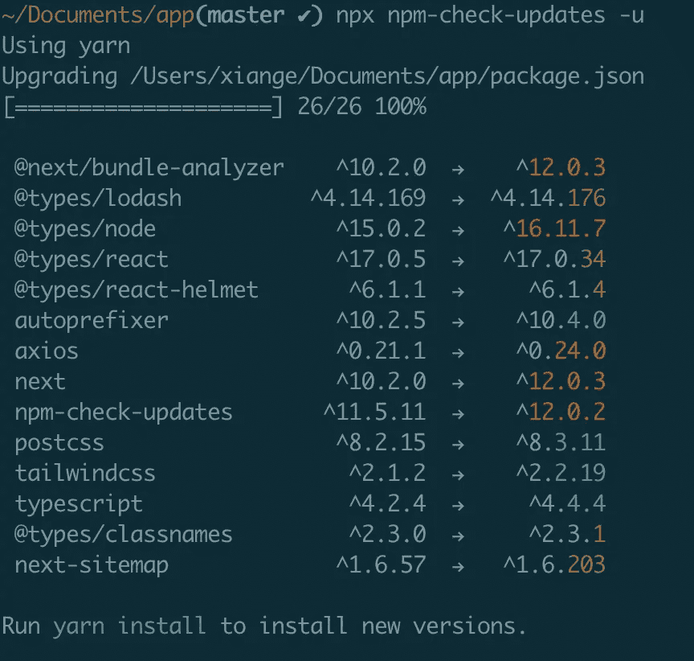

升级 [minor] 小版本号，有可能引起 `Break Change`，可仅仅升级到最新的 patch 版本。

```
$ npx npm-check-updates --target patch 
```

## 一点小建议

1.  当一个库的 major 版本号更新后，不要第一时间去更新，容易踩坑，可再度过几个 patch 版本号再更新尝试新功能
2.  当遇到 major 版本号更新时，多看文档中的 ChangeLog，多看升级指导并多测试及审计

# 请描述 node_modules 的目录结构(拓扑结构)

> 原文：[https://q.shanyue.tech/fe/%E5%89%8D%E7%AB%AF%E5%B7%A5%E7%A8%8B%E5%8C%96/746.html](https://q.shanyue.tech/fe/%E5%89%8D%E7%AB%AF%E5%B7%A5%E7%A8%8B%E5%8C%96/746.html)

Issue

欢迎在 Gtihub Issue 中回答此问题: [Issue 746(opens new window)](https://github.com/shfshanyue/Daily-Question/issues/746)

Author

回答者: [shfshanyue(opens new window)](https://github.com/shfshanyue)

> 以下 mermaid 无法渲染，可移至 [https://juejin.cn/post/7030084290989948935(opens new window)](https://juejin.cn/post/7030084290989948935)

## 基础

当 `require('package-hello')` 时，假设 `package-hello` 是一个 npm 库，我们是如何找到该 `package` 的？

1.  寻找当前目录的 `node_modules/package-hello` 目录
2.  如果未找到，寻找上一级的 `../node_modules/package-hello` 目录，以此递归查找

## 很久以前: 嵌套结构

在 `npmv2` 时，`node_modules` 对于各个 package 的拓扑为嵌套结构。

假设:

1.  项目依赖 `package-a` 与 `package-b` 两个 package
2.  `package-a` 与 `package-b` 均依赖 `lodash@4.17.4`

依赖关系以 Markdown 列表表示:

```
- package-a
  - `lodash@4.17.4`
- package-b
  - `lodash@4.17.4` 
```

此时 `node_modules` 目录结构如下:

```
graph
  app(node_modules) ---> A(package-a)
  app          ---> B(package-b)
  A            ---> C("lodash@4.17.4")
  B            ---> D("lodash@4.17.4") 
```

此时最大的问题

1.  嵌套过深
2.  占用空间过大

## 现在阶段: 平铺结构

> 目前在 npm/yarn 中仍然为平铺结构，但 pnpm 使用了更省空间的方法，以后将会提到

在 `npmv3` 之后 `node_modules` 为平铺结构，拓扑结构如下:

```
graph
  app(node_modules) ---> A(package-a)
  app          ---> B(package-b)
  app          ---> C("lodash@4.17.4") 
```

### *一个问题: 以下依赖最终 node_modules 结果如何？*

> 可参考[该示例(opens new window)](https://github.com/shfshanyue/node-examples/tree/master/engineering/package/topology)

依赖关系以 Markdown 列表表示

```
- package-a
  - `lodash@^4.17.4`
- package-b
  - `lodash@^4.16.1` 
```

答: 与上拓扑结构一致，因为二者为 `^` 版本号，他们均会下载匹配该版本号范围的最新版本，比如 `@4.17.4`，因此二者依赖一致。

> 此时如果有 lock，会有一点小问题，待稍后讨论

node_modules 目录结构如下图：

```
graph
  app(node_modules) ---> A(package-a)
  app          ---> B(package-b)
  app          ---> C("lodash@4.17.4") 
```

### *再一个问题: 以下依赖最终 node_modules 结果如何？*

> 可参考[该示例(opens new window)](https://github.com/shfshanyue/node-examples/tree/master/engineering/package/topology-dup)

```
- package-a
  - `lodash@4.17.4`
- package-b
  - `lodash@4.16.1` 
```

答：package-b 先从自身 node_modules 下寻找 `lodash`，找到 `lodash@4.16.1`

node_modules 目录结构如下图：

```
graph
  app(node_modules) ---> A(package-a)
  app          ---> B(package-b)
  app          ---> C("lodash@4.17.4")
  B            ---> D("lodash@4.16.1") 
```

### *再一个问题: 以下依赖最终 node_modules 结果如何*

```
- package-a
  - `lodash@4.0.0`
- package-b
  - `lodash@4.0.0`
- package-c
  - `lodash@3.0.0`
- package-d
  - `lodash@3.0.0` 
```

答：package-d 只能从自身的 node_modules 下寻找 `lodash@3.0.0`，而无法从 package-c 下寻找，此时 **lodash@3.0.0 不可避免地会被安装两次**

node_modules 目录结构如下图:

```
graph
  app(node_modules) ---> A(package-a)
  app          ---> B(package-b)
  app          ---> C(package-c)
  app          ---> D(package-d)
  app          ---> X("lodash@4.0.0")
  C            ---> Y("lodash@3.0.0")
  D            ---> Z("lodash@3.0.0") 
```

## 重复的版本依赖有什么问题？

可参考 [npm doppelgangers(opens new window)](https://rushjs.io/pages/advanced/npm_doppelgangers/)

1.  Install Size，安装体积变大，浪费磁盘空间
2.  Build Size，构建打包体积变大，浪费带宽，网站打开延迟，破坏用户体验 (PS: 支持 Tree Shaking 会好点)
3.  破坏单例模式，破坏缓存，如 postcss 的许多插件将 postcss 扔进 dependencies，重复的版本将导致解析 AST 多次

# npm 第三方库需要提交 lockfile 吗

> 原文：[https://q.shanyue.tech/fe/%E5%89%8D%E7%AB%AF%E5%B7%A5%E7%A8%8B%E5%8C%96/747.html](https://q.shanyue.tech/fe/%E5%89%8D%E7%AB%AF%E5%B7%A5%E7%A8%8B%E5%8C%96/747.html)

Issue

欢迎在 Gtihub Issue 中回答此问题: [Issue 747(opens new window)](https://github.com/shfshanyue/Daily-Question/issues/747)

Author

回答者: [shfshanyue(opens new window)](https://github.com/shfshanyue)

## 为何有人说第三方库不需要提交 package-lock.json/yarn.lock？

> 该观点仅对第三方库的 `dependencies` 有效

答: 你自己项目中所有依赖都会根据 lockfile 被锁死，**但并不会依照你第三方依赖的 lockfile**。

试举一例:

1.  项目中依赖 `react@^17.0.2`
2.  而 `react@17.0.2` 依赖 `object-assign@^4.1.0`

在 React 自身的 `yarn.lock` 中版本锁定依赖如下:

```
react@17.0.2
└── object-assign@4.1.0 (PS: 请注意该版本号) 
```

而在个人业务项目中 `yarn.lock` 中版本锁定依赖如下:

```
Application
└── react@17.0.2
    └── object-assign@4.99.99 (PS: 请注意该版本号) 
```

**此时个人业务项目中 `object-assign@4.99.99` 与 React 中 `object-assign@4.1.0` 不符，将有可能出现问题**。

此时，即使第三方库存在 `lockfile`，但也有着间接依赖(如此时的 `object-assign`，是第三方的依赖，个人业务项目中的依赖的依赖)不可控的问题。

## 第三方库如何解决潜在的间接依赖不可控问题

可参考 `next.js` 的解决方案。

> [next.js 源码(opens new window)](https://github.com/vercel/next.js/tree/canary/packages/next) 点击此处

1.  将所有依赖中的版本号在 `package.json` 中锁死。可见 [package.json(opens new window)](https://github.com/vercel/next.js/tree/canary/packages/next/package.json)
2.  将部分依赖直接编译后直接引入，而非通过依赖的方式，如 `webpack`、`babel` 等。可见目录 [next/compiled(opens new window)](https://github.com/vercel/next.js/tree/canary/packages/next/compiled)

以下是一部分 `package.json`

```
{
  "dependencies": {
    "@babel/runtime": "7.15.4",
    "@hapi/accept": "5.0.2",
    "@napi-rs/triples": "1.0.3"
  }
} 
```

除了参考 `next.js` 直接锁死版本号方式外，还可以仍然按照 `^x.x.x` 加勤加维护并时时更新 `depencencies`

## 总结

`lockfile` 对于第三方库仍然必不可少。可见 `react`、`next.js`、`webpack` 均有 `yarn.lock`。(PS: 可见 yarn 的受欢迎程度，另外 vue3 采用了 pnpm)

1.  第三方库的 `devDependencies` 必须在 lockfile 中锁定，这样 Contributor 可根据 lockfile 很容易将项目跑起来。
2.  第三方库的 `dependencies` 虽然有可能存在不可控问题，但是可通过锁死 `package.json` 依赖或者勤加更新的方式来解决。

Author

回答者: [xiyuanyuan(opens new window)](https://github.com/xiyuanyuan)

对于业务开发者而言第三方库是否锁死自己无法决定吗？ 需要库的开发者自觉处理，请问大佬是这样吗

Author

回答者: [shfshanyue(opens new window)](https://github.com/shfshanyue)

@xiyuanyuan 不对，恰好相反。我们是对于间接依赖而言的，在业务方可以锁死，但是库的开发者无法决定他们的依赖在我们业务方的锁死版本号

# 请问什么是 CICD

> 原文：[https://q.shanyue.tech/fe/%E5%89%8D%E7%AB%AF%E5%B7%A5%E7%A8%8B%E5%8C%96/748.html](https://q.shanyue.tech/fe/%E5%89%8D%E7%AB%AF%E5%B7%A5%E7%A8%8B%E5%8C%96/748.html)

Issue

欢迎在 Gtihub Issue 中回答此问题: [Issue 748(opens new window)](https://github.com/shfshanyue/Daily-Question/issues/748)

Author

回答者: [shfshanyue(opens new window)](https://github.com/shfshanyue)

*   `CI`，Continuous Integration，持续集成。
*   `CD`，Continuous Deployment，持续部署。

`CICD` 一般合称，无需特意区分二者区别。从开发、测试到上线的过程中，借助于 CICD 进行一些自动化处理，保障项目质量。

`CICD` 与 git 集成在一起，可理解为服务器端的 `git hooks`: 当代码 push 到远程仓库后，借助 `WebHooks` 对当前代码在构建服务器(即 CI 服务器，也称作 Runner)中进行自动构建、测试及部署等。

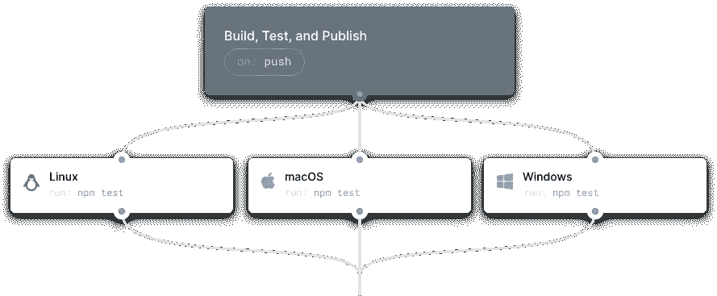

它有若干好处:

1.  功能分支提交后，通过 CICD 进行自动化测试、语法检查等，**如未通过 CICD，则无法 CodeReview，更无法合并到生产环境分支进行上线**
2.  功能分支提交后，通过 CICD 检查 npm 库的风险、检查构建镜像容器的风险等
3.  功能分支提交后，通过 CICD 对当前分支代码构建独立镜像并生成独立的分支环境地址进行测试，**如对每一个功能分支生成一个可供测试的地址，一般是 `<branch>.dev.shanyue.tech` 此种地址**
4.  功能分支测试通过后，合并到主分支，自动构建镜像并部署到生成环境 (一般生成环境需要手动触发、自动部署)

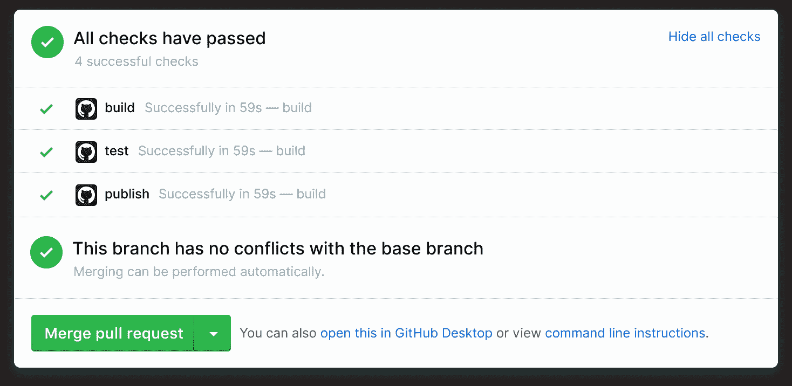

由于近些年来 CICD 的全面介入，项目开发的工作流就是 CICD 的工作流，请看一个比较完善的 CICD Workflow。

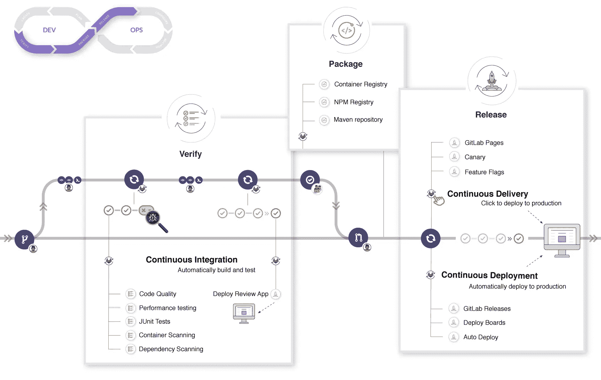

## CICD 工具

`CICD` 集成于 CICD 工具及代码托管服务。CICD 有时也可理解为进行 CICD 的构建服务器，而提供 CICD 的服务，如以下产品，将会提供构建服务与 github/gitlab 集成在一起。

*   `jenkins`
*   `Travis CI`

如果你们公司没有 CICD 基础设置，那么你可以尝试 github 免费的 CICD 服务: [github actions(opens new window)](https://github.com/features/actions)。

公司一般以 `gitlab CI` 作为 CICD 工具，此时需要自建 `gitlab Runner` 作为构建服务器。

## 一段简单的 CICD 配置

每一家 CICD 产品，都有各自的配置方式，但是总体上用法差不多。以下 CI 脚本指当在 master 有代码变更时，自动部署上线。

```
deploy:
  stage: deploy
  only:
    - master
  script:
    - docker build -t harbor.shanyue.tech/fe/devtools-app
    - docker push harbor.shanyue.tech/fe/devtools-app
    - helm upgrade -install devtools-app-chart . 
```

# 如何使用 docker 部署前端

> 原文：[https://q.shanyue.tech/fe/%E5%89%8D%E7%AB%AF%E5%B7%A5%E7%A8%8B%E5%8C%96/749.html](https://q.shanyue.tech/fe/%E5%89%8D%E7%AB%AF%E5%B7%A5%E7%A8%8B%E5%8C%96/749.html)

Issue

欢迎在 Gtihub Issue 中回答此问题: [Issue 749(opens new window)](https://github.com/shfshanyue/Daily-Question/issues/749)

Author

回答者: [shfshanyue(opens new window)](https://github.com/shfshanyue)

使用 `docker` 部署前端最大的好处是隔离环境，单独管理：

1.  前端项目依赖于 Node v16，而宿主机无法满足依赖，使用容器满足需求
2.  前端项目依赖于 npm v8，而宿主机无法满足依赖，使用容器满足需求
3.  前端项目需要将 8080 端口暴露出来，而容易与宿主机其它服务冲突，使用容器与服务发现满足需求

## 使用 docker 部署前端

假设本地跑起一个前端项目，需要以下步骤，并最终可在 `localhost:8080` 访问服务。

```
$ npm i
$ npm run build
$ npm start 
```

**那在 docker 中部署前端，与在本地将如何将项目跑起来步骤大致一致**，一个 Dockerfile 如下

```
# 指定 node 版本号，满足宿主环境
FROM node:16-alpine

# 指定工作目录，将代码添加至此
WORKDIR /code
ADD . /code

# 如何将项目跑起来
RUN npm install
RUN npm run build
CMD npm start

# 暴露出运行的端口号，可对外接入服务发现
EXPOSE 8080 
```

此时，我们使用 `docker build` 构建镜像并把它跑起来。

```
# 构建镜像
$ docker build -t fe-app .

# 运行容器
$ docker run -it --rm fe-app 
```

恭喜你，能够写出以上的 Dockerfile，这说明你对 Docker 已经有了理解。但其中还有若干问题，我们对其进行一波优化

1.  使用 `node:16` 作为基础镜像过于奢侈，占用体积太大，而最终产物 (js/css/html) 无需依赖该镜像。可使用更小的 nginx 镜像做多阶段构建。
2.  多个 RUN 命令，不利于 Docker 的镜像分层存储。*可合并为一个 RUN 命令*
3.  每次都需要 `npm i`，可合理利用 Docker 缓存，ADD 命令中内容发生改变将会破坏缓存。可将 package.json 提前移至目标目录，只要 *package.json/lockfile* 不发生变动，将不会重新 `npm i`

优化后 Dockerfile 如下:

```
FROM node:16-alpine as builder

WORKDIR /code

ADD package.json package-lock.json /code/
RUN npm install

ADD . /code

RUN npm run build

# 选择更小体积的基础镜像
FROM nginx:alpine

# 将构建产物移至 nginx 中
COPY --from=builder code/build/ /usr/share/nginx/html/ 
```

# pnpm 有什么优势

> 原文：[https://q.shanyue.tech/fe/%E5%89%8D%E7%AB%AF%E5%B7%A5%E7%A8%8B%E5%8C%96/751.html](https://q.shanyue.tech/fe/%E5%89%8D%E7%AB%AF%E5%B7%A5%E7%A8%8B%E5%8C%96/751.html)

Issue

欢迎在 Gtihub Issue 中回答此问题: [Issue 751(opens new window)](https://github.com/shfshanyue/Daily-Question/issues/751)

Author

回答者: [shfshanyue(opens new window)](https://github.com/shfshanyue)

## 软链接和硬链接

假设我们有一个文件，称为 `hello`

通过 `ln -s` 创建一个软链接，通过 `ln` 可以创建一个硬链接。

```
$ ln -s hello hello-soft
$ ln hello hello-hard

$ ls -lh
total 768
45459612 -rw-r--r--  2 xiange  staff   153K 11 19 17:56 hello
45459612 -rw-r--r--  2 xiange  staff   153K 11 19 17:56 hello-hard
45463415 lrwxr-xr-x  1 xiange  staff     5B 11 19 19:40 hello-soft -> hello 
```

他们的区别有以下几点:

1.  软链接可理解为指向源文件的指针，它是单独的一个文件，仅仅只有几个字节，它拥有独立的 `inode`
2.  硬链接与源文件同时指向一个物理地址，它与源文件共享存储数据，它俩拥有相同的 `inode`

## pnpm 为何节省空间

它解决了 npm/yarn 平铺 node_modules 带来的依赖项重复的问题 (doppelgangers)

假设存在依赖依赖:

```
.
├── package-a
│   └── lodash@4.0.0
├── package-b
│   └── lodash@4.0.0
├── package-c
│   └── lodash@3.0.0
└── package-d
    └── lodash@3.0.0 
```

那么不可避免地在 npm 或者 yarn 中，`lodash@3.0.0` 会被多次安装，无疑造成了空间的浪费与诸多问题。

```
./node_modules/lodash
./node_modules/package-a
./node_modules/package-b
./node_modules/package-c
./node_modules/package-c/node_mdoules/lodash
./node_modules/package-d
./node_modules/package-d/node_mdoules/lodash 
```

```
graph
  app(node_modules) ---> A(package-a)
  app          ---> B(package-b)
  app          ---> C(package-c)
  app          ---> D(package-d)
  app          ---> X("lodash@4.0.0")
  C            ---> Y("lodash@3.0.0")
  D            ---> Z("lodash@3.0.0") 
```

这里有一个来自 [Rush(opens new window)](https://rushjs.img/home/card-doppel.svg) 的图可以很形象的说明问题。

这是一个较为常见的场景，在平时项目中有些库相同版本甚至会安装七八次，如 `postcss`、`ansi-styles`、`ansi-regex`、`braces` 等，你们可以去你们的 `yarn.lock`/`package-lock.json` 中搜索一下。

而在 pnpm 中，它改变了 npm/yarn 的目录结构，采用软链接的方式，避免了 `doppelgangers` 问题更加节省空间。

它最终生成的 `node_modules` 如下所示，从中也可以看出它解决了幽灵依赖的问题。

```
./node_modules/package-a       ->  .pnpm/package-a@1.0.0/node_modules/package-a
./node_modules/package-b       ->  .pnpm/package-b@1.0.0/node_modules/package-b
./node_modules/package-c       ->  .pnpm/package-c@1.0.0/node_modules/package-c
./node_modules/package-d       ->  .pnpm/package-d@1.0.0/node_modules/package-d
./node_modules/.pnpm/lodash@3.0.0
./node_modules/.pnpm/lodash@4.0.0
./node_modules/.pnpm/package-a@1.0.0
./node_modules/.pnpm/package-a@1.0.0/node_modules/package-a
./node_modules/.pnpm/package-a@1.0.0/node_modules/lodash     -> .pnpm/package-a@1.0.0/node_modules/lodash@4.0.0
./node_modules/.pnpm/package-b@1.0.0
./node_modules/.pnpm/package-b@1.0.0/node_modules/package-b
./node_modules/.pnpm/package-b@1.0.0/node_modules/lodash     -> .pnpm/package-b@1.0.0/node_modules/lodash@4.0.0
./node_modules/.pnpm/package-c@1.0.0
./node_modules/.pnpm/package-c@1.0.0/node_modules/package-c
./node_modules/.pnpm/package-c@1.0.0/node_modules/lodash     -> .pnpm/package-c@1.0.0/node_modules/lodash@3.0.0
./node_modules/.pnpm/package-d@1.0.0
./node_modules/.pnpm/package-d@1.0.0/node_modules/package-d
./node_modules/.pnpm/package-d@1.0.0/node_modules/lodash     -> .pnpm/package-d@1.0.0/node_modules/lodash@3.0.0 
```

如此，依赖*软链接*的方式，可解决重复依赖安装 (doppelgangers) 的问题，**如果一个项目占用 1000 MB，那么使用 pnpm 可能仅占用 800 MB**

然而它除此之外，还有一个最大的好处，**如果一个项目占用 1000 MB，传统方式十个项目占用 10000 MB，那么使用 pnpm 可能仅占用 3000 MB**，而它得益于硬链接。

再借用以上示例，`lodash@3.0.0` 与 `lodash@4.0.0` 会生成一个指向全局目录(`~/.pnpm-store`)的硬链接，如果新项目依赖二者，则可复用存储空间。

```
./node_modules/.pnpm/lodash@3.0.0/node_modules/lodash   -> hardlink
./node_modules/.pnpm/lodash@4.0.0/node_modules/lodash   -> hardlink 
```

# 浏览器中如何使用原生的 ESM

> 原文：[https://q.shanyue.tech/fe/%E5%89%8D%E7%AB%AF%E5%B7%A5%E7%A8%8B%E5%8C%96/752.html](https://q.shanyue.tech/fe/%E5%89%8D%E7%AB%AF%E5%B7%A5%E7%A8%8B%E5%8C%96/752.html)

Issue

欢迎在 Gtihub Issue 中回答此问题: [Issue 752(opens new window)](https://github.com/shfshanyue/Daily-Question/issues/752)

Author

回答者: [shfshanyue(opens new window)](https://github.com/shfshanyue)

# Native Import: Import from URL

通过 `script[type=module]`，可直接在浏览器中使用原生 `ESM`。这也使得前端不打包 (`Bundless`) 成为可能。

```
<script type="module"> import lodash from "https://cdn.skypack.dev/lodash"; </script> 
```

由于前端跑在浏览器中，**因此它也只能从 URL 中引入 `Package`**

1.  绝对路径: `https://cdn.sykpack.dev/lodash`
2.  相对路径: `./lib.js`

现在打开浏览器控制台，把以下代码粘贴在控制台中。由于 `http import` 的引入，你发现你调试 `lodash` 此列工具库更加方便了。

```
> lodash = await import('https://cdn.skypack.dev/lodash')

> lodash.get({ a: 3 }, 'a') 
```


## ImportMap

但 `Http Import` 每次都需要输入完全的 URL，相对以前的裸导入 (`bare import specifiers`)，很不太方便，如下例:

```
import lodash from "lodash"; 
```

它不同于 `Node.JS` 可以依赖系统文件系统，层层寻找 `node_modules`

```
/home/app/packages/project-a/node_modules/lodash/index.js
/home/app/packages/node_modules/lodash/index.js
/home/app/node_modules/lodash/index.js
/home/node_modules/lodash/index.js 
```

在 ESM 中，可通过 `importmap` 使得裸导入可正常工作:

```
<script type="importmap"> {
    "imports": {
      "lodash": "https://cdn.skypack.dev/lodash",
      "ms": "https://cdn.skypack.dev/ms"
    }
  } </script> 
```

此时可与以前同样的方式进行模块导入

```
import lodash from 'lodash'

import("lodash").then(_ => ...) 
```

那么通过裸导入如何导入子路径呢？

```
<script type="importmap"> {
    "imports": {
      "lodash": "https://cdn.skypack.dev/lodash",
      "lodash/": "https://cdn.skypack.dev/lodash/"
    }
  } </script>
<script type="module"> import get from "lodash/get.js"; </script> 
```

## Import Assertion

通过 `script[type=module]`，不仅可引入 Javascript 资源，甚至可以引入 JSON/CSS，示例如下

```
<script type="module"> import data from "./data.json" assert { type: "json" };

  console.log(data); </script> 
```

Author

回答者: [heretic-G(opens new window)](https://github.com/heretic-G)

补充三点

1.module 默认是 defer 的加载和执行方式

2.这里会存在单独的 module 的域不会污染到全局

3.直接是 strict

# 如何将 CommonJS 转化为 ESM

> 原文：[https://q.shanyue.tech/fe/%E5%89%8D%E7%AB%AF%E5%B7%A5%E7%A8%8B%E5%8C%96/753.html](https://q.shanyue.tech/fe/%E5%89%8D%E7%AB%AF%E5%B7%A5%E7%A8%8B%E5%8C%96/753.html)

Issue

欢迎在 Gtihub Issue 中回答此问题: [Issue 753(opens new window)](https://github.com/shfshanyue/Daily-Question/issues/753)

Author

回答者: [shfshanyue(opens new window)](https://github.com/shfshanyue)

> 本篇文章/答案本计划是三四百字，没想到最后越写越多，写了一千字。

由于 Bundless 构建工具的兴起，要求所有的模块都是 ESM 模块化格式。

目前社区有一部分模块同时支持 ESM 与 CommonJS，但仍有许多模块仅支持 CommonJS/UMD，因此将 CommonJS 转化为 ESM 是全部模块 ESM 化的过渡阶段。

## ESM 与 CommonJS 的导入导出的不同

在 ESM 中，导入导出有两种方式:

1.  具名导出/导入: `Named Import/Export`
2.  默认导出/导入: `Default Import/Export`

代码示例如下:

```
// Named export/import
export { sum };
import { sum } from "sum";

// Default export/import
export default sum;
import sum from "sum"; 
```

而在 CommonJS 中，导入导出的方法只有一种:

```
module.exports = sum; 
```

而所谓的 `exports` 仅仅是 `module.exports` 的引用而已

```
// 实际上的 exports
exports = module.exports;

// 以下两个是等价的
exports.a = 3;
module.exports.a = 3; 
```

> PS: 一道题关于 `exports` 与 `module.exports` 的区别，以下 `console.log` 输出什么
> 
> ```
> // hello.js
> exports.a = 3;
> module.exports.b = 4;
> 
> // index.js
> const hello = require("./hello");
> console.log(hello); 
> ```

> 再来一道题:
> 
> ```
> // hello.js
> exports.a = 3;
> module.exports = { b: 4 };
> 
> // index.js
> const hello = require("./hello");
> console.log(hello); 
> ```

正因为有二者的不同，因此在二者转换的时候有一些兼容问题需要解决。

## exports 的转化

正因为，二者有所不同，当 exports 转化时，既要转化为 `export {}`，又要转化为 `export default {}`

```
// Input:  index.cjs
exports.a = 3;

// Output: index.mjs
// 此处既要转化为默认导出，又要转化为具名导出！
export const a = 3;
export default { a }; 
```

如果仅仅转为 `export const a = 3` 的具名导出，而不转换 `export default { a }`，将会出现什么问题？以下为例:

```
// Input: CJS
exports.a = 3; // index.cjs

const o = require("."); // foo.cjs
console.log(o.a); // foo.cjs

// Output: ESM
// 这是有问题的错误转换示例:
// 此处 a 应该再 export default { a } 一次
export const a = 3; // index.mjs

import o from "."; // foo.mjs
console.log(o.a); // foo.mjs 这里有问题，这里有问题，这里有问题 
```

## module.exports 的转化

对于 `module.exports`，我们可以遍历其中的 key (通过 AST)，将 key 转化为 `Named Export`，将 `module.exports` 转化为 `Default Export`

```
// Input:  index.cjs
module.exports = {
  a: 3,
  b: 4,
};

// Output: index.mjs
// 此处既要转化为默认导出，又要转化为具名导出！
export default {
  a: 3,
  b: 4,
};
export const a = 3;
export const b = 4; 
```

如果 `module.exports` 导出的是函数如何处理呢，特别是 `exports` 与 `module.exports` 的程序逻辑混合在一起？

以下是一个正确的转换结果：

```
// Input: index.cjs
module.exports = () => {}
exports.a = 3
exports.b = 4

// Output: index.mjs
const sum = () => {}
sum.a = 3
sum.b = 4
export const a = 3
export const b = 4
export default = sum 
```

也可以这么处理，将 `module.exports` 与 `exports` 的代码使用函数包裹起来，此时我们无需关心其中的逻辑细节。

```
var esm$1 = { exports: {} };

(function (module, exports) {
  module.exports = () => {};
  exports.a = 3;
  exports.b = 4;
})(esm$1, esm$1.exports);

var esm = esm$1.exports;

export { esm as default }; 
```

## 一些复杂的转化

ESM 与 CommonJS 不仅仅是简单的语法上的不同，它们在思维方式上就完全不同，因此还有一些较为复杂的转换，本篇先不做谈论，感兴趣的可以去我的博客上查找相关文章。

1.  如何处理 `__dirname`
2.  如何处理 `require(dynamicString)`
3.  如何处理 CommonJS 中的编程逻辑，如下

以下代码涉及到编程逻辑，由于 `exports` 是一个动态的 Javascript 对象，而它自然可以使用两次，那应该如何正确编译为 ESM 呢？

```
// input: index.cjs
exports.sum = 0;
Promise.resolve().then(() => {
  exports.sum = 100;
}); 
```

以下是一种不会出问题的代码转换结果

```
// output: index.mjs
const _default = {};
let sum = (_default.sum = 0);
Promise.resolve().then(() => {
  sum = _default.sum = 100;
});
export default _default;
export { sum }; 
```

## CommonJS To ESM 的构建工具

CommonJS 向 ESM 转化，自然有构建工具的参与，比如

*   [@rollup/plugin-commonjs(opens new window)](https://github.com/rollup/plugins/tree/master/packages/commonjs)

甚至把一些 CommonJS 库转化为 ESM，并且置于 CDN 中，使得我们可以直接使用，而无需构建工具参与

*   [https://cdn.skypack.dev/(opens new window)](https://cdn.skypack.dev/)
*   [https://jspm.org/(opens new window)](https://jspm.org/)

# 如何对 npm package 进行发包

> 原文：[https://q.shanyue.tech/fe/%E5%89%8D%E7%AB%AF%E5%B7%A5%E7%A8%8B%E5%8C%96/754.html](https://q.shanyue.tech/fe/%E5%89%8D%E7%AB%AF%E5%B7%A5%E7%A8%8B%E5%8C%96/754.html)

Issue

欢迎在 Gtihub Issue 中回答此问题: [Issue 754(opens new window)](https://github.com/shfshanyue/Daily-Question/issues/754)

Author

回答者: [shfshanyue(opens new window)](https://github.com/shfshanyue)

## 准备工作：一个账号

在发布公共 package 之前，需要在 [npm 官网(opens new window)](https://www.npmjs.com/)进行注册一个账号。

随后，在本地(需要发包的地方)执行命令 `npm login`，进行交互式操作并且登录。

```
$ npm login 
```

## 发包

发布一个 npm 包之前，填写 `package.json` 中以下三项最重要的字段。假设此时包的名称为 `@shanyue/just-demo`

```
{
  name: '@shanyue/just-demo',
  version: '1.0.0',
  main: './index.js',
} 
```

之后执行 `npm publish` 发包即可。

```
$ npm publish 
```

一旦发布完成，在任意地方通过 `npm i` 均可依赖该包。

```
const x = require("@shanyue/just-demo");

console.log(x); 
```

如若该包进行更新后，需要再次发包，可 `npm version` 控制该版本进行升级，记住需要遵守 [Semver 规范(opens new window)](https://github.com/shfshanyue/Daily-Question/issues/534)

```
# 增加一个修复版本号: 1.0.1 -> 1.0.2 (自动更改 package.json 中的 version 字段)
$ npm version patch

# 增加一个小的版本号: 1.0.1 -> 1.1.0 (自动更改 package.json 中的 version 字段)
$ npm version minor

# 将更新后的包发布到 npm 中
$ npm publish 
```

## 实际发包的内容

在 npm 发包时，实际发包内容为 `package.json` 中 `files` 字段，一般只需将构建后资源(如果需要构建)进行发包，源文件可发可不发。

```
{
  files: ["dist"];
} 
```

若需要查看一个 package 的发包内容，可直接在 `node_modules/${package}` 进行查看，将会发现它和源码有很大不同。也可以在 CDN 中进行查看，以 React 为例

1.  jsdelivr: [https://cdn.jsdelivr.net/npm/react/(opens new window)](https://cdn.jsdelivr.net/npm/react/)
2.  unpkg: [https://unpkg.com/browse/react/(opens new window)](https://unpkg.com/browse/react/)


## 发包的实际流程

`npm publish` 将自动走过以下生命周期

*   prepublishOnly: 如果发包之前需要构建，可以放在这里执行
*   prepack
*   prepare: 如果发包之前需要构建，可以放在这里执行 (该周期也会在 npm i 后自动执行)
*   postpack
*   publish
*   postpublish

发包实际上是将本地 package 中的所有资源进行打包，并上传到 npm 的一个过程。你可以通过 `npm pack` 命令查看详情

```
$ npm pack
npm notice
npm notice 📦  midash@0.2.6
npm notice === Tarball Contents ===
npm notice 1.1kB  LICENSE
npm notice 812B   README.md
npm notice 5.7kB  dist/midash.cjs.development.js
npm notice 13.4kB dist/midash.cjs.development.js.map
npm notice 3.2kB  dist/midash.cjs.production.min.js
npm notice 10.5kB dist/midash.cjs.production.min.js.map
npm notice 5.3kB  dist/midash.esm.js
npm notice 13.4kB dist/midash.esm.js.map
npm notice 176B   dist/omit.d.ts
......
npm notice === Tarball Details ===
npm notice name:          midash
npm notice version:       0.2.6
npm notice filename:      midash-0.2.6.tgz
npm notice package size:  11.5 kB
npm notice unpacked size: 67.8 kB
npm notice shasum:        c89d8c1aa96f78ce8b1dcf8f0f058fa7a6936a6a
npm notice integrity:     sha512-lyx8khPVkCHvH[...]kBL6K6VqOG6dQ==
npm notice total files:   46
npm notice
midash-0.2.6.tgz 
```

当你发包成功后，也可以前往 [npm devtool(opens new window)](https://npm.devtool.tech/react) 查看各项数据。

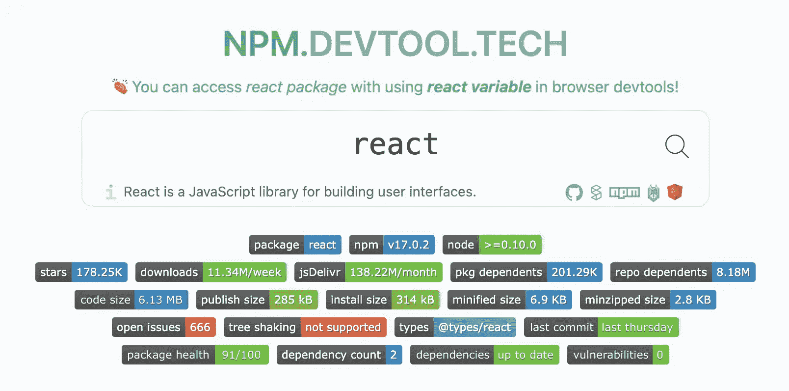

# 什么是 AST，及其应用

> 原文：[https://q.shanyue.tech/fe/%E5%89%8D%E7%AB%AF%E5%B7%A5%E7%A8%8B%E5%8C%96/756.html](https://q.shanyue.tech/fe/%E5%89%8D%E7%AB%AF%E5%B7%A5%E7%A8%8B%E5%8C%96/756.html)

Issue

欢迎在 Gtihub Issue 中回答此问题: [Issue 756(opens new window)](https://github.com/shfshanyue/Daily-Question/issues/756)

Author

回答者: [shfshanyue(opens new window)](https://github.com/shfshanyue)

`AST` 是 `Abstract Syntax Tree` 的简称，是前端工程化绕不过的一个名词。它涉及到工程化诸多环节的应用，比如:

1.  如何将 Typescript 转化为 Javascript (typescript)
2.  如何将 SASS/LESS 转化为 CSS (sass/less)
3.  如何将 ES6+ 转化为 ES5 (babel)
4.  如何将 Javascript 代码进行格式化 (eslint/prettier)
5.  如何识别 React 项目中的 JSX (babel)
6.  GraphQL、MDX、Vue SFC 等等

而在语言转换的过程中，实质上就是对其 AST 的操作，核心步骤就是 AST 三步走

1.  Code -> AST (Parse)
2.  AST -> AST (Transform)
3.  AST -> Code (Generate)

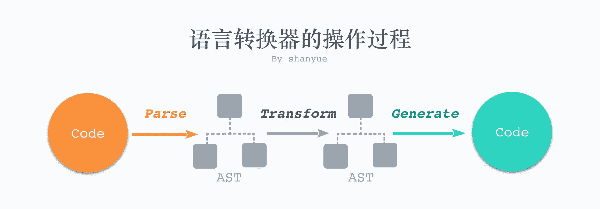

以下是一段代码，及其对应的 AST

```
// Code
const a = 4

// AST
{
  "type": "Program",
  "start": 0,
  "end": 11,
  "body": [
    {
      "type": "VariableDeclaration",
      "start": 0,
      "end": 11,
      "declarations": [
        {
          "type": "VariableDeclarator",
          "start": 6,
          "end": 11,
          "id": {
            "type": "Identifier",
            "start": 6,
            "end": 7,
            "name": "a"
          },
          "init": {
            "type": "Literal",
            "start": 10,
            "end": 11,
            "value": 4,
            "raw": "4"
          }
        }
      ],
      "kind": "const"
    }
  ],
  "sourceType": "module"
} 
```

不同的语言拥有不同的解析器，比如 Javascript 的解析器和 CSS 的解析器就完全不同。

对相同的语言，也存在诸多的解析器，也就会生成多种 AST，如 `babel` 与 `espree`。

在 [AST Explorer(opens new window)](https://astexplorer.net/) 中，列举了诸多语言的解析器(Parser)，及转化器(Transformer)。

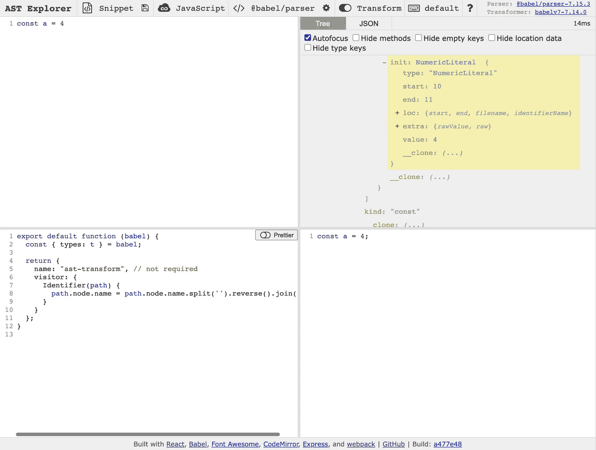

## AST 的生成

AST 的生成这一步骤被称为**解析(Parser)**，而该步骤也有两个阶段: 词法分析(Lexical Analysis)和语法分析(Syntactic Analysis)

### 词法分析 (Lexical Analysis)

词法分析用以将代码转化为 `Token` 流，维护一个关于 Token 的数组

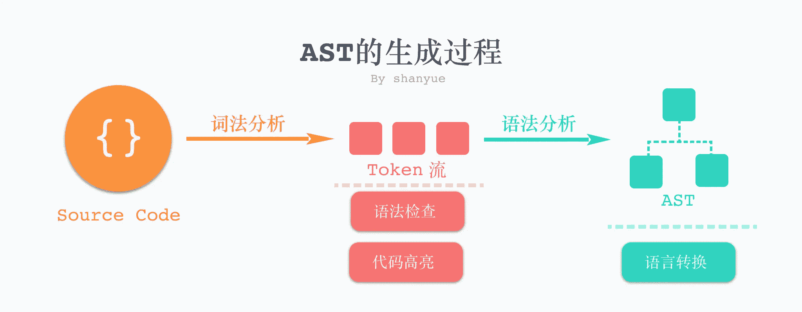

```
// Code
a = 3

// Token
[
  { type: { ... }, value: "a", start: 0, end: 1, loc: { ... } },
  { type: { ... }, value: "=", start: 2, end: 3, loc: { ... } },
  { type: { ... }, value: "3", start: 4, end: 5, loc: { ... } },
  ...
] 
```

词法分析后的 Token 流也有诸多应用，如:

1.  代码检查，如 eslint 判断是否以分号结尾，判断是否含有分号的 token
2.  语法高亮，如 highlight/prism 使之代码高亮
3.  模板语法，如 ejs 等模板也离不开

### 语法分析 (Syntactic Analysis)

语法分析将 Token 流转化为结构化的 AST，方便操作

```
{
  "type": "Program",
  "start": 0,
  "end": 5,
  "body": [
    {
      "type": "ExpressionStatement",
      "start": 0,
      "end": 5,
      "expression": {
        "type": "AssignmentExpression",
        "start": 0,
        "end": 5,
        "operator": "=",
        "left": {
          "type": "Identifier",
          "start": 0,
          "end": 1,
          "name": "a"
        },
        "right": {
          "type": "Literal",
          "start": 4,
          "end": 5,
          "value": 3,
          "raw": "3"
        }
      }
    }
  ],
  "sourceType": "module"
} 
```

## 实践

可通过自己写一个解析器，将语言 (DSL) 解析为 AST 进行练手，以下两个示例是不错的选择

1.  解析简单的 HTML 为 AST
2.  解析 Marktodwn List 为 AST

或可参考一个最简编译器的实现 [the super tiny compiler(opens new window)](https://github.com/jamiebuilds/the-super-tiny-compiler)

Author

回答者: [wenhui7788(opens new window)](https://github.com/wenhui7788)

你好，请问下 token 流 怎么理解这个名词？因为通常理解的 token 就是一个唯一的字符串，流，一般想到的是什么文件流什么的。一些什么序列化相关的，而 token 流说是一个数组，那就是说是由很多字符串组成的一个数组吗？为什么不直接说是一个数组反而要说是 token 流，为什么要提到 token 以及流（有点咬文嚼字了:( ），谢谢~~

# 简述 browserslist 的意义

> 原文：[https://q.shanyue.tech/fe/%E5%89%8D%E7%AB%AF%E5%B7%A5%E7%A8%8B%E5%8C%96/757.html](https://q.shanyue.tech/fe/%E5%89%8D%E7%AB%AF%E5%B7%A5%E7%A8%8B%E5%8C%96/757.html)

Issue

欢迎在 Gtihub Issue 中回答此问题: [Issue 757(opens new window)](https://github.com/shfshanyue/Daily-Question/issues/757)

Author

回答者: [YaoHuangMark(opens new window)](https://github.com/YaoHuangMark)

browserslist 是在不同的前端工具之间共用目标浏览器和 node 版本的配置工具。 相当于给 Babel、PostCSS、ESLint、StyleLint 等这些前端工具预设一个浏览器支持范围，这些工具转换或检查代码时会参考这个范围。

Author

回答者: [shfshanyue(opens new window)](https://github.com/shfshanyue)

[browserslist(opens new window)](https://github.com/browserslist/browserslist) 用特定的语句来查询浏览器列表，如 `last 2 Chrome versions`。

```
$ npx browserslist "last 2 Chrome versions"
chrome 100
chrome 99 
```

细说起来，**它是现代前端工程化不可或缺的工具，无论是处理 JS 的 `babel`，还是处理 CSS 的 `postcss`，凡是与垫片相关的，他们背后都有 `browserslist` 的身影。**

*   `babel`，在 `@babel/preset-env` 中使用 `core-js` 作为垫片
*   `postcss` 使用 `autoprefixer` 作为垫片

关于前端打包体积与垫片关系，我们有以下几点共识:

1.  由于低浏览器版本的存在，垫片是必不可少的
2.  垫片越少，则打包体积越小
3.  浏览器版本越新，则垫片越少

那在前端工程化实践中，当我们确认了浏览器版本号，那么它的垫片体积就会确认。

假设项目只需要支持最新的两个谷歌浏览器。那么关于 `browserslist` 的查询，可以写作 `last 2 Chrome versions`。

而随着时间的推移，**该查询语句将会返回更新的浏览器，垫片体积便会减小。**

**如使用以上查询语句，一年前可能还需要 `Promise.any` 的垫片，但目前肯定不需要了。**

## 原理

最终，谈一下 `browserslist` 的原理: `browserslist` 根据正则解析查询语句，对浏览器版本数据库 `caniuse-lite` 进行查询，返回所得的浏览器版本列表。

> PS: `caniuse-lite` 这个库也由 `browserslist` 团队进行维护，它是基于 [caniuse(opens new window)](https://caniuse.com/) 的数据库进行的数据整合。

因为 `browserslist` 并不维护数据库，因此它会经常提醒你去更新 `caniuse-lite` 这个库，由于 lock 文件的存在，因此需要使用以下命令手动更新数据库。

```
$ npx browserslist@latest --update-db 
```

该命令将会对 caniuse-lite 进行升级，可体现在 lock 文件中。

```
 "caniuse-lite": { - "version": "1.0.30001265", - "resolved": "https://registry.npmjs.org/caniuse-lite/-/caniuse-lite-1.0.30001265.tgz", - "integrity": "sha512-YzBnspggWV5hep1m9Z6sZVLOt7vrju8xWooFAgN6BA5qvy98qPAPb7vNUzypFaoh2pb3vlfzbDO8tB57UPGbtw==", + "version": "1.0.30001332", + "resolved": "https://registry.npmjs.org/caniuse-lite/-/caniuse-lite-1.0.30001332.tgz", + "integrity": "sha512-10T30NYOEQtN6C11YGg411yebhvpnC6Z102+B95eAsN0oB6KUs01ivE8u+G6FMIRtIrVlYXhL+LUwQ3/hXwDWw==",  "dev": true
 }, 
```

## 一些常用的查询语法

### 根据用户份额:

*   `> 5%`: 在全球用户份额大于 `5%` 的浏览器
*   `> 5% in CN`: 在中国用户份额大于 `5%` 的浏览器

### 根据最新浏览器版本

*   `last 2 versions`: 所有浏览器的最新两个版本
*   `last 2 Chrome versions`: Chrome 浏览器的最新两个版本

### 不再维护的浏览器

*   `dead`: 官方不在维护已过两年，比如 `IE10`

### 浏览器版本号

*   `Chrome > 90`: Chrome 大于 90 版本号的浏览器

# 简述 bundless 的优势与不足

> 原文：[https://q.shanyue.tech/fe/%E5%89%8D%E7%AB%AF%E5%B7%A5%E7%A8%8B%E5%8C%96/758.html](https://q.shanyue.tech/fe/%E5%89%8D%E7%AB%AF%E5%B7%A5%E7%A8%8B%E5%8C%96/758.html)

Issue

欢迎在 Gtihub Issue 中回答此问题: [Issue 758(opens new window)](https://github.com/shfshanyue/Daily-Question/issues/758)

Author

回答者: [wenreq(opens new window)](https://github.com/wenreq)

Bundleless 的优势。 1.项目启动快。因为不需要过多的打包，只需要处理修改后的单个文件，所以响应速度是 O(1) 级别，刷新即可即时生效，速度很快。 2.浏览器加载块。利用浏览器自主加载的特性，跳过打包的过程。 3.本地文件更新，重新请求单个文件。 

# 简述 npm cache

> 原文：[https://q.shanyue.tech/fe/%E5%89%8D%E7%AB%AF%E5%B7%A5%E7%A8%8B%E5%8C%96/759.html](https://q.shanyue.tech/fe/%E5%89%8D%E7%AB%AF%E5%B7%A5%E7%A8%8B%E5%8C%96/759.html)

Issue

欢迎在 Gtihub Issue 中回答此问题: [Issue 759(opens new window)](https://github.com/shfshanyue/Daily-Question/issues/759)

Author

回答者: [wenreq(opens new window)](https://github.com/wenreq)

npm 会把所有下载的包，保存在用户文件夹下面。

默认值：~/.npm 在 Posix 上 或 %AppData%/npm-cache 在 Windows 上。根缓存文件夹。

npm install 之后会计算每个包的 sha1 值(PS:安全散列算法(Secure Hash Algorithm))，然后将包与他的 sha1 值关联保存在 package-lock.json 里面，下次 npm install 时，会根据 package-lock.json 里面保存的 sha1 值去文件夹里面寻找包文件，如果找到就不用从新下载安装了。

```
npm cache verify 
```

上面这个命令是重新计算，磁盘文件是否与 sha1 值匹配，如果不匹配可能删除。

> 要对现有缓存内容运行脱机验证，请使用 `npm cache verify`。

```
npm cache clean --force 
```

上面这个命令是删除磁盘所有缓存文件。

# 如何修复某个 npm 包的紧急 bug

> 原文：[https://q.shanyue.tech/fe/%E5%89%8D%E7%AB%AF%E5%B7%A5%E7%A8%8B%E5%8C%96/760.html](https://q.shanyue.tech/fe/%E5%89%8D%E7%AB%AF%E5%B7%A5%E7%A8%8B%E5%8C%96/760.html)

Issue

欢迎在 Gtihub Issue 中回答此问题: [Issue 760(opens new window)](https://github.com/shfshanyue/Daily-Question/issues/760)

Author

回答者: [shfshanyue(opens new window)](https://github.com/shfshanyue)

假设 `lodash` 有一个 Bug，影响线上开发，应该怎么办？


答: 三步走。

1.  在 Github 提交 Pull Request，修复 Bug，等待合并
2.  合并 PR 后，等待新版本发包
3.  升级项目中的 lodash 依赖

很合理很规范的一个流程，但是它一个最大的问题就是，太慢了，三步走完黄花菜都凉了。

此时可直接上手修改 `node_modules` 中 lodash 代码，并修复问题！

新问题：`node_modules` 未纳入版本管理，在生产环境并没有用。请看流程

1.  本地修改 `node_modules/lodash`，本地正常运行 ✅
2.  线上 `npm i lodash`，lodash 未被修改，线上运行失败 ❌

此时有一个简单的方案，临时将修复文件纳入工作目录，可以解决这个问题

1.  本地修改 `node_modules/lodash`，本地正常运行 ✅
2.  将修改文件复制到 `${work_dir}/patchs/lodash` 中，纳入版本管理
3.  线上 `npm i lodash`，并将修改文件再度复制到 `node_modules/lodash` 中，线上正常运行 ✅

但此时并不是很智能，且略有小问题，演示如下:

1.  本地修改 `node_modules/lodash`，本地正常运行 ✅
2.  将修改文件复制到 `${work_dir}/patchs/lodash` 中，纳入版本管理 ✅
3.  线上 `npm i lodash`，并将修改文件再度复制到 `node_modules/lodash` 中，线上正常运行 ✅
4.  两个月后升级 `lodash`，该问题得以解决，而我们代码引用了 lodash 的新特性
5.  线上 `npm i lodash`，并将修改文件再度复制到 `node_modules/lodash` 中，由于已更新了 lodash，并且依赖于新特性，线上运行失败 ❌

此时有一个万能之策，那就是 [patch-package(opens new window)](https://github.com/ds300/patch-package)

## patch-package

想要知道 `patch-package` 如何解决上述问题，请先了解下它的用法，流程如下

```
# 修改 lodash 的一个小问题
$ vim node_modules/lodash/index.js

# 对 lodash 的修复生成一个 patch 文件，位于 patches/lodash+4.17.21.patch
$ npx patch-package lodash

# 将修复文件提交到版本管理之中
$ git add patches/lodash+4.17.21.patch
$ git commit -m "fix 一点儿小事 in lodash"

# 此后的命令在生产环境或 CI 中执行
# 此后的命令在生产环境或 CI 中执行
# 此后的命令在生产环境或 CI 中执行

# 在生产环境装包
$ npm i

# 为生产环境的 lodash 进行小修复
$ npx patch-package

# 大功告成！ 
```

再次看下 `patch-package` 自动生成 patch 文件的本来面目吧:

它实际上是一个 `diff` 文件，在生产环境中可自动根据 diff 文件与版本号 (根据 patch 文件名存取) 将修复场景复原！

```
$ cat patches/lodash+4.17.21.patch
diff --git a/node_modules/lodash/index.js b/node_modules/lodash/index.js
index 5d063e2..fc6fa33 100644
--- a/node_modules/lodash/index.js
+++ b/node_modules/lodash/index.js
@@ -1 +1,3 @@
+console.log('DEBUG SOMETHING')
+
 module.exports = require('./lodash');
\ No newline at end of file 
```

# 前端如何进行高效的分包

> 原文：[https://q.shanyue.tech/fe/%E5%89%8D%E7%AB%AF%E5%B7%A5%E7%A8%8B%E5%8C%96/761.html](https://q.shanyue.tech/fe/%E5%89%8D%E7%AB%AF%E5%B7%A5%E7%A8%8B%E5%8C%96/761.html)

Issue

欢迎在 Gtihub Issue 中回答此问题: [Issue 761(opens new window)](https://github.com/shfshanyue/Daily-Question/issues/761)

Author

回答者: [shfshanyue(opens new window)](https://github.com/shfshanyue)

# 如何正确地进行分包

## 为什么需要分包？

*为什么需要进行分包，一个大的 `bundle.js` 不好吗？*

极其不建议，可从两方面进行考虑:

1.  一行代码将导致整个 `bundle.js` 的缓存失效
2.  一个页面仅仅需要 `bundle.js` 中 1/N 的代码，剩下代码属于其它页面，完全没有必要加载

## 如何更好的分包？

### 打包工具运行时

> webpack(或其他构建工具) 运行时代码不容易变更，需要单独抽离出来，比如 `webpack.runtime.js`。由于其体积小，**必要时可注入 `index.html` 中**，减少 HTTP 请求数，优化关键请求路径

### 前端框架运行时

> React(Vue) 运行时代码不容易变更，且每个组件都会依赖它，可单独抽离出来 `framework.runtime.js`。请且注意，**务必将 React 及其所有依赖(react-dom/object-assign)共同抽离出来**，否则有可能造成性能损耗，见下示例

*假设仅仅抽离 React 运行时(不包含其依赖)为单独 Chunk*，且每个路由页面为单独 Chunk。*某页面不依赖任何第三方库*，则该页面会加载以下 Chunk

1.  `webpack.runtime.js` 5KB ✅
2.  `framework.runtime.js` 30KB ✅
3.  `page-a.chunk.js` 50KB ✅
4.  `vendor.chunk.js` 50KB ❌ (因 webpack 依赖其 `object-assign`，而 `object-assign` 将被打入共同依赖 `vendor.chunk.js`，因此此时它必回加载，但是该页面并不依赖任何第三方库，完全没有必要全部加载 `vendor.chunk.js`)

将 React 运行时及其所有依赖，共同打包，修复结果如下，拥有了更完美的打包方案。

1.  `webpack.runtime.js` 5KB ✅
2.  `framework.runtime.js` 40KB ✅ (+10KB)
3.  `page-a.chunk.js` 50KB ✅

### 高频库

一个模块被 N(2 个以上) 个 Chunk 引用，可称为公共模块，可把公共模块给抽离出来，形成 `vendor.js`。

问：那如果一个模块被用了多次 (2 次以上)，但是该模块体积过大(1MB)，每个页面都会加载它(但是无必要，因为不是每个页面都依赖它)，导致性能变差，此时如何分包？

答：如果一个模块虽是公共模块，但是该模块体积过大，可直接 `import()` 引入，异步加载，单独分包，比如 `echarts` 等

问：如果公共模块数量多，导致 vendor.js 体积过大(1MB)，每个页面都会加载它，导致性能变差，此时如何分包

答：有以下两个思路

1.  思路一: 可对 vendor.js 改变策略，比如被引用了十次以上，被当做公共模块抽离成 verdor-A.js，五次的抽离为 vendor-B.js，两次的抽离为 vendor-C.js
2.  思路二: 控制 vendor.js 的体积，当大于 100KB 时，再次进行分包，多分几个 vendor-XXX.js，但每个 vendor.js 都不超过 100KB

## 使用 webpack 分包

在 webpack 中可以使用 [SplitChunksPlugin(opens new window)](https://webpack.js.org/plugins/split-chunks-plugin) 进行分包，它需要满足三个条件:

1.  minChunks: 一个模块是否最少被 minChunks 个 chunk 所引用
2.  maxInitialRequests/maxAsyncRequests: 最多只能有 maxInitialRequests/maxAsyncRequests 个 chunk 需要同时加载 (如一个 Chunk 依赖 VendorChunk 才可正常工作，此时同时加载 chunk 数为 2)
3.  minSize/maxSize: chunk 的体积必须介于 (minSize, maxSize) 之间

以下是 `next.js` 的默认配置，可视作最佳实践

> [源码位置: next/build/webpack-config.ts(opens new window)](https://github.com/vercel/next.js/blob/v12.0.5-canary.10/packages/next/build/webpack-config.ts#L728)

```
{
  // Keep main and _app chunks unsplitted in webpack 5
  // as we don't need a separate vendor chunk from that
  // and all other chunk depend on them so there is no
  // duplication that need to be pulled out.
  chunks: (chunk) =>
    !/^(polyfills|main|pages\/_app)$/.test(chunk.name) &&
    !MIDDLEWARE_ROUTE.test(chunk.name),
  cacheGroups: {
    framework: {
      chunks: (chunk: webpack.compilation.Chunk) =>
        !chunk.name?.match(MIDDLEWARE_ROUTE),
      name: 'framework',
      test(module) {
        const resource =
          module.nameForCondition && module.nameForCondition()
        if (!resource) {
          return false
        }
        return topLevelFrameworkPaths.some((packagePath) =>
          resource.startsWith(packagePath)
        )
      },
      priority: 40,
      // Don't let webpack eliminate this chunk (prevents this chunk from
      // becoming a part of the commons chunk)
      enforce: true,
    },
    lib: {
      test(module: {
        size: Function
        nameForCondition: Function
      }): boolean {
        return (
          module.size() > 160000 &&
          /node_modules[/\\]/.test(module.nameForCondition() || '')
        )
      },
      name(module: {
        type: string
        libIdent?: Function
        updateHash: (hash: crypto.Hash) => void
      }): string {
        const hash = crypto.createHash('sha1')
        if (isModuleCSS(module)) {
          module.updateHash(hash)
        } else {
          if (!module.libIdent) {
            throw new Error(
              `Encountered unknown module type: ${module.type}. Please open an issue.`
            )
          }

          hash.update(module.libIdent({ context: dir }))
        }

        return hash.digest('hex').substring(0, 8)
      },
      priority: 30,
      minChunks: 1,
      reuseExistingChunk: true,
    },
    commons: {
      name: 'commons',
      minChunks: totalPages,
      priority: 20,
    },
    middleware: {
      chunks: (chunk: webpack.compilation.Chunk) =>
        chunk.name?.match(MIDDLEWARE_ROUTE),
      filename: 'server/middleware-chunks/[name].js',
      minChunks: 2,
      enforce: true,
    },
  },
  maxInitialRequests: 25,
  minSize: 20000,
} 
```

# 前端如何对分支环境进行部署

> 原文：[https://q.shanyue.tech/fe/%E5%89%8D%E7%AB%AF%E5%B7%A5%E7%A8%8B%E5%8C%96/762.html](https://q.shanyue.tech/fe/%E5%89%8D%E7%AB%AF%E5%B7%A5%E7%A8%8B%E5%8C%96/762.html)

Issue

欢迎在 Gtihub Issue 中回答此问题: [Issue 762(opens new window)](https://github.com/shfshanyue/Daily-Question/issues/762)

Author

回答者: [AndyTiTi(opens new window)](https://github.com/AndyTiTi)

以下是基于 gitlab 的分支和 tag 进行前端部署的.gitlab-ci.yml 配置

```
image: node:12-alpine3.14
stages: # 分段
  # - install
  - build
  - deploy
  - clear

cache: # 缓存
  paths:
    - node_modules

job_install:
  tags:
    - test
  stage: build
  script:
    - npm install -g cnpm --registry=https://registry.npm.taobao.org
    - cnpm install
    - npm run build
  # 只在指定dev分支或者tag以 dev_ 开头的标签执行该job
  only:
    refs:
      - dev
      - /^dev_[0-9]+(?:.[0-9]+)+$/ # regular expression
  # 打包后的文件可以在gitlab上直接下载
  artifacts:
    name: "dist"
    paths:
      - dist

job_deploy:
  image: docker
  stage: deploy
  environment:
    name: test
    url: http://172.6.6.6:8000
  script:
    - docker build -t appimages .
    - if [ $(docker ps -aq --filter name=app-container) ]; then docker rm -f app-container;fi
    - docker run -d -p 8082:80 --name app-container appimages

job_clear:
  image: docker
  stage: clear
  tags:
    - test
  script:
    - if [ $(docker ps -aq | grep "Exited" | awk '{print $1 }') ]; then docker stop $(docker ps -a | grep "Exited" | awk '{print $1 }');fi
    - if [ $(docker ps -aq | grep "Exited" | awk '{print $1 }') ]; then docker rm $(docker ps -a | grep "Exited" | awk '{print $1 }');fi
    - if [ $(docker images | grep "none" | awk '{print $3}') ]; then docker rmi $(docker images | grep "none" | awk '{print $3}');fi 
```

# vite 中是如何处理 new URL 资源的

> 原文：[https://q.shanyue.tech/fe/%E5%89%8D%E7%AB%AF%E5%B7%A5%E7%A8%8B%E5%8C%96/772.html](https://q.shanyue.tech/fe/%E5%89%8D%E7%AB%AF%E5%B7%A5%E7%A8%8B%E5%8C%96/772.html)

Issue

欢迎在 Gtihub Issue 中回答此问题: [Issue 772(opens new window)](https://github.com/shfshanyue/Daily-Question/issues/772)