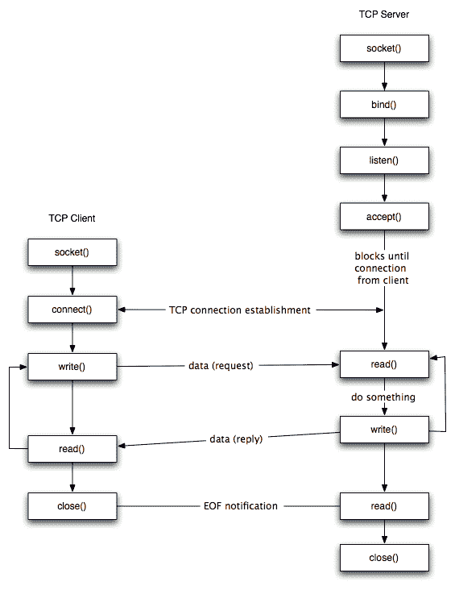
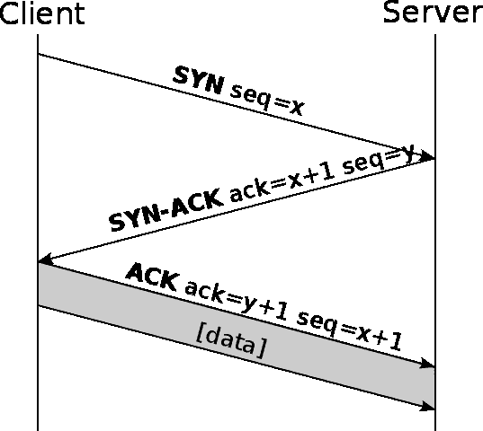
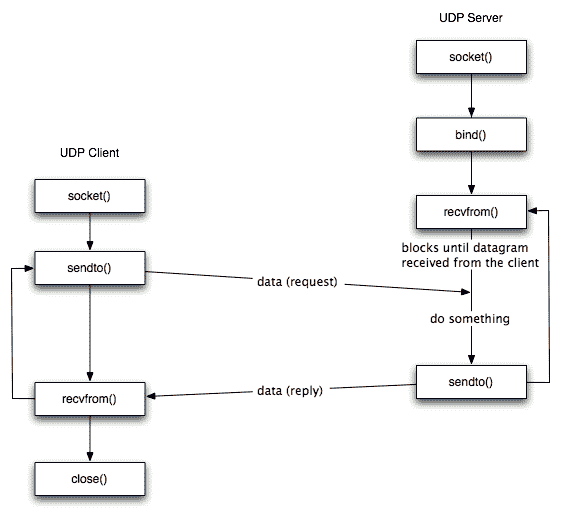
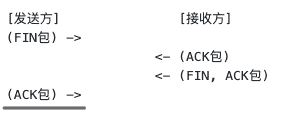

# 计算机网络

# 当 ping 一个 IP 地址时发生了什么

> 原文：[https://q.shanyue.tech/base/network/2.html](https://q.shanyue.tech/base/network/2.html)

Issue

欢迎在 Gtihub Issue 中回答此问题: [Issue 2(opens new window)](https://github.com/shfshanyue/Daily-Question/issues/2)

Author

回答者: [shfshanyue(opens new window)](https://github.com/shfshanyue)

从 `ping` 的 `man` 手册就可以看出来，`ping` 实际上发送了 **`ICMP ECHO_REQUEST`** 的报文

> ping -- send ICMP ECHO_REQUEST packets to network hosts

通过让目标 IP 地址返回 **`ICMP ECHO_RESPONSE`** 报文来判断 IP 可不可达。

`ICMP` 分为 `Query` 查询报文及 `Error Message` 报文，ping 为查询报文。

# 简述 TCP socket 建立的过程

> 原文：[https://q.shanyue.tech/base/network/26.html](https://q.shanyue.tech/base/network/26.html)

Issue

欢迎在 Gtihub Issue 中回答此问题: [Issue 26(opens new window)](https://github.com/shfshanyue/Daily-Question/issues/26)

Author

回答者: [shfshanyue(opens new window)](https://github.com/shfshanyue)

一图胜千言



# linux 中如何打印所有网络接口

> 原文：[https://q.shanyue.tech/base/network/31.html](https://q.shanyue.tech/base/network/31.html)

Issue

欢迎在 Gtihub Issue 中回答此问题: [Issue 31(opens new window)](https://github.com/shfshanyue/Daily-Question/issues/31)

Author

回答者: [shfshanyue(opens new window)](https://github.com/shfshanyue)

## ifconfig

`ifconfig` 是最简单最常用，但是打印信息太多了

```
$ ifconfig
cni0: flags=4163<UP,BROADCAST,RUNNING,MULTICAST>  mtu 1450
        inet 10.244.0.1  netmask 255.255.255.0  broadcast 0.0.0.0
        ether 9e:f3:9e:47:9d:55  txqueuelen 1000  (Ethernet)
        RX packets 14733665  bytes 1007493238 (960.8 MiB)
        RX errors 0  dropped 0  overruns 0  frame 0
        TX packets 15040396  bytes 4534954611 (4.2 GiB)
        TX errors 0  dropped 0 overruns 0  carrier 0  collisions 0

docker0: flags=4099<UP,BROADCAST,MULTICAST>  mtu 1500
        inet 172.18.0.1  netmask 255.255.0.0  broadcast 172.18.255.255
        ether 02:42:09:fe:1d:e5  txqueuelen 0  (Ethernet)
        RX packets 0  bytes 0 (0.0 B)
        RX errors 0  dropped 0  overruns 0  frame 0
        TX packets 0  bytes 0 (0.0 B)
        TX errors 0  dropped 0 overruns 0  carrier 0  collisions 0 
```

## netstat

`netstat` 与 `ip` 也挺好用，特别是它们还可以打印路由表

```
$ netstat -i
Kernel Interface table
Iface             MTU    RX-OK RX-ERR RX-DRP RX-OVR    TX-OK TX-ERR TX-DRP TX-OVR Flg
cni0             1450 14733471      0      0 0      15040202      0      0      0 BMRU
docker0          1500        0      0      0 0             0      0      0      0 BMU
eth0             1500 42833038      0      0 0      40961577      0      0      0 BMRU
flannel.1        1450  4761436      0      0 0       4091581      0      0      0 BMRU
lo              65536 376447249      0      0 0      376447249      0      0      0 LRU
veth2052e2d6     1450  7358995      0      0 0       7518642      0      0      0 BMRU
veth3190806e     1450  7363232      0      0 0       7510100      0      0      0 BMRU 
```

## ip

```
$ ip link

$ ip addr 
```

# 如何把一个 CIDR 地址转化为 IP 地址范围段

> 原文：[https://q.shanyue.tech/base/network/46.html](https://q.shanyue.tech/base/network/46.html)

更多描述

如 `172.16.0.0/27` 的 IP 范围是多少

Issue

欢迎在 Gtihub Issue 中回答此问题: [Issue 46(opens new window)](https://github.com/shfshanyue/Daily-Question/issues/46)

# 简述 TCP 的三次握手

> 原文：[https://q.shanyue.tech/base/network/55.html](https://q.shanyue.tech/base/network/55.html)

Issue

欢迎在 Gtihub Issue 中回答此问题: [Issue 55(opens new window)](https://github.com/shfshanyue/Daily-Question/issues/55)

Author

回答者: [WenHaiYana(opens new window)](https://github.com/WenHaiYana)

我：你在吗？ 他： 我在的。 我： 那开始聊天吧

Author

回答者: [shfshanyue(opens new window)](https://github.com/shfshanyue)

一图胜千言



三次握手之后，客户端与服务器端的两个 socket 处于 `ESTABSHED` 状态

Author

回答者: [changshou83(opens new window)](https://github.com/changshou83)

第一次：服务端知道客户端有发送能力 第二次：客户端知道服务端有发送和接受的能力 第三次：服务端知道客户端有接受能力

Author

回答者: [SunshineHusky(opens new window)](https://github.com/SunshineHusky)

第一次握手：发送方请求连接 客户端状态: (syn_send) 具体行为：主机 A 发送位码为 syn ＝ 1,随机产生 seq number=1234567 的数据包到服务器，主机 B 由 SYN=1 知道，A 要求建立联机 目的：确定客户端能够正常发送信息 第二次握手：服务方发送应答报文 服务端状态:(syn_recv) 具体行为：主机 B 收到请求后要确认联机信息，向 A 发送 ack number=(主机 A 的 seq+1),syn=1,ack=1,随机产生 seq=7654321 的包 目的：确定服务端能够正常收取信息 发送信息 第三次握手：服务方发送应答报文 服务端状态:(establish) 具体行为：主机 B 收到请求后要确认联机信息，向 A 发送 ack number=(主机 A 的 seq+1),syn=1,ack=1,随机产生 seq=7654321 的包 目的：确定服务端能够正常收取信息 发送信息

# 什么是 CNAME 记录和 A 记录

> 原文：[https://q.shanyue.tech/base/network/88.html](https://q.shanyue.tech/base/network/88.html)

Issue

欢迎在 Gtihub Issue 中回答此问题: [Issue 88(opens new window)](https://github.com/shfshanyue/Daily-Question/issues/88)

Author

回答者: [shfshanyue(opens new window)](https://github.com/shfshanyue)

CNAME：域名 -> 域名 A：域名 -> IP

# TCP 是如何保证可靠性的

> 原文：[https://q.shanyue.tech/base/network/121.html](https://q.shanyue.tech/base/network/121.html)

Issue

欢迎在 Gtihub Issue 中回答此问题: [Issue 121(opens new window)](https://github.com/shfshanyue/Daily-Question/issues/121)

Author

回答者: [shfshanyue(opens new window)](https://github.com/shfshanyue)

ACK

Author

回答者: [Carrie999(opens new window)](https://github.com/Carrie999)

现在 UDP 也挺可靠的还快

Author

回答者: [changshou83(opens new window)](https://github.com/changshou83)

@Carrie999 大佬细说

# vpn 的原理是什么

> 原文：[https://q.shanyue.tech/base/network/128.html](https://q.shanyue.tech/base/network/128.html)

更多描述

当在公司工作时经常需要 vpn 用以连接公司内网，其原理是什么

Issue

欢迎在 Gtihub Issue 中回答此问题: [Issue 128(opens new window)](https://github.com/shfshanyue/Daily-Question/issues/128)

Author

回答者: [xinlanlan(opens new window)](https://github.com/xinlanlan)

正向代理

# ssh 的原理是什么

> 原文：[https://q.shanyue.tech/base/network/135.html](https://q.shanyue.tech/base/network/135.html)

Issue

欢迎在 Gtihub Issue 中回答此问题: [Issue 135(opens new window)](https://github.com/shfshanyue/Daily-Question/issues/135)

Author

回答者: [nextprops(opens new window)](https://github.com/nextprops)

搬运 [图解 SSH 原理(opens new window)](https://www.jianshu.com/p/33461b619d53)

# 简述 UDP socket 建立的过程

> 原文：[https://q.shanyue.tech/base/network/174.html](https://q.shanyue.tech/base/network/174.html)

Issue

欢迎在 Gtihub Issue 中回答此问题: [Issue 174(opens new window)](https://github.com/shfshanyue/Daily-Question/issues/174)

Author

回答者: [shfshanyue(opens new window)](https://github.com/shfshanyue)

一图胜千言



# TCP 三次握手发生在 socket 建立的哪一步

> 原文：[https://q.shanyue.tech/base/network/175.html](https://q.shanyue.tech/base/network/175.html)

Issue

欢迎在 Gtihub Issue 中回答此问题: [Issue 175(opens new window)](https://github.com/shfshanyue/Daily-Question/issues/175)

Author

回答者: [changshou83(opens new window)](https://github.com/changshou83)

TCP Client 调用 connec()请求建立连接时

# 简述 TCP 的四次挥手，三次挥手可以吗

> 原文：[https://q.shanyue.tech/base/network/183.html](https://q.shanyue.tech/base/network/183.html)

Issue

欢迎在 Gtihub Issue 中回答此问题: [Issue 183(opens new window)](https://github.com/shfshanyue/Daily-Question/issues/183)

Author

回答者: [manondidi(opens new window)](https://github.com/manondidi)

第一次挥手 客户端 发送 fin 给服务端 第二次回收 服务端 发送 ack 给客户端 中间服务端 可能还有数据传输 第三次挥手 服务端 发送 fin 给客户端 第四次挥手 客户端 发送 ack 给 客户端 上述四个挥手 分别 类比 两人再打电话 A 对 B 说 我说完了 B 对 A 说 我知道了 中间 b 还有话说 B 再对 A 说 我也说完了 A 再对 B 说 我知道了 双方挂断电话

如果只有两次 即 A 对 B 说我说完了 而没有 ack, A 不确定 B 是否知道"A 我说完了"这句话 B 听到没有 同理,第三次挥手 B 对 A 说我说完了, 还没等 A 回答我知道了就挂断,有可能 A 不知道 B 已经说完.

tcp 协议之所以可靠 就是由于 三次握手四次挥手 建立的连接, 以及 ack 回执机制, 如果传输过程中连接断开 又会重新三次握手建立连接, 如果一直没收到 ack, 发送方会一直发送相同的消息,等待另一方发 ack 回执回来

Author

回答者: [manondidi(opens new window)](https://github.com/manondidi)

> 第一次挥手 客户端 发送 fin 给服务端 第二次回收 服务端 发送 ack 给客户端 中间服务端 可能还有数据传输 第三次挥手 服务端 发送 fin 给客户端 第四次挥手 客户端 发送 ack 给 客户端 上述四个挥手 分别 类比 两人再打电话 A 对 B 说 我说完了 B 对 A 说 我知道了 中间 b 还有话说 B 再对 A 说 我也说完了 A 再对 B 说 我知道了 双方挂断电话
> 
> 如果只有两次 即 A 对 B 说我说完了 而没有 ack, A 不确定 B 是否知道"A 我说完了"这句话 B 听到没有 同理,第三次挥手 B 对 A 说我说完了, 还没等 A 回答我知道了就挂断,有可能 A 不知道 B 已经说完.
> 
> tcp 协议之所以可靠 就是由于 三次握手四次挥手 建立的连接, 以及 ack 回执机制, 如果传输过程中连接断开 又会重新三次握手建立连接, 如果一直没收到 ack, 发送方会一直发送相同的消息,等待另一方发 ack 回执回来

1.A 对 B 说 我说完了 2.B 对 A 说 我知道了 中间 b 还有话说 3.B 再对 A 说 我也说完了 4.A 再对 B 说 我知道了 双方挂断电话

题主 把 两次挥手改成三次挥手了,我还是拿挂电话的例子 如果步骤 4 没了 就挂断,那么 B 不确定 A 是否收到 B 已经说完了, 而直接挂断 ,如果 A 没收到 A 将会一直等待

Author

回答者: [changshou83(opens new window)](https://github.com/changshou83)

第一次：客户端通知服务端我要结束了 第二次：服务端告诉客户端我知道了 第三次：服务端通知客户端我准备好了 第四次：客户端通知服务端表示我知道了

-- update 3 月 31 日 -- 三次握手还有确认哪条连接的作用(根据 ACK)

# tcp 中 time_wait 堆积过多会有什么问题，为什么它超时时间这么长

> 原文：[https://q.shanyue.tech/base/network/184.html](https://q.shanyue.tech/base/network/184.html)

Issue

欢迎在 Gtihub Issue 中回答此问题: [Issue 184(opens new window)](https://github.com/shfshanyue/Daily-Question/issues/184)

Author

回答者: [changshou83(opens new window)](https://github.com/changshou83)

会占用大量网络资源(接口)，导致网络响应卡顿。超时时间长是为了有足够的时间确保客户端能接受到消息

# localhost 与 127.0.0.1 有什么区别

> 原文：[https://q.shanyue.tech/base/network/365.html](https://q.shanyue.tech/base/network/365.html)

Issue

欢迎在 Gtihub Issue 中回答此问题: [Issue 365(opens new window)](https://github.com/shfshanyue/Daily-Question/issues/365)

Author

回答者: [nextprops(opens new window)](https://github.com/nextprops)

localhost 可以更改后指向其它地址。 127.0.0.1 是约定的本机 IP。 类似互联网中域名与服务器 IP 的关系。

Author

回答者: [libin1991(opens new window)](https://github.com/libin1991)

对 99.99%的人来说**没有区别**

Author

回答者: [ovarte(opens new window)](https://github.com/ovarte)

如果在浏览器访问时，当前页面的 location.hostname(host) 不同，配置代理的时候要注意

Author

回答者: [PixelMonkeyPro(opens new window)](https://github.com/PixelMonkeyPro)

localhost 也叫 local ，正确的解释是：本地服务器

127.0.0.1 在 windows 等系统的正确解释是：本机地址（本机服务器）

他们的解析通过本机的 host 文件，windows 自动将 localhost 解析为 127.0.0.1

localhot（local）是不经网卡传输！这点很重要，它不受网络防火墙和网卡相关的的限制。

127.0.0.1 是通过网卡传输，依赖网卡，并受到网络防火墙和网卡相关的限制。

一般设置程序时本地服务用 localhost 是最好的，localhost 不会解析成 ip，也不会占用网卡、网络资源。

有时候用 localhost 可以，但用 127.0.0.1 就不可以的情况就是在于此。猜想 localhost 访问时，系统带的本机当前用户的权限去访问，而用 ip 的时候，等于本机是通过网络再去访问本机，可能涉及到网络用户的权限。

摘录自--https://zhuanlan.zhihu.com/p/26503558

Author

回答者: [nmsn(opens new window)](https://github.com/nmsn)

> localhost 也叫 local ，正确的解释是：本地服务器
> 
> 127.0.0.1 在 windows 等系统的正确解释是：本机地址（本机服务器）
> 
> 他们的解析通过本机的 host 文件，windows 自动将 localhost 解析为 127.0.0.1
> 
> localhot（local）是不经网卡传输！这点很重要，它不受网络防火墙和网卡相关的的限制。
> 
> 127.0.0.1 是通过网卡传输，依赖网卡，并受到网络防火墙和网卡相关的限制。
> 
> 一般设置程序时本地服务用 localhost 是最好的，localhost 不会解析成 ip，也不会占用网卡、网络资源。
> 
> 有时候用 localhost 可以，但用 127.0.0.1 就不可以的情况就是在于此。猜想 localhost 访问时，系统带的本机当前用户的权限去访问，而用 ip 的时候，等于本机是通过网络再去访问本机，可能涉及到网络用户的权限。
> 
> 摘录自--https://zhuanlan.zhihu.com/p/26503558

评论中又写到 `127.0.0.1` 也是不进过网卡的

# TCP 四次挥手时为什么需要 2MSL

> 原文：[https://q.shanyue.tech/base/network/381.html](https://q.shanyue.tech/base/network/381.html)

Issue

欢迎在 Gtihub Issue 中回答此问题: [Issue 381(opens new window)](https://github.com/shfshanyue/Daily-Question/issues/381)

Author

回答者: [zzetao(opens new window)](https://github.com/zzetao)

**我们先来看看什么是 2MSL ？** MSL: Maximum Segment Lifetime, 最长报文段寿命 意思是，需要等候 2 * MSL 时间，才会进入关闭状态

* * *

**然后再来看哪个阶段需要 2MSL ？**

 从上图来看，是在 [发送方] 发送完 ACK 后，进入 **TIME_WAIT** 阶段，这个阶段需要等候 2*MSL，才将 TCP 关闭

* * *

**为什么要等候 2*MSL ？**

1.  用足够长的等候时间，来确保 [接收方] 能收到 ACK 包

    *   如果 [接收方] 在一定时间没收到 (ACK)，会重发 (FIN, ACK)，[发送方] 收到后，会重发 (ACK)，再重置 2*MSL 定时器 .
2.  防止当前连接延迟到达的数据段，被新的 TCP 连接收到

    *   新的 TCP 连接：相同端口，相同地址

* * *

**TIME_WAIT 等候时间长短问题**

1.  等候时间过短

    *   可能会收到上一个 TCP 连接延迟到达的数据段 .
2.  等候时间过长

    *   TCP 连接一直占用着端口，需要关闭后才能建立新的连接，高并发下压力比较大

Author

回答者: [shfshanyue(opens new window)](https://github.com/shfshanyue)

可以参考知乎这个问题：

目的是为了优雅地关闭 TCP 连接。

[为什么 TCP4 次挥手时等待为 2MSL？(opens new window)](https://www.zhihu.com/question/67013338)

#26

# 简单介绍一下 RSA 算法

> 原文：[https://q.shanyue.tech/base/network/397.html](https://q.shanyue.tech/base/network/397.html)

Issue

欢迎在 Gtihub Issue 中回答此问题: [Issue 397(opens new window)](https://github.com/shfshanyue/Daily-Question/issues/397)

# HTTP 与 TCP 中的 keep-alive 各是什么

> 原文：[https://q.shanyue.tech/base/network/657.html](https://q.shanyue.tech/base/network/657.html)

Issue

欢迎在 Gtihub Issue 中回答此问题: [Issue 657(opens new window)](https://github.com/shfshanyue/Daily-Question/issues/657)